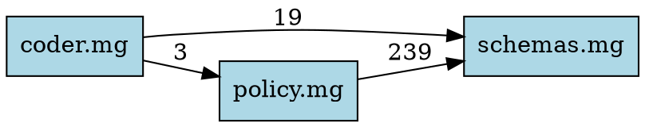

# Mangle Module Analyzer - Examples

Real-world examples using the codeNERD Mangle codebase.

## Example 1: Basic Cross-File Analysis

**Command:**
```bash
python analyze_module.py internal/core/defaults/schemas.mg internal/core/defaults/coder.mg
```

**Output:**
```
======================================================================
CROSS-FILE ANALYSIS
======================================================================

Files analyzed: 2
  - schemas.mg
  - coder.mg

Total predicates: 581
Cross-file dependencies: 1
Conflicts: 8
Missing definitions: 26
Unused exports: 47

----------------------------------------------------------------------
MODULE DEPENDENCIES
----------------------------------------------------------------------

coder.mg
  ├── imports from: schemas.mg (19 predicates)

!!!!!!!!!!!!!!!!!!!!!!!!!!!!!!!!!!!!!!!!!!!!!!!!!!!!!!!!!!!!!!!!!!!!!!
CONFLICTS
!!!!!!!!!!!!!!!!!!!!!!!!!!!!!!!!!!!!!!!!!!!!!!!!!!!!!!!!!!!!!!!!!!!!!!

--- Conflict #1 (ERROR) ---
Type: decl_conflict
Predicate: security_violation
Message: Predicate 'security_violation' declared with different arities: [1, 3]
Locations:
  schemas.mg:234
    Decl security_violation(ViolationType).
  schemas.mg:1136
    Decl security_violation(ActionType, Reason, Timestamp).
```

**Interpretation:** The analysis found that `security_violation` is declared with different arities in the same file. This is an error that needs fixing.

## Example 2: Multi-File Analysis with All Core Files

**Command:**
```bash
python analyze_module.py internal/core/defaults/*.mg
```

**Key Findings:**
- **609 total predicates** across all files
- **4 cross-file dependencies** detected
- **12 conflicts** including arity mismatches
- **29 missing definitions** (many are Go FFI predicates)

**Actionable Items:**
1. Fix arity mismatches for `learning_signal` predicate
2. Standardize `rejection_count` declaration
3. Add Go FFI predicates to virtual list

## Example 3: Using Virtual Predicates

**Command:**
```bash
python analyze_module.py internal/core/defaults/*.mg \
  --virtual "file_content,symbol_at,tool_instance,build_state,test_result"
```

**Result:** Reduces false positives by ignoring Go-implemented predicates.

**Before:**
```
Missing definitions: 45
```

**After:**
```
Missing definitions: 29
```

## Example 4: Generate Dependency Graph

**Command:**
```bash
python analyze_module.py internal/core/defaults/schemas.mg \
                         internal/core/defaults/policy.mg \
                         internal/core/defaults/coder.mg \
  --graph > module_deps.dot
dot -Tpng module_deps.dot > module_deps.png
```

**Output (DOT):**


**Visualization:** Shows that `policy.mg` heavily depends on `schemas.mg` (239 predicates), while `coder.mg` uses predicates from both.

## Example 5: JSON Output for Automation

**Command:**
```bash
python analyze_module.py internal/core/defaults/*.mg --json > analysis.json
```

**Sample Output:**
```json
{
  "files_analyzed": ["schemas.mg", "policy.mg", "coder.mg"],
  "statistics": {
    "total_predicates": 609,
    "total_definitions": 223,
    "total_declarations": 498,
    "cross_file_dependencies": 4
  },
  "conflicts": [
    {
      "type": "arity_mismatch",
      "predicate": "learning_signal",
      "severity": "error",
      "message": "Predicate 'learning_signal' defined with different arities: [1, 2]",
      "locations": [...]
    }
  ],
  "missing_definitions": [...],
  "status": "failed"
}
```

**Usage in Scripts:**
```bash
# Check if analysis passed
python analyze_module.py *.mg --json | jq -r '.status'

# Count errors
python analyze_module.py *.mg --json | jq '.conflicts | map(select(.severity == "error")) | length'

# List missing predicates
python analyze_module.py *.mg --json | jq -r '.missing_definitions[].predicate'
```

## Example 6: Verbose Mode for Unused Code

**Command:**
```bash
python analyze_module.py internal/core/defaults/*.mg -v | grep -A 100 "UNUSED EXPORTS"
```

**Sample Output:**
```
----------------------------------------------------------------------
UNUSED EXPORTS
----------------------------------------------------------------------

'impact_warning' - defined but never used
  coder.mg:311
  coder.mg:314

'learned_proposal' - defined but never used
  policy.mg:230

'minimal_implementation_mode' - defined but never used
  coder.mg:674
```

**Action:** Review these predicates - they might be:
1. Dead code to remove
2. API predicates meant for future use
3. Helper predicates that should be used

## Example 7: CI/CD Integration

**Pre-commit Hook:**
```bash
#!/bin/bash
# .git/hooks/pre-commit

# Get changed .mg files
changed_mg=$(git diff --cached --name-only --diff-filter=ACM | grep '\.mg$')

if [ -n "$changed_mg" ]; then
  echo "Analyzing Mangle modules..."

  # Load virtual predicates
  virtual_preds=$(cat .mangle-virtual-predicates | grep -v '^#' | tr -d '\n' | tr -d ' ')

  # Run analysis
  python .claude/skills/mangle-programming/scripts/analyze_module.py \
    internal/core/defaults/*.mg \
    --check-completeness \
    --virtual "$virtual_preds" \
    --strict

  if [ $? -ne 0 ]; then
    echo "❌ Mangle module analysis failed!"
    echo "Fix conflicts and missing definitions before committing."
    exit 1
  fi

  echo "✅ Mangle module analysis passed!"
fi
```

**GitHub Actions:**
```yaml
name: Mangle Analysis

on: [push, pull_request]

jobs:
  analyze:
    runs-on: ubuntu-latest
    steps:
      - uses: actions/checkout@v2

      - name: Set up Python
        uses: actions/setup-python@v2
        with:
          python-version: '3.9'

      - name: Analyze Mangle modules
        run: |
          virtual_preds=$(cat .mangle-virtual-predicates | grep -v '^#' | tr -d '\n' | tr -d ' ')
          python .claude/skills/mangle-programming/scripts/analyze_module.py \
            internal/core/defaults/*.mg \
            --check-completeness \
            --virtual "$virtual_preds" \
            --strict \
            --json > analysis.json

      - name: Upload analysis results
        uses: actions/upload-artifact@v2
        with:
          name: mangle-analysis
          path: analysis.json
```

## Example 8: Finding Dependencies for a Specific File

**Command:**
```bash
python analyze_module.py internal/core/defaults/*.mg -v | \
  grep -A 10 "^coder.mg$"
```

**Output:**
```
coder.mg
  ├── imports from: policy.mg (3 predicates)
      context_priority, current_campaign, current_phase
  ├── imports from: schemas.mg (19 predicates)
      build_state, coder_block_write, coder_safe_to_write, ...
```

**Use Case:** Understanding module dependencies before refactoring.

## Example 9: Comparing Before/After Refactoring

**Before refactoring:**
```bash
python analyze_module.py *.mg --json > before_refactor.json
```

**After refactoring:**
```bash
python analyze_module.py *.mg --json > after_refactor.json
```

**Compare:**
```bash
# Did we reduce conflicts?
echo "Before: $(jq '.conflicts | length' before_refactor.json) conflicts"
echo "After: $(jq '.conflicts | length' after_refactor.json) conflicts"

# Did we reduce missing definitions?
echo "Before: $(jq '.missing_definitions | length' before_refactor.json) missing"
echo "After: $(jq '.missing_definitions | length' after_refactor.json) missing"

# Show new conflicts introduced
jq -s '.[1].conflicts - .[0].conflicts' before_refactor.json after_refactor.json
```

## Example 10: Finding All Users of a Predicate

**Scenario:** You want to refactor `learning_signal` but need to know where it's used.

**Command:**
```bash
python analyze_module.py *.mg --json | \
  jq '.conflicts[] | select(.predicate == "learning_signal")'
```

**Output:**
```json
{
  "type": "arity_mismatch",
  "predicate": "learning_signal",
  "severity": "error",
  "message": "Predicate 'learning_signal' defined with different arities: [1, 2]",
  "locations": [
    {
      "file": "internal/core/defaults/policy.mg",
      "line": 1546,
      "context": "learning_signal(/rule_success, RuleID)"
    },
    {
      "file": "internal/core/defaults/coder.mg",
      "line": 849,
      "context": "learning_signal(/avoid, Pattern)"
    }
  ]
}
```

## Summary

The module analyzer is essential for:
- ✅ **Pre-commit validation** - Catch errors before they reach CI
- ✅ **Architecture visualization** - Understand module dependencies
- ✅ **Refactoring safety** - Ensure changes don't break cross-file contracts
- ✅ **Dead code detection** - Find unused predicates
- ✅ **Integration testing** - Automate coherence checks in CI/CD
- ✅ **Documentation** - Generate dependency graphs automatically

**Pro Tip:** Run the analyzer regularly and track metrics over time to monitor architectural complexity.
