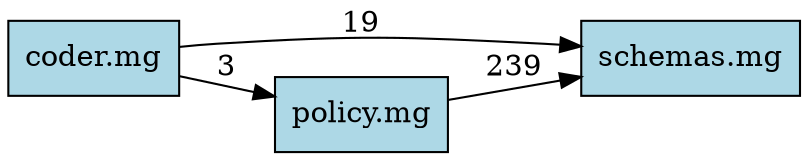

# Mangle Module Analysis Tools

This directory contains Python tools for analyzing Mangle programs.

## Tools

### 1. diagnose_stratification.py

Checks single Mangle files for stratification issues (negation cycles).

**Usage:**
```bash
python diagnose_stratification.py policy.mg
python diagnose_stratification.py policy.mg -v -g > deps.dot
```

**See:** [diagnose_stratification.py](./diagnose_stratification.py) header for full documentation.

### 2. analyze_module.py

**NEW!** Analyzes multiple Mangle files together for cross-file coherence.

**Features:**
- Cross-file dependency tracking
- Missing definition detection
- Duplicate definition conflicts
- Arity mismatch detection
- Module dependency graph generation
- Virtual predicate filtering (for Go FFI predicates)

**Quick Start:**

```bash
# Analyze all core Mangle files
python analyze_module.py internal/core/defaults/*.mg

# Generate dependency graph
python analyze_module.py *.mg --graph | dot -Tpng > deps.png

# Check completeness with known virtual predicates
python analyze_module.py *.mg --check-completeness \
  --virtual "file_content,symbol_at,tool_instance"

# JSON output for tooling integration
python analyze_module.py *.mg --json > analysis.json
```

## Common Workflows

### Pre-Commit Check

Before committing changes to .mg files:

```bash
# Check your changes don't break cross-file references
python analyze_module.py internal/core/defaults/*.mg --check-completeness \
  --virtual "$(cat virtual_predicates.txt)"
```

### Architecture Review

Generate module dependency visualization:

```bash
python analyze_module.py internal/core/defaults/*.mg --graph | \
  dot -Tpng -Gdpi=150 > module_architecture.png
```

### Find Unused Code

```bash
# Verbose mode shows unused exports
python analyze_module.py *.mg -v | grep "UNUSED EXPORTS" -A 100
```

### Integration Testing

```bash
# Exit code 0 = success, 1 = issues found
python analyze_module.py *.mg --check-completeness \
  --virtual "$(cat virtual_predicates.txt)" && \
  echo "All checks passed!" || \
  echo "Issues detected, review output above"
```

## Known Virtual Predicates

Create a file `virtual_predicates.txt` with Go FFI predicates:

```
file_content,symbol_at,tool_instance,shard_executed,external_api_call,
call_llm,ast_query,file_topology,symbol_graph,build_state,test_result,
tool_generated,tool_executed,dependency_node,edge_between,path_exists,
scope_contains,method_signature,type_constraint,interface_boundary,
cross_file_ref,import_chain,caller_of,callee_of,data_flow,control_flow,
test_file_for,testable_language,type_definition_file,code_symbol,
language_of,test_framework_for,related_file,build_tool,package_manager
```

Then use:
```bash
python analyze_module.py *.mg --virtual "$(cat virtual_predicates.txt | tr '\n' ' ')"
```

## Output Examples

### Text Report

```
======================================================================
CROSS-FILE ANALYSIS
======================================================================

Files analyzed: 3
  - schemas.mg
  - policy.mg
  - coder.mg

Total predicates: 609
Cross-file dependencies: 4
Conflicts: 12
Missing definitions: 29
Unused exports: 118

----------------------------------------------------------------------
MODULE DEPENDENCIES
----------------------------------------------------------------------

coder.mg
  ├── imports from: policy.mg (3 predicates)
  └── imports from: schemas.mg (19 predicates)

policy.mg
  ├── imports from: coder.mg (3 predicates)
  └── imports from: schemas.mg (239 predicates)

!!!!!!!!!!!!!!!!!!!!!!!!!!!!!!!!!!!!!!!!!!!!!!!!!!!!!!!!!!!!!!!!!!!!!!
CONFLICTS
!!!!!!!!!!!!!!!!!!!!!!!!!!!!!!!!!!!!!!!!!!!!!!!!!!!!!!!!!!!!!!!!!!!!!!

--- Conflict #1 (ERROR) ---
Type: arity_mismatch
Predicate: learning_signal
Message: Predicate 'learning_signal' defined with different arities: [1, 2]
Locations:
  policy.mg:1546
    learning_signal(/rule_success, RuleID)
  coder.mg:849
    learning_signal(/avoid, Pattern)
```

### DOT Graph



### JSON Output

```json
{
  "files_analyzed": ["schemas.mg", "policy.mg"],
  "statistics": {
    "total_predicates": 581,
    "total_definitions": 181,
    "cross_file_dependencies": 1
  },
  "conflicts": [
    {
      "type": "arity_mismatch",
      "predicate": "learning_signal",
      "severity": "error",
      "message": "Predicate 'learning_signal' defined with different arities: [1, 2]",
      "locations": [...]
    }
  ],
  "missing_definitions": [...],
  "unused_exports": [...],
  "status": "failed"
}
```

## Exit Codes

- **0**: No issues found
- **1**: Conflicts, missing definitions, or errors detected
- **2**: Parse error or fatal error

## Integration with CI/CD

### GitHub Actions

```yaml
- name: Analyze Mangle modules
  run: |
    python .claude/skills/mangle-programming/scripts/analyze_module.py \
      internal/core/defaults/*.mg \
      --check-completeness \
      --virtual "file_content,symbol_at,tool_instance,shard_executed" \
      --strict
```

### Pre-commit Hook

Add to `.git/hooks/pre-commit`:

```bash
#!/bin/bash
changed_mg_files=$(git diff --cached --name-only --diff-filter=ACM | grep '\.mg$')

if [ -n "$changed_mg_files" ]; then
  echo "Analyzing Mangle modules..."
  python .claude/skills/mangle-programming/scripts/analyze_module.py \
    internal/core/defaults/*.mg \
    --check-completeness \
    --virtual "$(cat .mangle-virtual-predicates)" || exit 1
fi
```

## Common Issues and Solutions

### Issue: "Predicate used but never defined"

**Cause:** Predicate is referenced but no rule defines it.

**Solutions:**
1. Add a definition in an appropriate .mg file
2. If it's a Go FFI predicate, add to `--virtual` list
3. If it's a typo, fix the reference

### Issue: "Arity mismatch"

**Cause:** Same predicate used with different numbers of arguments.

**Solution:** Standardize the arity across all files. Usually this is a bug.

### Issue: "Duplicate definition in multiple files"

**Cause:** Same predicate defined in multiple .mg files.

**Solution:**
- If intentional (multiple rules for same predicate), this is OK but flagged as warning
- If unintentional, consolidate into one file
- Use different predicate names for different concerns

## Tips

1. **Run regularly:** Include in your development workflow
2. **Track virtual predicates:** Maintain a centralized list
3. **Use --verbose:** Get detailed unused export analysis
4. **Generate graphs:** Visualize architecture regularly
5. **Automate:** Add to CI/CD pipeline

## Requirements

- Python 3.7+
- No external dependencies (stdlib only)
- Optional: Graphviz for DOT graph rendering

## See Also

- [Mangle Language Reference](../references/01_quickstart.md)
- [Stratification Guide](../references/04_advanced.md)
- [codeNERD Architecture](../../../../CLAUDE.md)
