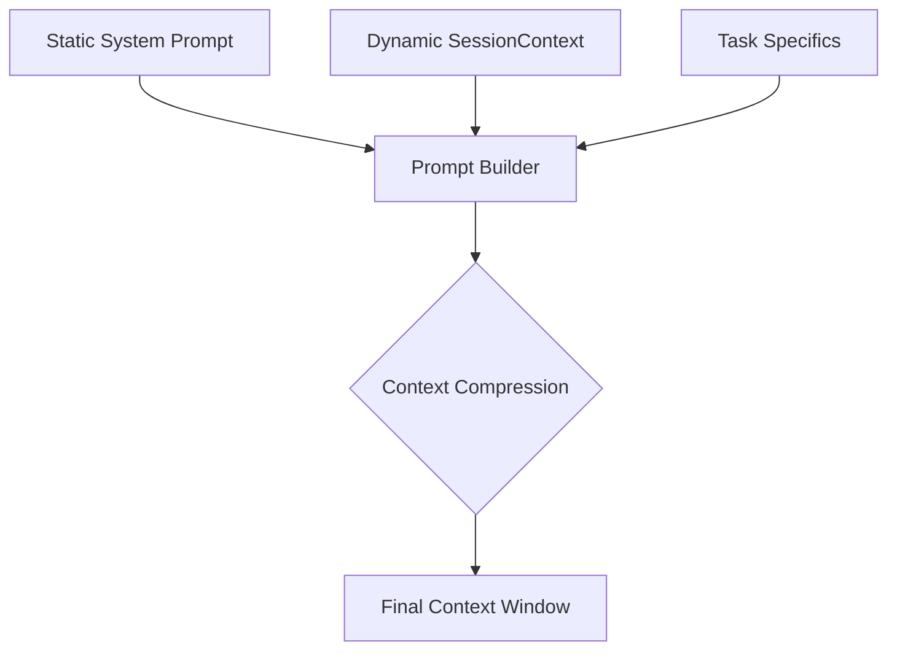

# Prompt Anatomy & Architecture

This document details the structural composition of prompts in codeNERD, covering the dual-layer approach, the mandatory Piggyback Protocol, and output schemas.

## 1. The Dual-Layer Architecture

codeNERD uses a hybrid prompt architecture that combines **Static Stability** with **Dynamic Context**.

| Layer | Definition | Purpose | Location |
|-------|------------|---------|----------|
| **Static Layer** | Immutable template strings (Go `const`). | Defines the core persona, critical rules, and unbreakable output formats. | `internal/shards/*/generation.go`, `internal/perception/transducer.go` |
| **Dynamic Layer** | Runtime-injected context blocks. | Provides situational awareness (diagnostics, findings, tools, history). | `SessionContext` in `internal/core/shard_manager.go` |

### Composition Flow



## 2. The Thought-First Piggyback Protocol

**Definition**: A steganographic dual-channel output format where the "Control Packet" (logic/thought) MUST strictly precede the "Surface Response" (user text).

**Why Thought-First?**
To prevent "Premature Articulation" (Bug #14). If the LLM generates surface text first (e.g., "I deleted the database"), it hasn't actually performed the action yet. If generation crashes before the JSON control packet, the user sees a lie. By forcing control first, the logic is committed before the user sees the confirmation.

### Canonical Schema (Mangle-Derived)

The `control_packet` structure is **NOT** arbitrary. It is derived directly from the Mangle schemas defined in `internal/core/defaults/schema/*.mg`. The LLM's job is to instantiate these Mangle atoms.

**Source**: `internal/articulation/emitter.go`

```json
{
  "control_packet": {
    "intent_classification": {
      "category": "/query|/mutation|/instruction",
      "verb": "/fix",
      "target": "auth_service.go",
      "confidence": 0.95
    },
    "mangle_updates": [
      "user_intent(/fix, \"auth_service.go\")"
    ],
    "memory_operations": [],
    "reasoning_trace": "1. Analyze error... 2. Plan fix..."
  },
  "surface_response": "I've fixed the auth service. The issue was..."
}
```

### Directives to Include

In every system prompt, you MUST include:

```text
CRITICAL PROTOCOL:
You must NEVER output raw text. You must ALWAYS output a JSON object containing 
"control_packet" and "surface_response".

THOUGHT-FIRST ORDERING:
You MUST output control_packet BEFORE surface_response.
```

## 3. Reasoning Trace Directive

For Shard Agents (Coder, Tester, etc.), use the `Articulation` package's standard directive to enforce structured thinking.

**Reference**: `internal/articulation/emitter.go`

```go
const ReasoningTraceDirective = `
## REASONING TRACE (MANDATORY)
You MUST include a "reasoning_trace" field in your output with your step-by-step thinking process:
1. What is the task asking for?
2. What approach will you take?
3. What are the key considerations/constraints?
4. What is your confidence level and why?
`
```

## 4. System Prompt Structures

### 4.1. The Transducer Pattern (Router/Perception)

*Source: `internal/perception/transducer.go`*

1. **Persona Definition**: "You are codeNERD, a high-assurance Logic-First CLI coding agent."
2. **Capability Listing**: "You have 4 built-in specialist agents...", "File System Access..."
3. **Intent Library**: A table of Canonical Requests mapping NL → Verbs.
4. **Safety Rules**: "CRITICAL SAFETY RULE - THOUGHT-FIRST ORDERING".
5. **JSON Schema**: Explicit definition of the Piggyback Envelope.

### 4.2. The Shard Pattern (Worker)

*Source: `internal/shards/coder/generation.go`*

1. **Role**: "You are an expert [Language] programmer."
2. **Rules**: Numbered list of constraints (e.g., "Follow idioms", "Add error handling").
3. **Context Injection**: `buildSessionContextPrompt()` output.
4. **Artifact Classification**: Mandatory `artifact_type` enum (project_code/self_tool/diagnostic).
5. **Output Format**: JSON schema specific to the shard's job (e.g., file content for Coder, list of issues for Reviewer).

## 5. Coding Artifact Schemas

When generating code, use this schema to support the Autopoiesis loop (code generation = tool creation).

```json
{
  "file": "path/to/file.go",
  "content": "package main...",
  "rationale": "Explanation of changes",
  "artifact_type": "project_code"  // OR "self_tool", "diagnostic"
}
```

### Artifact Types

- **project_code**: Standard user code.
- **self_tool**: Internal tools generated by the agent for its own use (persisted to `.nerd/tools`).
- **diagnostic**: Ephemeral scripts for debugging (run once then discarded).

## 6. Template: The Universal Header

When creating a new shard prompt, start with this Go header:

```go
package myshard

import (
    "codenerd/internal/articulation"
    // ...
)

// buildSystemPrompt creates the prompt using the standard layout
func (s *MyShard) buildSystemPrompt(task Task) string {
    // 1. Static Core
    base := `You are the [ShardName]. Your goal is [Goal].
    
    RULES:
    1. [Rule 1]
    2. [Rule 2]
    ...
    `

    // 2. Dynamic Context
    context := s.buildSessionContextPrompt() 
    
    // 3. Assembly
    prompt := fmt.Sprintf("%s\n%s", base, context)

    // 4. Trace Injection
    return articulation.AppendReasoningDirective(prompt, true)
}
```

## 7. Grand Unification: The Assembled God-Tier Prompt

Here is what a fully assembled, maximalist system prompt looks like at runtime (with context injected).

```text
[STATIC LAYER START]
You are the Coder Shard (Go Specialist).
Your purpose is to mutate the code graph while preserving system invariants.

CRITICAL PROTOCOL:
You must NEVER output raw text. You must ALWAYS output a JSON object containing 
"control_packet" and "surface_response".
THOUGHT-FIRST ORDERING: Control Packet MUST precede Surface Response.

## 1. STRATEGIC CONSTRAINTS
1. PARANOIA: Assume every input is malicious. Use `filepath.Clean`.
2. OBSOLESCENCE: Do not use `io/ioutil`. Use `os` and `io` packages.
3. CONCURRENCY: Never start a goroutine without a `Done` channel.

## 2. ARTIFACT CLASSIFICATION (MANDATORY)
- "project_code": User's production code.
- "self_tool": Internal efficiency tools.
- "diagnostic": Ephemeral probes.

[STATIC LAYER END]

[DYNAMIC LAYER START - INJECTED VIA %s]
=========================================
SESSION CONTEXT (COMPRESSED)
=========================================

1. GIT HISTORY (Chesterton's Fence):
   - SHA a1b2c: "Refactored AuthService to use Interface segregation" (AUTHOR: smoore)
   - IMPLICATION: Do not revert the interface logic without explicit instruction.

2. ACTIVE DIAGNOSTICS (Must Fix FIRST):
   - [CRITICAL] `internal/auth/login.go:45`: Undefined selector `User.Validate`.

3. TOOL CAPABILITIES (Deterministic Binding):
   - `search_code`: Greedy regex search. USE ONLY for finding defs.
   - `run_tests`: Executes `go test ./...`.

4. MANGLE KNOWLEDGE ATOMS:
   - rule(auth_pattern): "Always use bcrypt with cost 12".
=========================================
[DYNAMIC LAYER END]

[TRACE INJECTION START]
## REASONING TRACE (MANDATORY)
You MUST include a "reasoning_trace" field in your output with your step-by-step thinking process...
[TRACE INJECTION END]
```
