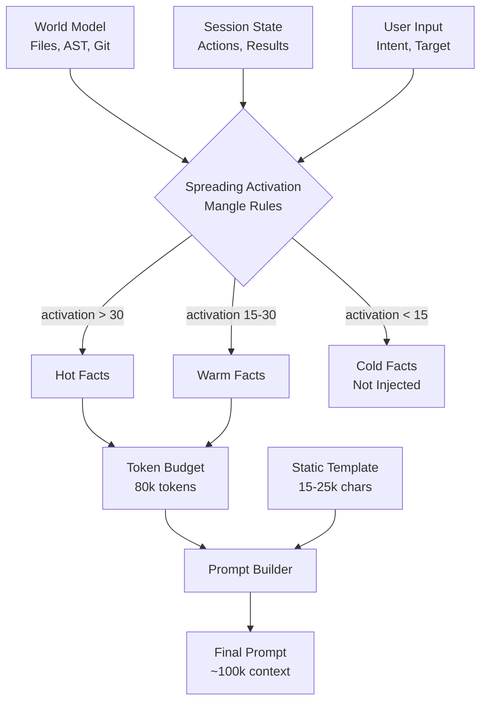

# Context Injection & Session State

In codeNERD, "Context" is not a window; it is a **Curated Stream**. We do not blindly dump file contents into the prompt. We use **Spreading Activation** and **Priority Layers** to ensure that "Working Memory" contains only the most actionable information.

**The Breakthrough**: Because Mangle compresses semantic state at >100:1 ratio, we have **massive headroom** for extensive context injection. A 20-turn conversation that would consume 50k tokens in raw text consumes only 500 atoms. This means our prompts can be 2-3x longer than traditional agents.

---

## 1. The Context Pipeline



---

## 2. SessionContext: The Complete Schema

The `SessionContext` struct is the vehicle for ALL dynamic context. It is defined in `internal/core/shard_manager.go` and contains **15+ distinct categories** of information.

```go
type SessionContext struct {
    // =========================================================================
    // PRIORITY 1: CRITICAL BLOCKERS (Must Address First)
    // =========================================================================

    // CurrentDiagnostics contains active build/lint errors.
    // These are BLOCKERS - the LLM must address these before anything else.
    // Format: "severity:file:line:message"
    // Example: "error:internal/auth/login.go:45:undefined: ValidateToken"
    CurrentDiagnostics []string

    // TestState indicates the current test status.
    // Values: "/passing", "/failing", "/unknown"
    TestState string

    // FailingTests lists specific test names that are failing.
    // Format: "TestName/SubTestName"
    // Example: "TestValidateToken/empty_token"
    FailingTests []string

    // TDDRetryCount tracks how many times we've tried to fix failing tests.
    // If > 1, the LLM's previous fix was wrong and it needs to think harder.
    // If >= 3, escalate to user (surrender).
    TDDRetryCount int

    // =========================================================================
    // PRIORITY 2: SUPERVISORY GUIDANCE
    // =========================================================================

    // RecentFindings contains outputs from ReviewerShard or TesterShard.
    // These are issues identified by other shards that should be considered.
    // Format: "[CATEGORY] description"
    // Example: "[SECURITY] SQL injection risk in UserQuery"
    RecentFindings []string

    // SafetyWarnings are Constitutional alerts about dangerous patterns.
    // The LLM must acknowledge and respect these.
    // Example: "Modifying .git directory requires explicit permission"
    SafetyWarnings []string

    // BlockedActions are actions the kernel has forbidden.
    // The LLM should not attempt these.
    // Example: "rm -rf is blocked by Constitutional rule"
    BlockedActions []string

    // TaskDependencies are tasks that must complete before the current task.
    // If non-empty, the LLM may be blocked.
    // Example: ["T001:schema_migration", "T002:backup_database"]
    TaskDependencies []string

    // =========================================================================
    // PRIORITY 3: LOCAL NEIGHBORHOOD (Situational Awareness)
    // =========================================================================

    // ImpactedFiles are files that will be affected by changes to the target.
    // Derived from dependency_link(Target, Impacted, _) in Mangle.
    // Example: ["internal/auth/middleware.go", "cmd/server/main.go"]
    ImpactedFiles []string

    // DependencyContext lists direct imports/dependencies of the target.
    // Helps the LLM understand what the code uses.
    // Example: ["context", "fmt", "internal/store"]
    DependencyContext []string

    // CodeDOMWarnings are metadata warnings about the code structure.
    // Example: "WARNING: This is generated code (protoc). Changes will be overwritten."
    // Example: "NOTE: This file contains CGo. Be careful with memory management."
    CodeDOMWarnings []string

    // =========================================================================
    // PRIORITY 4: HISTORICAL CONTEXT (Understanding)
    // =========================================================================

    // GitBranch is the current branch name.
    GitBranch string

    // GitModifiedFiles lists uncommitted modified files.
    GitModifiedFiles []string

    // GitRecentCommits provides context for WHY code exists.
    // Format: "sha: message (author)"
    // Example: "abc123: Disabled caching due to race condition (jsmith)"
    // This is CRITICAL for Chesterton's Fence - don't "fix" things you don't understand.
    GitRecentCommits []string

    // CompressedHistory is a semantic summary of recent turns.
    // Not raw chat log, but compressed atoms: "user requested /fix on auth.go"
    CompressedHistory string

    // =========================================================================
    // PRIORITY 5: CAMPAIGN CONTEXT (Multi-Phase Goals)
    // =========================================================================

    // CampaignActive indicates if we're in a multi-phase campaign.
    CampaignActive bool

    // CampaignPhase is the current phase name.
    // Example: "Phase 2: Implementation"
    CampaignPhase string

    // CampaignGoal is the goal for the current phase.
    // Example: "Implement user authentication with JWT"
    CampaignGoal string

    // LinkedRequirements are requirement IDs this task fulfills.
    // Example: ["REQ-AUTH-001", "REQ-AUTH-002"]
    LinkedRequirements []string

    // =========================================================================
    // PRIORITY 6: CROSS-SHARD AWARENESS (Blackboard Pattern)
    // =========================================================================

    // PriorShardOutputs are results from other shards in the same turn.
    // This enables shards to build on each other's work.
    PriorShardOutputs []ShardResult

    // RecentActions are actions taken in recent turns.
    // Example: ["/fix auth.go", "/test ./...", "/review internal/"]
    RecentActions []string

    // =========================================================================
    // PRIORITY 7: DOMAIN EXPERTISE (Type B/U Specialists)
    // =========================================================================

    // KnowledgeAtoms are domain-specific facts for specialists.
    // Injected when spawning Type B (Persistent) or Type U (User) shards.
    // Example: "bcrypt cost must be >= 12 for password hashing"
    KnowledgeAtoms []string

    // SpecialistHints are task-specific suggestions from knowledge base.
    // Example: "HINT: The auth service uses RS256 for JWT, not HS256"
    SpecialistHints []string

    // =========================================================================
    // PRIORITY 8: TOOL AWARENESS (Ouroboros Integration)
    // =========================================================================

    // AvailableTools are self-generated tools the Coder can use.
    // If a tool exists for the task, USE IT instead of writing new code.
    AvailableTools []ToolInfo

    // =========================================================================
    // EXECUTION FLAGS
    // =========================================================================

    // DreamMode indicates the shard should simulate, not execute.
    // When true: "What WOULD you do?" not "DO this."
    DreamMode bool
}
```

---

## 3. Priority Injection Order

The SessionContext is NOT dumped as a blob. It is injected in **strict priority order**, ensuring the most critical information appears first and gets the most attention.

### Priority 1: The "Bleeding Edge" (MUST FIX)

These are active failures. The model MUST address these before doing anything else.

```text
CURRENT BUILD/LINT ERRORS (must address):
  error:internal/auth/login.go:45: undefined: ValidateToken
  error:internal/auth/login.go:52: cannot use nil as type *Claims

TEST STATE: FAILING
  TDD Retry: 2 (fix the root cause, not symptoms)
  - TestValidateToken/empty_token
  - TestValidateToken/expired_token
```

**Injection Rule**: If `len(CurrentDiagnostics) > 0` OR `TestState == "/failing"`, these appear FIRST in the dynamic section.

**Why First**: If the codebase doesn't compile, nothing else matters. The model must internalize that it cannot proceed until these are resolved.

### Priority 2: The "Supervisor" (Guidance)

External constraints and directives that shape behavior.

```text
RECENT FINDINGS TO ADDRESS:
  - [SECURITY] SQL injection risk in UserQuery (ReviewerShard)
  - [PERFORMANCE] N+1 query in GetAllUsers (ReviewerShard)
  - [TEST] Missing coverage for error paths (TesterShard)

SAFETY CONSTRAINTS:
  WARNING: Modifying internal/core/ requires explicit permission
  BLOCKED: rm -rf is forbidden by Constitutional rule
```

**Injection Rule**: Appears after diagnostics but before task-specific context.

**Why This Order**: These shape HOW the model approaches the task. It should know about security findings before generating code.

### Priority 3: The "Local Neighborhood" (Situational)

Context specific to the target file/function.

```text
IMPACTED FILES (may need updates):
  - internal/auth/middleware.go (imports login.go)
  - cmd/server/main.go (calls ValidateToken)
  - internal/auth/login_test.go (tests ValidateToken)

DEPENDENCY CONTEXT:
  - context
  - fmt
  - internal/store
  - github.com/golang-jwt/jwt/v4

CODE CONTEXT:
  - WARNING: This file contains CGo. Be careful with memory management.
  - NOTE: ValidateToken is called from 12 locations.
```

**Injection Rule**: Appears when the task has a specific target file.

**Why This Order**: Prevents the model from making changes that break callers.

### Priority 4: The "Deep Past" (Understanding)

Historical context that explains WHY things are the way they are.

```text
GIT STATE:
  Branch: feature/auth-refactor
  Modified files: 3
  Recent commits (context for why code exists):
    - abc123: "Disabled token caching due to race condition" (jsmith)
    - def456: "Added timeout to prevent hanging" (alee)
    - ghi789: "Reverted optimization - caused memory leak" (jsmith)
```

**Injection Rule**: Always include if available. Essential for Chesterton's Fence.

**Why**: If a commit says "Reverted optimization - caused memory leak", the model should NOT re-apply that "optimization".

### Priority 5: The "Campaign Map" (Multi-Phase)

Context for long-running, multi-phase goals.

```text
CAMPAIGN CONTEXT:
  Current Phase: Phase 2 - Implementation
  Phase Goal: Implement JWT-based authentication
  Blocked by: T001:schema_migration (waiting)
  Fulfills requirements: REQ-AUTH-001, REQ-AUTH-002, REQ-AUTH-003
```

**Injection Rule**: Appears when `CampaignActive == true`.

**Why**: Keeps the model aligned with the larger goal, not just the immediate task.

### Priority 6: The "Peers" (Cross-Shard)

Results from other shards in the current or recent turns.

```text
PRIOR SHARD RESULTS:
  [reviewer] SUCCESS: Code review complete - 2 issues found
  [tester] FAILED: Test run failed - 3 failing tests
```

**Injection Rule**: Appears when there are recent shard outputs.

**Why**: Enables shards to build on each other. If Reviewer found issues, Coder should know.

### Priority 7: The "Expert" (Domain Knowledge)

For Type B/U specialists, injected domain expertise.

```text
DOMAIN KNOWLEDGE:
  - Always use bcrypt with cost >= 12 for password hashing
  - JWT RS256 requires public/private key pair, HS256 uses shared secret
  - HINT: This codebase uses RS256 - check for key loading
  - EXEMPLAR: See internal/auth/keys.go for key loading pattern
  - ANTI-PATTERN: Never store JWTs in localStorage (XSS risk)
```

**Injection Rule**: Appears for Type B (Persistent) and Type U (User) specialists.

**Why**: Hydrates the specialist with domain-specific expertise not in base training.

### Priority 8: The "Toolbox" (Self-Generated Tools)

Tools created by previous Ouroboros cycles.

```text
AVAILABLE TOOLS (use instead of creating new ones):
  - ast_analyzer: Analyze Go AST for patterns
    Binary: .nerd/tools/.compiled/ast_analyzer
  - dep_graph: Generate dependency graph
    Binary: .nerd/tools/.compiled/dep_graph
  NOTE: If a tool already exists for the task, USE IT instead of creating a new one.
```

**Injection Rule**: Appears when `len(AvailableTools) > 0`.

**Why**: Prevents the model from reinventing tools that already exist.

---

## 4. Spreading Activation Logic

We do not use vector similarity to select context. We use **Logic-Driven Activation**.

### The Activation Algorithm

Source: `internal/core/defaults/policy.mg` (Section 1)

```mangle
// =============================================================================
// SPREADING ACTIVATION RULES
// =============================================================================

// Base Activation: Active goal seeds activation
activation(Fact, 100) :-
    active_goal(Goal),
    directly_relevant(Fact, Goal).

// Spreading via Dependencies: Files that import the target get activation
activation(FileB, Score * 0.6) :-
    activation(FileA, Score),
    Score > 20,
    dependency_link(FileA, FileB, _).

// Spreading via Symbols: Functions called by active code get activation
activation(FuncB, Score * 0.7) :-
    activation(FuncA, Score),
    Score > 20,
    calls(FuncA, FuncB).

// Spreading via Errors: Files with errors get boosted
activation(File, Score + 50) :-
    activation(File, Score),
    diagnostic(/error, File, _, _, _).

// Spreading via Recency: Recently modified files get boost
activation(File, Score + 30) :-
    activation(File, Score),
    file_state(File, /modified).

// Spreading via Tests: Test files for active code get activation
activation(TestFile, Score * 0.8) :-
    activation(SourceFile, Score),
    Score > 20,
    tests_file(TestFile, SourceFile).

// Threshold: Only facts above threshold enter context
context_atom(Fact) :-
    activation(Fact, Score),
    Score > 30.

// Priority: Higher activation = earlier in prompt
context_priority(Fact, Score) :-
    activation(Fact, Score),
    Score > 30.
```

### Activation Weights by Predicate Type

Source: `internal/context/activation.go`

| Predicate Type | Base Weight | Decay | Notes |
|----------------|-------------|-------|-------|
| `diagnostic(/error, ...)` | +100 | None | Errors are always hot |
| `diagnostic(/warning, ...)` | +50 | None | Warnings are warm |
| `user_intent(...)` | +100 | None | Current intent is hot |
| `file_state(_, /modified)` | +30 | -5/turn | Recently modified files |
| `dependency_link(A, B, _)` | A * 0.6 | -10/hop | Transitive dependencies |
| `calls(A, B)` | A * 0.7 | -10/hop | Call graph |
| `symbol_graph(_, _, _, File, _)` | +20 | None | Symbols in active files |
| `knowledge_atom(Topic, _, _)` | +40 | None | Domain knowledge |
| `shard_executed(_, _, _, _)` | +25 | -10/turn | Cross-shard context |

### Example Activation Trace

```
User: "Fix the null pointer in ValidateToken"

1. Parse intent → user_intent(/id1, /mutation, /fix, "ValidateToken", _)

2. Resolve target → focus_resolution("ValidateToken", "internal/auth/login.go", "ValidateToken", 0.95)

3. Seed activation:
   - internal/auth/login.go: 100 (target)
   - ValidateToken (function): 100 (target symbol)

4. Spread via dependencies:
   - internal/auth/middleware.go: 60 (imports login.go)
   - cmd/server/main.go: 60 (imports login.go)

5. Spread via calls:
   - parseToken (called by ValidateToken): 70
   - getClaims (called by ValidateToken): 70

6. Boost for errors:
   - internal/auth/login.go: 100 + 50 = 150 (has error at line 45)

7. Spread via tests:
   - internal/auth/login_test.go: 120 (tests login.go)

8. Final activation scores:
   - internal/auth/login.go: 150 ✓ (above 30)
   - internal/auth/login_test.go: 120 ✓
   - ValidateToken: 100 ✓
   - parseToken: 70 ✓
   - internal/auth/middleware.go: 60 ✓
   - cmd/server/main.go: 60 ✓
   - getClaims: 70 ✓
   - unrelated_file.go: 0 ✗ (not injected)
```

---

## 5. Token Budgeting Strategy

We have ~128k tokens total. Here is how we allocate them:

### Budget Allocation

| Category | Tokens | Percentage | Notes |
|----------|--------|------------|-------|
| Static System Prompt | 20,000 | 15.6% | God Tier template (fixed) |
| Tool Definitions | 10,000 | 7.8% | Available tools/actions |
| **Dynamic SessionContext** | 80,000 | 62.5% | Variable, priority-ordered |
| Output Buffer | 8,000 | 6.3% | Reserved for LLM response |
| Safety Margin | 10,000 | 7.8% | Overflow protection |

### Dynamic Budget Allocation

Within the 80k SessionContext budget:

| Priority | Max Tokens | Category |
|----------|------------|----------|
| P1 | 10,000 | Diagnostics + Test State |
| P2 | 8,000 | Supervisor (Findings, Safety) |
| P3 | 20,000 | Local Neighborhood (Files, Deps) |
| P4 | 10,000 | Historical (Git, Commits) |
| P5 | 8,000 | Campaign Context |
| P6 | 8,000 | Cross-Shard Results |
| P7 | 10,000 | Domain Knowledge |
| P8 | 6,000 | Available Tools |

### Compression Strategies

When budget is exceeded, apply these strategies in order:

1. **Truncate CompressedHistory** - Oldest turns first
2. **Limit GitRecentCommits** - Keep only last 5
3. **Summarize RecentFindings** - Group by category
4. **Reduce ImpactedFiles** - Keep only 1-hop dependencies
5. **Prune KnowledgeAtoms** - Keep only highest-confidence

---

## 6. Implementing New Context Categories

To add a new context category:

### Step 1: Add to SessionContext Struct

```go
// internal/core/shard_manager.go

type SessionContext struct {
    // ... existing fields ...

    // MyNewContext describes [what this context is].
    // Format: [format specification]
    // Example: [example value]
    MyNewContext []string
}
```

### Step 2: Populate in PrepareSessionContext

```go
// internal/core/shard_manager.go

func (sm *ShardManager) PrepareSessionContext(ctx context.Context, task string) *SessionContext {
    sessCtx := &SessionContext{
        // ... existing population ...
    }

    // Populate MyNewContext
    if myData, err := sm.fetchMyNewData(ctx); err == nil {
        sessCtx.MyNewContext = myData
    }

    return sessCtx
}
```

### Step 3: Render in buildSessionContextPrompt

```go
// internal/shards/coder/generation.go (or base shard)

func (c *CoderShard) buildSessionContextPrompt() string {
    // ... existing rendering ...

    // ==========================================================================
    // MY NEW CONTEXT (Priority X)
    // ==========================================================================
    if len(ctx.MyNewContext) > 0 {
        sb.WriteString("\nMY NEW CONTEXT (why this matters):\n")
        for _, item := range ctx.MyNewContext {
            sb.WriteString(fmt.Sprintf("  - %s\n", item))
        }
    }

    return sb.String()
}
```

### Step 4: Add Activation Rule

```mangle
// internal/core/defaults/policy.mg

// My new context gets activation when [condition]
activation(MyFact, 40) :-
    my_new_predicate(MyFact),
    [relevance condition].
```

---

## 7. Context Injection Best Practices

### DO: Explain Why Context Matters

```text
GIT STATE:
  Recent commits (context for why code exists):
    - abc123: "Disabled caching due to race condition" (jsmith)
```

The phrase "context for why code exists" tells the model HOW to use this information.

### DO: Use Consistent Formatting

```text
CURRENT BUILD/LINT ERRORS (must address):
  error:file.go:45: message

TEST STATE: FAILING
  - TestName/SubTest
```

Consistent prefixes and indentation help the model parse the context.

### DON'T: Dump Raw Data

```text
// BAD
Here is the file content:
[2000 lines of code]
```

Raw file dumps waste tokens and dilute attention.

### DO: Use Semantic Compression

```text
// GOOD
file_state("auth.go", /modified, "added ValidateToken function")
symbol_added("ValidateToken", /function, "auth.go", 45)
```

Atoms are dense. The model expands them.

### DON'T: Include Irrelevant Context

```text
// BAD - Why is the weather mentioned?
CONTEXT:
  - Weather: Sunny
  - User location: NYC
  - Random fact: The sky is blue
```

Every token must serve the task.

### DO: Prioritize Actionable Information

```text
// GOOD
CURRENT BUILD ERRORS (must address FIRST):
  error:auth.go:45: undefined ValidateToken

This blocks all other work. Fix this first.
```

Tell the model what to do with the context.

---

## 8. The buildSessionContextPrompt Implementation

Here is the full implementation pattern from `internal/shards/coder/generation.go`:

```go
func (c *CoderShard) buildSessionContextPrompt() string {
    if c.config.SessionContext == nil {
        return ""
    }

    var sb strings.Builder
    ctx := c.config.SessionContext

    // ==========================================================================
    // PRIORITY 1: CURRENT DIAGNOSTICS (Highest Priority - Must Fix)
    // ==========================================================================
    if len(ctx.CurrentDiagnostics) > 0 {
        sb.WriteString("\nCURRENT BUILD/LINT ERRORS (must address):\n")
        for _, diag := range ctx.CurrentDiagnostics {
            sb.WriteString(fmt.Sprintf("  %s\n", diag))
        }
    }

    // ==========================================================================
    // PRIORITY 1.5: TEST STATE (TDD Loop Awareness)
    // ==========================================================================
    if ctx.TestState == "/failing" || len(ctx.FailingTests) > 0 {
        sb.WriteString("\nTEST STATE: FAILING\n")
        if ctx.TDDRetryCount > 0 {
            sb.WriteString(fmt.Sprintf("  TDD Retry: %d (fix the root cause, not symptoms)\n", ctx.TDDRetryCount))
        }
        for _, test := range ctx.FailingTests {
            sb.WriteString(fmt.Sprintf("  - %s\n", test))
        }
    }

    // ==========================================================================
    // PRIORITY 2: RECENT FINDINGS TO ADDRESS (from reviewer/tester)
    // ==========================================================================
    if len(ctx.RecentFindings) > 0 {
        sb.WriteString("\nRECENT FINDINGS TO ADDRESS:\n")
        for _, finding := range ctx.RecentFindings {
            sb.WriteString(fmt.Sprintf("  - %s\n", finding))
        }
    }

    // ==========================================================================
    // PRIORITY 2.5: SAFETY CONSTRAINTS
    // ==========================================================================
    if len(ctx.BlockedActions) > 0 || len(ctx.SafetyWarnings) > 0 {
        sb.WriteString("\nSAFETY CONSTRAINTS:\n")
        for _, blocked := range ctx.BlockedActions {
            sb.WriteString(fmt.Sprintf("  BLOCKED: %s\n", blocked))
        }
        for _, warning := range ctx.SafetyWarnings {
            sb.WriteString(fmt.Sprintf("  WARNING: %s\n", warning))
        }
    }

    // ==========================================================================
    // PRIORITY 3: IMPACT ANALYSIS (Transitive Effects)
    // ==========================================================================
    if len(ctx.ImpactedFiles) > 0 {
        sb.WriteString("\nIMPACTED FILES (may need updates):\n")
        for _, file := range ctx.ImpactedFiles {
            sb.WriteString(fmt.Sprintf("  - %s\n", file))
        }
    }

    // ==========================================================================
    // PRIORITY 3.5: DEPENDENCY CONTEXT (1-hop)
    // ==========================================================================
    if len(ctx.DependencyContext) > 0 {
        sb.WriteString("\nDEPENDENCY CONTEXT:\n")
        for _, dep := range ctx.DependencyContext {
            sb.WriteString(fmt.Sprintf("  - %s\n", dep))
        }
    }

    // ==========================================================================
    // PRIORITY 4: GIT STATE (Chesterton's Fence)
    // ==========================================================================
    if ctx.GitBranch != "" || len(ctx.GitModifiedFiles) > 0 {
        sb.WriteString("\nGIT STATE:\n")
        if ctx.GitBranch != "" {
            sb.WriteString(fmt.Sprintf("  Branch: %s\n", ctx.GitBranch))
        }
        if len(ctx.GitModifiedFiles) > 0 {
            sb.WriteString(fmt.Sprintf("  Modified files: %d\n", len(ctx.GitModifiedFiles)))
        }
        if len(ctx.GitRecentCommits) > 0 {
            sb.WriteString("  Recent commits (context for why code exists):\n")
            for _, commit := range ctx.GitRecentCommits {
                sb.WriteString(fmt.Sprintf("    - %s\n", commit))
            }
        }
    }

    // ==========================================================================
    // PRIORITY 5: CAMPAIGN CONTEXT (if in campaign)
    // ==========================================================================
    if ctx.CampaignActive {
        sb.WriteString("\nCAMPAIGN CONTEXT:\n")
        if ctx.CampaignPhase != "" {
            sb.WriteString(fmt.Sprintf("  Current Phase: %s\n", ctx.CampaignPhase))
        }
        if ctx.CampaignGoal != "" {
            sb.WriteString(fmt.Sprintf("  Phase Goal: %s\n", ctx.CampaignGoal))
        }
        if len(ctx.TaskDependencies) > 0 {
            sb.WriteString("  Blocked by: ")
            sb.WriteString(strings.Join(ctx.TaskDependencies, ", "))
            sb.WriteString("\n")
        }
        if len(ctx.LinkedRequirements) > 0 {
            sb.WriteString("  Fulfills requirements: ")
            sb.WriteString(strings.Join(ctx.LinkedRequirements, ", "))
            sb.WriteString("\n")
        }
    }

    // ==========================================================================
    // PRIORITY 6: PRIOR SHARD OUTPUTS (Cross-Shard Context)
    // ==========================================================================
    if len(ctx.PriorShardOutputs) > 0 {
        sb.WriteString("\nPRIOR SHARD RESULTS:\n")
        for _, output := range ctx.PriorShardOutputs {
            status := "SUCCESS"
            if !output.Success {
                status = "FAILED"
            }
            sb.WriteString(fmt.Sprintf("  [%s] %s: %s - %s\n",
                output.ShardType, status, output.Task, output.Summary))
        }
    }

    // ==========================================================================
    // PRIORITY 6.5: RECENT SESSION ACTIONS
    // ==========================================================================
    if len(ctx.RecentActions) > 0 {
        sb.WriteString("\nRECENT SESSION ACTIONS:\n")
        for _, action := range ctx.RecentActions {
            sb.WriteString(fmt.Sprintf("  - %s\n", action))
        }
    }

    // ==========================================================================
    // PRIORITY 7: DOMAIN KNOWLEDGE (Type B Specialist Hints)
    // ==========================================================================
    if len(ctx.KnowledgeAtoms) > 0 || len(ctx.SpecialistHints) > 0 {
        sb.WriteString("\nDOMAIN KNOWLEDGE:\n")
        for _, atom := range ctx.KnowledgeAtoms {
            sb.WriteString(fmt.Sprintf("  - %s\n", atom))
        }
        for _, hint := range ctx.SpecialistHints {
            sb.WriteString(fmt.Sprintf("  - HINT: %s\n", hint))
        }
    }

    // ==========================================================================
    // PRIORITY 8: AVAILABLE TOOLS (Self-Generated via Ouroboros)
    // ==========================================================================
    if len(ctx.AvailableTools) > 0 {
        sb.WriteString("\nAVAILABLE TOOLS (use instead of creating new ones):\n")
        for _, tool := range ctx.AvailableTools {
            sb.WriteString(fmt.Sprintf("  - %s: %s\n", tool.Name, tool.Description))
            sb.WriteString(fmt.Sprintf("    Binary: %s\n", tool.BinaryPath))
        }
        sb.WriteString("  NOTE: If a tool already exists for the task, USE IT.\n")
    }

    // ==========================================================================
    // PRIORITY 9: COMPRESSED SESSION HISTORY (Long-range context)
    // ==========================================================================
    if ctx.CompressedHistory != "" && len(ctx.CompressedHistory) < 2000 {
        sb.WriteString("\nSESSION HISTORY (compressed):\n")
        sb.WriteString(ctx.CompressedHistory)
        sb.WriteString("\n")
    }

    return sb.String()
}
```

This implementation ensures:
1. **Priority ordering** - Critical blockers first
2. **Conditional rendering** - Only show sections with content
3. **Consistent formatting** - Easy for LLM to parse
4. **Explanatory labels** - Tell the model WHY context matters
5. **Budget awareness** - CompressedHistory truncated if too long
