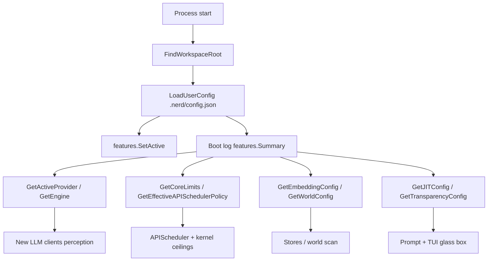

# codeNERD Config — Implemented Spec (Deep-Dive)

> Last verified against codebase: 2026-07-13  
> Status: Living Reference Document  
> Language: Go  
> Primary sources: `internal/config/`  
> Scale: **17** non-test Go files ≈ **3.1k** lines; **5** test files ≈ **1.6k** lines; **0** Mangle sources  

## 1. Overview

`internal/config` is the **configuration substrate** for the codeNERD binary and libraries. It does not run the OODA loop; it **feeds** every subsystem that does: LLM clients (perception), API scheduler and fact ceilings (core), JIT token budgets (prompt), execution allowlists (tactile), world scan workers, embeddings, transparency/glass-box, and feature flags.

Two coexisting aggregates exist:

| Aggregate | On-disk format | Role today |
|-----------|----------------|------------|
| **`UserConfig`** | JSON `.nerd/config.json` | **Authoritative** runtime config; `Get*` helpers apply defaults |
| **`Config`** | YAML (optional path) | Legacy monolithic defaults + env overrides; still used by `cmd/nerd/main.go` early load |

### Key characteristics

| Property | Value |
|----------|-------|
| Live file | `.nerd/config.json` via `DefaultUserConfigPath()` |
| Workspace root | `FindWorkspaceRoot()` — **go.mod first**, deepest `.nerd` fallback |
| Engines | `api`, `claude-cli`, `codex-cli`, `xai-oauth` |
| Providers | `zai`, `anthropic`, `openai`, `gemini`, `xai`, `openrouter`, `ollama` |
| Config-is-boss | Explicit `provider` never silently falls back to another provider’s key |
| Feature install | `LoadUserConfig` → `features.SetActive(cfg.Features)` |
| Global timeouts | `GetLLMTimeouts()` / `SetLLMTimeouts()` process singleton |
| Constitutional edge | `ExecutionConfig.AllowedBinaries` / `AllowedEnvVars` (data for tactile) |

### High-level load flow

```
cwd walk (FindWorkspaceRoot)
   │  prefer go.mod; else deepest .nerd; else cwd
   ▼
.nerd/config.json
   │  LoadUserConfig(path)
   │  json.Unmarshal → UserConfig
   │  features.SetActive(cfg.Features)
   │  logging.CategoryBoot Summary()
   ▼
Callers use GetActiveProvider / GetEngine / GetCoreLimits /
          GetEffectiveAPISchedulerPolicy / GetEmbeddingConfig / …
   │
   ├─ optional: Config via Load(yaml) + applyEnvOverrides (legacy path)
   └─ optional: GlobalConfig() convenience wrapper
```

Fact-flow position (config is **upstream of** action, not inside the decide step):

```
user input → perception (uses provider/engine/timeouts from config)
          → user_intent → kernel (fact limits, derived limits from core_limits)
          → next_action → VirtualStore / shards (shard_profiles, worker LLM)
          → articulation (timeouts) → TUI/stdout (theme, transparency, guidance)
```

---

## 2. Implementation status

| Component | Status | Notes |
|-----------|--------|-------|
| `UserConfig` + `LoadUserConfig`/`Save` | **Implemented** | `user_config.go` — primary path |
| Workspace root discovery | **Implemented** | go.mod-first algorithm (stray-`.nerd` fix) |
| Multi-engine config | **Implemented** | ClaudeCLI, CodexCLI, XAIOAuth, Gemini blocks |
| Worker + Image + Ollama LLM blocks | **Implemented** | Secondary worker; Gemini image isolation |
| Core limits + API scheduler policy | **Implemented** | `limits.go` + `GetEffective*` |
| Context window + embedding + reflection | **Implemented** | `memory.go` / helpers |
| JIT config + clamp to context window | **Implemented** | `jit.go`, `GetEffectiveJITConfig` |
| Integrations → MCP configs | **Implemented** | `integrations.go` → `mcp.MCPServerConfig` |
| World scan defaults | **Implemented** | CPU-scaled workers, ignore patterns |
| UX: onboarding / transparency / guidance | **Implemented** | `ux.go` |
| Feature flag bridge | **Implemented** | `features.SetActive` on load |
| Global `LLMTimeouts` singleton | **Implemented** | Default / Fast / Aggressive presets |
| Legacy YAML `Config` | **Implemented** | Still in tree; dual-path risk |
| Single config type consolidation | **Partial** | Two aggregates remain |
| Env overrides on `UserConfig` | **Partial** | Env mainly on legacy `Config.applyEnvOverrides`; Context7 has explicit env on UserConfig |
| Hot-reload of config.json | **Not implemented** | Load-at-boot / explicit Save/reload by callers |
| Schema validation of full UserConfig | **Partial** | Engine set validates; many fields trust Get* defaults |

**Overall:** living production configuration package — **not** pre-implementation.

---

## 3. Source inventory

### 3.1 Package layout

```
internal/config/
  user_config.go          # UserConfig, workspace root, Get*, engines, providers
  config.go               # Config (YAML), DefaultConfig, Load/Save, env overrides
  llm.go                  # LLMConfig, ClaudeCLI, CodexCLI, XAIOAuth, Gemini
  llm_timeouts.go         # LLMTimeouts presets + global singleton
  limits.go               # CoreLimits, APISchedulerPolicy, Validate/Enforce
  memory.go               # MemoryConfig, EmbeddingConfig, ContextWindowConfig
  mangle.go               # MangleConfig (paths, fact limits)
  shard.go                # ShardProfile + applyShardDefaults
  execution.go            # ExecutionConfig (allowlists)
  integrations.go         # MCP server map + ToMCPServerConfigs
  jit.go                  # JITConfig + UnmarshalJSON bool tracking
  reflection.go           # ReflectionConfig + UnmarshalJSON
  logging.go              # LoggingConfig + IsCategoryEnabled
  world.go                # WorldConfig (scan workers)
  build.go                # BuildConfig (CGO_CFLAGS etc.)
  tool_generation.go      # ToolGenerationConfig (Ouroboros targets)
  ux.go                   # Onboarding, Transparency, Guidance, UIConfig
  *_test.go               # comprehensive, defaults, env, ollama/worker
```

### 3.2 Non-test sources (approx. lines)

| Path | Lines | Purpose |
|------|------:|---------|
| `internal/config/user_config.go` | ~1488 | **Flagship** UserConfig + load/save + all Get* resolvers |
| `internal/config/config.go` | ~446 | YAML Config, defaults, env overrides, Validate |
| `internal/config/llm.go` | ~211 | Engine/provider structs |
| `internal/config/llm_timeouts.go` | ~179 | Timeout tiers + global |
| `internal/config/ux.go` | ~155 | UX / transparency / guidance |
| `internal/config/memory.go` | ~130 | Memory / embedding / context window |
| `internal/config/limits.go` | ~100 | CoreLimits + API scheduler policy |
| `internal/config/integrations.go` | ~87 | MCP integrations |
| `internal/config/jit.go` | ~76 | JIT prompt compiler knobs |
| `internal/config/shard.go` | ~56 | Per-shard profiles |
| `internal/config/reflection.go` | ~53 | System-2 reflection recall |
| `internal/config/world.go` | ~41 | World model scan |
| `internal/config/logging.go` | ~32 | Logging categories |
| `internal/config/build.go` | ~25 | Build env |
| `internal/config/execution.go` | ~16 | Tactile execution |
| `internal/config/tool_generation.go` | ~15 | Ouroboros targets |
| `internal/config/mangle.go` | ~13 | Mangle paths / limits |

### 3.3 Tests

| Path | Focus |
|------|--------|
| `config_comprehensive_test.go` | Load/Save/Validate, timeouts, shards, MCP, UserConfig engines/providers, Get* |
| `config_test.go` | Defaults, env, workspace root, scheduler, Context7 |
| `config_defaults_test.go` | Core limits, context window budget, timeout presets, MCP, logging |
| `env_override_test.go` | LLM/embedding/integration env precedence |
| `ollama_worker_config_test.go` | Ollama worker, image model detection |

---

## 4. Dual config model (deep dive)

### 4.1 UserConfig (JSON) — live path

```go
// user_config.go
type UserConfig struct {
  Provider, Model, ClassificationModel string
  // per-provider API keys + legacy api_key
  Engine string  // api | claude-cli | codex-cli | xai-oauth
  Gemini *GeminiProviderConfig
  ClaudeCLI *ClaudeCLIConfig
  CodexCLI *CodexCLIConfig
  XAIOAuth *XAIOAuthConfig
  Ollama *OllamaLLMConfig
  Worker *WorkerLLMConfig
  Image *ImageLLMConfig
  Theme string
  ContinuationMode int
  Context7APIKey string
  ContextWindow *ContextWindowConfig
  Embedding *EmbeddingConfig
  Reflection *ReflectionConfig
  ShardProfiles map[string]ShardProfile
  DefaultShard *ShardProfile
  CoreLimits *CoreLimits
  APIScheduler *APISchedulerPolicy
  World *WorldConfig
  Integrations *IntegrationsConfig
  ToolGeneration *ToolGenerationConfig
  Build *BuildConfig
  Execution *ExecutionConfig
  Logging *LoggingConfig
  JIT *JITConfig
  LearningCandidateThreshold int
  LearningCandidateAutoPromote bool
  Onboarding *OnboardingState
  Transparency *TransparencyConfig
  Guidance *GuidanceConfig
  Features *features.FeaturesConfig
}
```

**Design rules encoded in helpers:**

1. **Zero means default** for most numeric fields in `Get*` methods.
2. **Booleans that must distinguish “absent” vs `false`** use custom `UnmarshalJSON` + `enabledSet` flags (`JITConfig`, `ReflectionConfig`).
3. **Pointer fields on `APISchedulerPolicy`** mean “omit → engine default”.
4. **Explicit `provider` is boss** — missing key returns `("", "")` for that provider, not another key.

### 4.2 Config (YAML) — legacy path

`Config` nests value types (not pointers) and is filled by `DefaultConfig()` then YAML merge:

- `LLM`, `Mangle`, `Memory`, `Embedding`, `Reflection`, `Integrations`, `Execution`, `ToolGeneration`, `Transparency`, `Logging`, `ShardProfiles`, `DefaultShard`, `CoreLimits`

`Load(path)`:

1. Start from `DefaultConfig()`
2. Missing file → defaults + `applyEnvOverrides()` (not an error)
3. Present file → YAML unmarshal into defaults, then env overrides

Env vars (legacy path only, `applyEnvOverrides`):

| Env | Effect |
|-----|--------|
| `ZAI_API_KEY` | Key; set provider `zai` only if provider empty |
| `ANTHROPIC_API_KEY` | Key + force provider anthropic |
| `OPENAI_API_KEY` | Key + force openai |
| `GEMINI_API_KEY` | Key + force gemini |
| `XAI_API_KEY` | Key + force xai |
| `OPENROUTER_API_KEY` | Key + force openrouter |
| `CODEGRAPH_URL` / `BROWSERNERD_URL` / `SCRAPER_URL` | MCP server base URLs |
| `CODENERD_DB` | `Memory.DatabasePath` |
| `GENAI_API_KEY` / `GEMINI_API_KEY` | Embedding GenAI key; may switch provider to genai |
| `OLLAMA_ENDPOINT` / `OLLAMA_EMBEDDING_MODEL` | Embedding Ollama |

**Implication:** env override behavior is **not fully symmetric** between YAML `Config` and JSON `UserConfig`. UserConfig relies on keys stored in JSON (and a few explicit env helpers like `GetContext7APIKey`).

---

## 5. Engines and providers (deep dive)

### 5.1 Engine selection

```
GetEngine() → "api" if empty
SetEngine(engine) → validates membership of {api, claude-cli, codex-cli, xai-oauth}
```

| Engine | Config block | Default model / notes |
|--------|--------------|------------------------|
| `api` | Provider + keys | HTTP API clients; aggressive scheduler defaults (no spacing) |
| `claude-cli` | `ClaudeCLI` | sonnet, timeout 300s, MaxTurns should stay 1 (subprocess LLM, not agent) |
| `codex-cli` | `CodexCLI` | gpt-5.4, sandbox read-only, shell tool disabled by default, skill inject |
| `xai-oauth` | `XAIOAuth` | grok-4.5, OAuth store `~/.nerd/xai_oauth.json`, optional import `~/.grok/auth.json` |

**Subscription engines** (`xai-oauth`, `codex-cli`, `claude-cli`) default to polite scheduling:

- `MinCallSpacing` 150ms
- `AdaptiveConcurrency` true

API engine defaults: spacing 0, adaptive false.

### 5.2 Provider resolution (`GetActiveProvider`)

```
if Provider != "" → ONLY matching key (ollama → sentinel "ollama")
else → first non-empty key among:
  anthropic → openai → gemini → xai → zai → openrouter → legacy api_key (as zai)
```

Valid providers for YAML `Config.Validate()`: `ValidProviders` = zai, anthropic, openai, gemini, xai, openrouter, ollama. Ollama is keyless.

### 5.3 Worker vs Image vs main

| Path | Purpose | Isolation rule |
|------|---------|----------------|
| Main `Provider`/`Model` | Interactive agent | Config-is-boss |
| `Worker` | Shards / classification / background | Optional secondary (often ollama) |
| `Image` | Gemini Nano Banana 2 image gen | **Not** routed through worker=ollama |
| `ClassificationModel` | Perception Understand | Fast tier; never inherits main Model |

Helpers: `IsImageGenerationModel`, `IsImageShardType`, `GetImageLLMConfig` (aliases → `gemini-3.1-flash-image`).

### 5.4 Effective concurrency

```
GetEffectiveMaxConcurrentAPICalls():
  base = GetCoreLimits().MaxConcurrentAPICalls  // default 5
  if codex-cli / xai-oauth / claude-cli and engine MaxConcurrentCalls > 0:
    effective = min(base, engine MaxConcurrentCalls)
```

Codex/xAI OAuth default max concurrent calls: **2**.

---

## 6. Limits, timeouts, context (deep dive)

### 6.1 CoreLimits

| Field | Default (`GetCoreLimits`) | Role |
|-------|---------------------------|------|
| `MaxTotalMemoryMB` | 12288 | Process RAM ceiling intent |
| `MaxConcurrentShards` | 12 | Parallel shard cap |
| `MaxConcurrentAPICalls` | 5 | Scheduler ceiling |
| `MaxSessionDurationMin` | 120 | Session duration / auto-save intent |
| `MaxFactsInKernel` | 250000 | EDB size |
| `MaxDerivedFactsLimit` | 100000 | Mangle derived/gas related ceiling |

Note: legacy `defaultCoreLimits()` in `config.go` still uses **MaxConcurrentShards = 4** — another dual-default inconsistency.

`ValidateCoreLimits()` (on `Config`): memory ≥ 512, shards ≥ 1, facts/derived ≥ 1000.  
`EnforceCoreLimits()` returns a string→int map for kernel consumers.

### 6.2 APISchedulerPolicy

Pointer fields in config.json; resolved by `GetEffectiveAPISchedulerPolicy()` into `EffectiveAPISchedulerPolicy` with durations:

- `MinCallSpacing`
- `AdaptiveConcurrency` / `AdaptiveFloor` / `AdaptiveRecoverAfter`
- `SlotAcquireTimeout` (from `GetLLMTimeouts().SlotAcquisitionTimeout` or 300s)

### 6.3 LLMTimeouts (global)

Three presets in `llm_timeouts.go`:

| Preset | HTTP / Per-call | OODA loop | Notes |
|--------|-----------------|-----------|-------|
| `DefaultLLMTimeouts` | 10m | 30m | Calibrated for large GLM contexts |
| `FastLLMTimeouts` | 5m | 15m | “Fast” still high for Z.AI floors |
| `AggressiveLLMTimeouts` | 5m | 10m | Minimal while respecting ~150s Z.AI simple floor |

Tiers inside struct: per-call, operation (shard/articulation/follow-up/ouroboros/docs), campaign (phase + OODA).

**Critical comment in source:** shortest timeout in the chain wins — HTTP client vs context must align.

### 6.4 ContextWindowConfig

Token budget model (documented in `memory.go`):

```
Total = MaxTokens + OutputReserve + ThinkingReserve + ToolUseBuffer
InputBudget split by %: Core / Atom / History / Working
```

Defaults via `DefaultContextWindowConfig`: MaxTokens 200000, reserves 5/30/15/50, output 8000, tool buffer 4000, compression threshold 0.60.

### 6.5 JIT clamp

`GetEffectiveJITConfig()`:

1. Start from `GetJITConfig()` (defaults: enabled, fallback, budget 200k, reserved 8k, TraceLLMIO true, SemanticTopK 20)
2. Cap `TokenBudget` to `ContextWindow.MaxTokens` if smaller
3. If reserved ≥ budget, recompute reserved as budget / fallback ratio

---

## 7. Workspace root and load paths

### 7.1 FindWorkspaceRoot

Algorithm (authoritative comments in `user_config.go`):

1. Walk upward from cwd.
2. **Immediate return** on `go.mod` (Go module root).
3. Track deepest directory containing `.nerd/` as fallback.
4. If no go.mod to root: return deepest `.nerd` dir, else original cwd.

Fixes two historical bugs:

- Nested stray `.nerd` under packages trapping state
- Walking into personal `~/.nerd` when “topmost .nerd wins”

### 7.2 Paths

| Function | Path |
|----------|------|
| `DefaultUserConfigPath()` | `{workspace}/.nerd/config.json` |
| `GlobalConfig()` | `LoadUserConfig(DefaultUserConfigPath())` |
| Missing JSON | Empty `UserConfig{}` (not error); callers use Get* defaults |
| Malformed JSON | Error |
| Missing YAML for `Load` | Defaults + env (not error) |

### 7.3 Features bridge

On successful parse, `features.SetActive(cfg.Features)` installs process-wide toggles so leaf packages (`internal/core`, `internal/world`, …) that **must not** import `config` can still read flags. Boot log prints `features.Summary()`.

---

## 8. Secondary domains

### 8.1 Embedding

`GetEmbeddingConfig()`:

- Defaults: ollama, `http://localhost:11434`, model **`embeddinggemma:300m`**
- Bare `embeddinggemma` rewritten to `:300m` (404 on many Ollama installs)
- Rule in comments: callers must not invent model names at call sites

### 8.2 World

`DefaultWorldConfig()`: FastWorkers = clamp(NumCPU, 4..20), DeepWorkers = clamp(NumCPU, 2..8), ignore `.git`, `.nerd`, `node_modules`, `vendor`, …, MaxFastASTBytes 2MB.

### 8.3 Execution (tactile allowlists)

Default binaries: go, git, grep, shell-ish utils, npm/node, python, cargo/rustc, make/cmake.  
Default env: PATH, HOME, GOPATH, GOROOT (+ TEMP/TMP/GOCACHE/LOCALAPPDATA in `DefaultUserConfig` seed).  
Default timeout string on UserConfig path: **30s** (YAML defaultExecutionConfig uses **10m** — dual default).

### 8.4 Integrations / MCP

`IntegrationsConfig.Servers` is a free-form map. `ToMCPServerConfigs()` emits only **enabled** servers into `mcp.MCPServerConfig`. Default timeouts: scraper 120s, browser 60s, else 30s.

Helpers on YAML Config: `IsCodeGraphEnabled`, `IsBrowserEnabled`, `IsScraperEnabled` (IDs `code_graph`, `browser`, `scraper`).

### 8.5 UX / transparency

- `OnboardingState` — setup, experience level, milestones, tips, tour
- `TransparencyConfig` — glass box categories, safety explanations, JIT explain
- `GuidanceConfig` — verbose/normal/minimal/none
- `UIConfig` — split pane ratio (0.67 default) — type exists; not embedded on `UserConfig` as of this inventory (theme lives on UserConfig)

### 8.6 Build / tool generation

- `BuildConfig.EnvVars` often holds `CGO_CFLAGS` for sqlite-vec headers
- `ToolGenerationConfig` OS/arch for Ouroboros (default windows/amd64)

### 8.7 Mangle (YAML Config only fields)

`MangleConfig`: schema/policy paths (empty → embedded defaults + `.nerd/mangle` extensions at higher layers), fact limit, derived limit, query timeout string.

---

## 9. Integration map (who consumes config)

| Consumer area | Typical use |
|---------------|-------------|
| `cmd/nerd/main.go` | Early `config.Load` YAML path |
| `cmd/nerd/chat/session_boot.go` | Core limits, API scheduler, timeouts |
| `cmd/nerd/chat/session.go` | `FindWorkspaceRoot` |
| `cmd/nerd/chat/commands_handlers*.go` | Load/Save UserConfig, provider display |
| `cmd/nerd/chat/config_wizard*.go` | Interactive config write |
| `cmd/nerd/cmd_auth.go` | Engine/provider persistence |
| `cmd/nerd/cmd_campaign.go` | Limits + scheduler for campaigns |
| `cmd/nerd/embedding_cmd.go` | Embedding block |
| `internal/system/factory.go` | Boot-time UserConfig load |
| `internal/init/initializer.go` | Seed config on workspace init |
| `internal/perception/*` | Clients, timeouts, providers |
| `internal/build/env.go` | BuildConfig env |
| `internal/transparency/*` | TransparencyConfig |
| `internal/ux/*` | Onboarding / preferences |
| `internal/autopoiesis/*` | LoadUserConfig for tool gen |
| `internal/features` | FeaturesConfig type + SetActive |

Config does **not** assert Mangle facts itself. Limits and allowlists are **inputs** to systems that enforce constitutional safety in core/tactile.

---

## 10. Control-flow diagrams

### 10.1 Boot configuration (conceptual)



### 10.2 Engine scheduler resolution

```
UserConfig
  ├─ core_limits.max_concurrent_api_calls ──┐
  ├─ engine MaxConcurrentCalls ─────────────┼─► GetEffectiveMaxConcurrentAPICalls
  ├─ api_scheduler.* (pointers) ────────────┤
  └─ GetEngine() subscription? ─────────────┴─► GetEffectiveAPISchedulerPolicy
                                                    │
                                                    ▼
                                            core APIScheduler
```

---

## 11. Gaps pointer

See [03-GAP-ANALYSIS.md](03-GAP-ANALYSIS.md) for prioritized gaps. Headline risks:

1. Dual `Config` vs `UserConfig` defaults drift (shard concurrency, execution timeout).
2. Env overrides incomplete on JSON path.
3. No hot-reload; partial full-schema validation.
4. `UIConfig` type somewhat detached from `UserConfig`.

---

## 12. Verify commands

```powershell
go test ./internal/config/...
go test ./internal/config/ -count=1 -v
# spot-check consumers
rg "LoadUserConfig|GetActiveProvider|GetEffectiveAPISchedulerPolicy" -g "*.go"
```

---

## 13. Related corpora

- `Docs/architecture/cli/` — boots and mutates config
- `Docs/architecture/core/` — enforces fact limits / scheduler
- `Docs/architecture/perception/` — engines and providers
- `Docs/architecture/prompt/` — JIT budgets
- `Docs/architecture/features/` (if present) — flag registry
