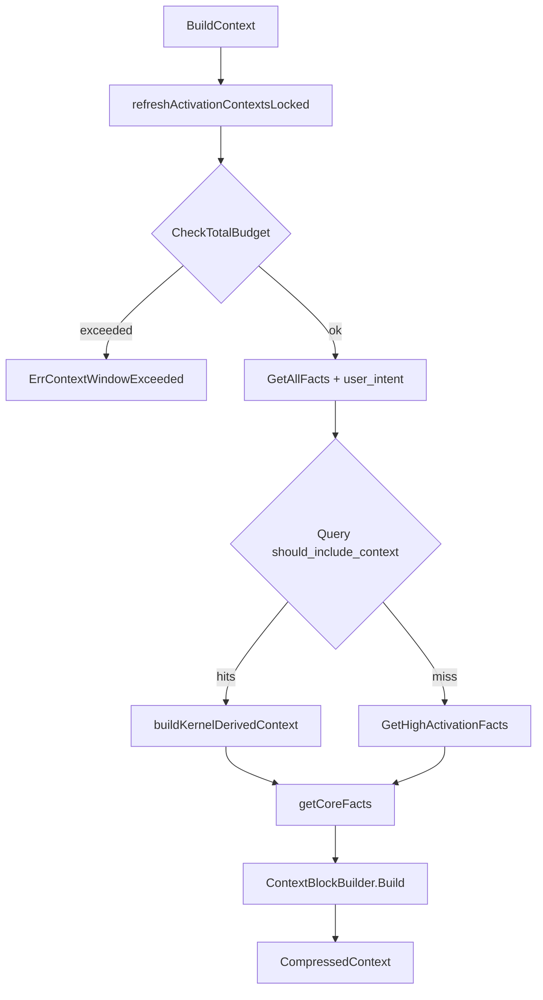
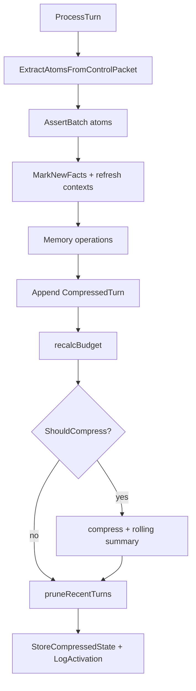

# codeNERD Context — Implemented Spec (Deep-Dive)

> Last verified against codebase: 2026-08-15  
> Status: Living Reference Document  
> Language: Go  
> Module path: `codenerd/internal/context`  
> Primary sources: `internal/context/*.go`  
> Scale: **9** non-test Go files ≈ **4,700** lines; **11** test files; package-owned Mangle: **none** (schemas/rules under `internal/core/defaults/`)  
> Note: no `.mg` file lives in this package. The kernel's crash dump
> (`debug_program_ERROR.mg`) is written to `.nerd/debug/` and is gitignored;
> earlier revisions of this corpus placed it in the package tree.

## 1. Overview

`internal/context` implements **semantic compression and logic-directed spreading activation** so long-running agent sessions can keep a bounded LLM window while retaining logical state across unbounded turns.

The architectural slogan of the package (from package comments and `README.md`):

> Achieve “Infinite Context” by continuously discarding surface text and retaining only logical state.

This is **not** vector RAG. Selection is driven by:

1. A **Go activation engine** (9-component heuristic scores + threshold + budget).
2. Optionally **kernel-derived inclusion** (`should_include_context` from `context_compilation.mg`).
3. **Constitutional core facts** always injected via `getCoreFacts()` (permissions, dangerous actions, etc.).

### Key characteristics

| Property | Value |
|----------|-------|
| Default total budget | 200k tokens (`DefaultConfig`) — override from `config.ContextWindow` at boot |
| Reserve split | Core 5% / Atoms 30% / History 15% / Working 50% |
| Compression trigger | Utilization ≥ `CompressionThreshold` (default 0.60) |
| Target ratio | 100:1 (`TargetCompressionRatio`) |
| Activation threshold | 105.0 (requires base+recency+relevance beyond pure recency) |
| Recent turn window | 5 turns full atom metadata (no surface text) |
| Token estimate | ~4 chars/token (`TokenCounter`, Claude-calibrated heuristic) |
| Feedback DB | `.nerd/context_feedback.db` (workspace-relative at boot) |
| Concurrency | `Compressor.mu`, `ActivationEngine.mu` (RWMutex), feedback store locks |

### High-level control flow

```
Turn completes (chat process)
        │
        ▼
  ProcessTurn(Turn)
        │  extract control-packet atoms → AssertBatch
        │  MarkNewFacts / refreshActivationContexts
        │  memory ops (promote / forget / store_vector)
        │  append CompressedTurn (NO surface text)
        │  recalcBudget → maybe compress()
        │  pruneRecentTurns + persist CompressedState
        ▼
Next LLM call
        │
        ▼
  IsCompressionActive?
     no  → full chat history to perception/articulation
     yes → GetContextString / BuildContext
              │
              ├─ refresh campaign/issue/back-ref contexts from kernel
              ├─ try Query("should_include_context")  [C1+C4]
              │     else GetHighActivationFacts(...)  [Go 9-component]
              ├─ getCoreFacts()  [permitted, dangerous_action, ...]
              ├─ ContextBlockBuilder.Build
              └─ FactSerializer.SerializeCompressedContext
```

Fact-flow (system-wide, with context package role):

```
user input → perception → user_intent → kernel next_action
  → VirtualStore / shards → articulation
       ▲                         │
       │   compressed mangle     │ ProcessTurn (async)
       │   context block         │ atoms + window mgmt
       └─────────────────────────┘
```

---

## 2. Implementation status

| Component | Status | Notes |
|-----------|--------|-------|
| `ActivationEngine` 9-component scoring | **Implemented** | `activation.go` + `activation_scoring.go` |
| Campaign / issue / back-ref contexts | **Implemented** | Setters + auto-refresh from kernel in compressor |
| Token budget + hard limit | **Implemented** | `tokens.go`; `ErrContextWindowExceeded` |
| Sliding window + rolling summary | **Implemented** | `compressor_turns.go` |
| Observation-masked summary (C3) | **Implemented** | Asserts age categories, queries `should_mask_observation` + `should_preserve_reasoning`, and drops observation atoms for masked turns (`generateObservationMaskedSummary`). LLM `generateSummary` remains available but unused by `compress()` |
| Kernel `should_include_context` path | **Implemented** | Entities resolved against fact arguments; falls back to Go when the query errors, returns nothing, or resolves to nothing. Split tracked by `SelectionStats` |
| Fact serializer + corpus order | **Implemented** | `serializer.go` |
| Compressed state persist/load | **Implemented** | JSON + `store.LocalStore` hooks |
| Context feedback store | **Implemented** | SQLite; wired at chat boot |
| Race-safe activation maps | **Implemented** | `sync.RWMutex`; race test present |
| Full Mangle replacement of Go scoring | **Partial** | NERD-EVOLVE markers; hybrid Go+kernel |
| End-to-end chat golden tests in-package | **Partial** | Unit-heavy; harness/CLI cover more |

**Overall:** living production subsystem — **not** pre-implementation.

---

## 3. Source inventory

### 3.1 Package layout

```
internal/context/
  activation.go              # ActivationEngine, graph, spread, session
  activation_scoring.go      # 9 score components + kernel override
  compressor.go              # Compressor, BuildContext, context refresh
  compressor_turns.go        # ProcessTurn, compress loop
  compressor_metrics.go      # metrics, state, activation scores export
  serializer.go              # FactSerializer, ParseMangleAtom, builder
  tokens.go                  # TokenCounter, TokenBudget
  feedback_store.go          # ContextFeedbackStore (SQLite)
  types.go                   # Config + compressed context types
  README.md                  # package overview (may lag corpus)
  *_test.go                  # unit/race/feedback/serializer tests
```

### 3.2 Top non-test sources (line counts ≈)

| Path | Lines | Purpose |
|------|------:|---------|
| `internal/context/compressor.go` | ~749 | Compressor, BuildContext, activation context refresh |
| `internal/context/activation.go` | ~701 | Engine API, scoring orchestration, spread, state |
| `internal/context/activation_scoring.go` | ~635 | Base/recency/relevance/dependency/campaign/issue/feedback/back-ref |
| `internal/context/serializer.go` | ~553 | Mangle serialization + control-packet extraction |
| `internal/context/compressor_metrics.go` | ~493 | Metrics, LoadState, GetActivationScores, C1/C3 helpers |
| `internal/context/compressor_turns.go` | ~439 | ProcessTurn + compress + summary |
| `internal/context/feedback_store.go` | ~424 | Feedback persistence + usefulness scores |
| `internal/context/types.go` | ~360 | CompressorConfig, CompressedContext, ScoredFact, … |
| `internal/context/tokens.go` | ~347 | TokenCounter + TokenBudget |

### 3.3 Test inventory

| Path | Focus |
|------|-------|
| `activation_test.go` | Scoring, threshold, budget select, corpus, issue clamp |
| `activation_race_test.go` | Concurrent ScoreFacts race |
| `activation_setters_test.go` | Campaign/issue/back-ref setters |
| `compressor_test.go` | ProcessTurn, compression, BuildContext, persistence |
| `compressor_accessors_test.go` | Constructors, metrics, session ID, trim |
| `budget_helpers_test.go` | TokenBudget allocate/release, hard enforcement |
| `token_counter_extra_test.go` | Count helpers, EstimateCompressionRatio |
| `serializer_test.go` | Grouping, corpus order, chaining |
| `feedback_store_test.go` | Persist + lock safety |
| `feedback_store_scoring_test.go` | Usefulness scoring |
| `mocks_test.go` | Test doubles |

---

## 4. Spreading activation (deep dive)

### 4.1 Purpose

Energy flows from the **current `user_intent`** through known facts so only **hot** logical state enters the atom reserve. Implements the “logic-directed context” idea from Cortex §8.1 comments.

### 4.2 Score components (`ScoredFact` / `scoreComponents`)

| Component | Typical range / cap | Source |
|-----------|---------------------|--------|
| Base | predicate priority (default 50) | corpus → config map → 50 |
| Recency | 0–50 | age buckets: <1m / <5m / <30m |
| Relevance | open sum | intent target, focus paths/symbols, verb→predicate boosts |
| Dependency | cap 40 | deps inheritance, reverse fan-in, symbol graph |
| Campaign | cap 60 | campaign ID/phase/task/files/symbols + campaign preds |
| Session | 0 or 15 | fact added this session |
| Issue | cap 100 | keywords (weight clamped 0–1), tiers, tests, issue preds |
| Feedback | −20..+20 | `ContextFeedbackStore` usefulness × 20 |
| Back-reference | cap 70 | referenced turns/topics/files/symbols/errors |

**Total** = sum of components. **Inclusion** requires `Score >= ActivationThreshold` (default **105**).

Design note in `DefaultConfig`: base(50)+recency(50)=100 is **not enough** without relevance — pure recency cannot flood the window.

### 4.3 Threshold then budget

```
ScoreFacts / ApplyIntentActivation
        │
        ▼
FilterByThreshold  (ActivationThreshold)
        │
        ▼
SelectWithinBudget (token estimate via CountFact)
```

`SelectWithinBudget` **always** re-filters by threshold (defensive — callers cannot skip).

### 4.4 Priority SSOT

1. `ActivationEngine.corpusPriorities` from `core.PredicateCorpus.GetPriorities()`  
2. Fallback: `CompressorConfig.PredicatePriorities` in `types.go` (deprecated hardcoded map)  
3. Default **50**

Boot wires corpus via `compressor.LoadPrioritiesFromCorpus(kernel.GetPredicateCorpus())` in `cmd/nerd/chat/session_boot.go` and `session_shared_boot.go`.

### 4.5 Graph construction

`buildSymbolGraphLocked` rebuilds maps each score pass from:

- `dependency_link(Caller, Callee, …)` → symbolGraph + reverseDependencies  
- `symbol_graph(SymbolID, …, DefinedAt, …)` → dependencies  

Explicit `AddDependency` edges are **preserved** across rebuilds.

### 4.6 SpreadFromSeeds

Optional multi-depth spread: marks seeds recent, scores facts, then for each depth spreads 50% × 0.7^d of score to dependencies. Used as an advanced API; main chat path uses `GetHighActivationFacts`.

### 4.7 Kernel override path

`ScoreFactsWithKernelOverride` / `buildKernelDerivedContext`:

- Query `should_include_context` → parse priority atoms `/p100`…`/p60`  
- Match fact strings against `GetAllFacts()`  
- `SelectWithinBudget` on atom reserve  
- If no usable results → Go activation fallback

Rules live in `internal/core/defaults/policy/context_compilation.mg` (C1 relevance, C4 hop reachability). Declarations in `internal/core/defaults/schemas_context.mg`.

---

## 5. Semantic compression (deep dive)

### 5.1 ProcessTurn loop

`ProcessTurn` is the main compression entry (`compressor_turns.go`):

1. Extract atoms from `perception.ControlPacket` (`ExtractAtomsFromControlPacket`) + pre-extracted atoms.  
2. `kernel.AssertBatch` (fallback per-atom Assert).  
3. `activation.MarkNewFacts` + `refreshActivationContextsLocked`.  
4. Memory ops: `promote_to_long_term` / `forget` / `store_vector`.  
5. Build `CompressedTurn` **without surface text** (intent/focus/result atoms only).  
6. Append to `recentTurns`; `recalcBudget`.  
7. If `shouldCompress()` → `compress()`.  
8. `pruneRecentTurns` (keep up to 2× window).  
9. Best-effort: `store.StoreCompressedState` + `LogActivation` for top hot facts.

### 5.2 When compression triggers

`TokenBudget.ShouldCompress()` iff `Utilization() >= CompressionThreshold`.  
Not turn-count driven.

### 5.3 compress()

- Keep last `RecentTurnWindow` turns; compress older into a `HistorySegment`.  
- `assertTurnAgeCategories` → kernel `turn_age_category(TurnID, /recent|/mid|/old|/ancient)` (C3).  
- Summary: **`generateSimpleSummary`** (atom-based), not the LLM path, in the current compress body (LLM `generateSummary` remains available).  
- Enforce target ratio: prefer serialized key atoms or `trimToTokens`.  
- Update rolling summary text; drop compressed turns; `DecayRecency(30m)`.

### 5.4 Observation masking invariant (C3)

Mangle derives:

- `should_mask_observation` for `/old` and `/ancient`  
- `should_preserve_reasoning` for any categorized turn  

Age calculation uses **`c.turnNumber - turn.TurnNumber`** (fixed from a slice-length bug that kept everything “recent”).

Go consumes both. `maskedObservationTurns()` reads the mask set and *intersects it
with* `should_preserve_reasoning`: a turn the kernel marks for masking but not for
reasoning preservation is left unmasked, because that combination means the rules
drifted apart and the safe failure is to keep more, not less.

`generateObservationMaskedSummary` then emits, per turn:

| Atom class | Masked turn | Unmasked turn |
|------------|-------------|---------------|
| `IntentAtom`, `FocusAtoms`, `ActionAtoms` (reasoning) | kept | kept (intent) |
| `ResultAtoms` (observations) | dropped, replaced by a one-line marker | first 3 kept |

With an empty mask set the output is byte-identical to `generateSimpleSummary`, so
a kernel that derives nothing degrades instead of losing history. Masked counts are
persisted on `HistorySegment.MaskedTurns` / `RollingSummary.TotalMaskedTurns`.

**Historical defect:** `assertTurnAgeCategories` appended a clause terminator that
`core.ParseFactString` adds itself, so every assertion failed to parse and the error
was discarded. No `turn_age_category` fact ever reached the kernel and C3 masking
was dead in production while appearing wired.

### 5.5 CompressedContext layout (LLM block)

Serialized by `SerializeCompressedContext`:

```
# MANGLE CONTEXT BLOCK
# ─── CONSTITUTIONAL FACTS ───   (core)
# ─── ACTIVE CONTEXT ───         (high-activation atoms)
# ─── COMPRESSED HISTORY ───     (rolling summary)
# ─── RECENT TURNS ───           (atom-only turns)
```

---

## 6. Token window management (deep dive)

### 6.1 Reserves

| Reserve | Default % | Role |
|---------|-----------|------|
| Core | 5% | Constitutional / safety facts |
| Atom | 30% | High-activation context atoms |
| History | 15% | Compressed history + recent turns allocation |
| Working | 50% | Current turn processing headroom |

`NewConfigWithBudget(total)` recomputes reserves as percentages.  
`NewCompressorWithParams` / `NewCompressorWithConfig` map from `config.ContextWindowConfig`.

### 6.2 TokenCounter

Heuristic: `utf8.RuneCount / 4.0` plus fact-structure overhead. Not a real tokenizer — good enough for relative budgeting.

### 6.3 TokenBudget enforcement

- Per-category `Allocate` / `AllocateWithError`  
- `CheckTotalBudget` / `MustFitWithinBudget` → `ErrContextWindowExceeded`  
- Hard enforcement default **true**  
- `BuildContext` refuses if already over total budget

### 6.4 Chat integration of active compression

In `cmd/nerd/chat/process.go`:

- If `IsCompressionActive()`: perception and articulation get **recent window only** + `GetContextString` compressed block.  
- Else: full message history.

`IsCompressionActive` is true if any rolling segments exist **or** budget threshold reached.

UI: `view.go` shows `GetBudgetUsage()` when compressor present.

---

## 7. Context feedback store (deep dive)

Third feedback loop in codeNERD learning architecture (package comments):

1. Tool learning  
2. Prompt evolution  
3. **Context learning** (this store)

Schema (SQLite):

- `context_feedback` — turn_id, usefulness, intent_verb, task_succeeded, …  
- `predicate_feedback` — helpful | noise ratings  

Scoring:

- Weighted by 7-day half-life decay  
- Min **10** samples before non-zero usefulness  
- Intent-specific lookup preferred over global  
- Activation maps usefulness ∈ [−1,1] → [−20, +20] points  

Opened at boot: `filepath.Join(workspace, ".nerd", "context_feedback.db")`.

---

## 8. Activation context refresh (kernel → engine)

`refreshActivationContextsLocked` uses **one** `QueryAll()` then in-memory filter:

| Context | Source predicates |
|---------|-------------------|
| Campaign | `current_campaign`, `current_phase`, `campaign_phase`, `next_campaign_task`, `campaign_task`, `phase_objective`, `task_artifact` |
| Issue | `swebench_instance` / `issue_context` / `issue_keyword`, `issue_text`, `file_mentioned`, `tiered_context_file`, swebench expected tests |
| Back-reference | `turn_references_back`, `turn_topic`, `turn_references_file`, `turn_references_symbol`, `turn_error_message` |

This is how long-horizon campaigns and issue-driven work keep scoring aligned without manual setter calls each turn.

---

## 9. Integration map

| Consumer | How |
|----------|-----|
| `cmd/nerd/chat/session_boot.go` | `NewCompressorWithParams`, corpus priorities, feedback store |
| `cmd/nerd/chat/session_shared_boot.go` | Same for shared boot path |
| `cmd/nerd/chat/process.go` | `IsCompressionActive`, `GetContextString`, async `ProcessTurn` |
| `cmd/nerd/chat/model_session_context.go` | `GetContextString` → `CompressedHistory` |
| `cmd/nerd/chat/session_persistence.go` | `GetState` / `MarshalCompressedState` |
| `cmd/nerd/chat/view.go` | Budget usage display |
| `cmd/nerd/chat/model_types.go` | Holds `*Compressor`, `*ContextFeedbackStore` |
| `cmd/nerd/cmd_test_context.go` | CLI stress / test-context command |
| `internal/testing/context_harness/` | Harness engines wrapping compressor |
| `internal/prompt/context.go` | Comments: activation scores from `GetActivationScores` for JIT |
| `internal/session/subagent.go` | Avoids direct import via interface comments |
| `store.LocalStore` | `StoreCompressedState`, `LogActivation`, memory ops |
| `core.RealKernel` | Facts, assert, Query, QueryAll, corpus |
| `perception` | ControlPacket, MemoryOperation, LLMClient (optional summary) |
| `config` | `ContextWindowConfig` → compressor config |

Mangle (outside package but load-bearing):

| File | Role |
|------|------|
| `internal/core/defaults/schemas_context.mg` | Decl `should_include_context`, age/mask predicates |
| `internal/core/defaults/policy/context_compilation.mg` | C1/C3/C4 rules |

---

## 10. Core types (summary)

| Type | Role |
|------|------|
| `Compressor` | Orchestrator: turns, build, compress, persist |
| `ActivationEngine` | Score / filter / budget select / contexts |
| `CompressorConfig` | Budgets, thresholds, fallback priorities |
| `CompressedContext` | Output block for one LLM call |
| `CompressedTurn` | Surface-free turn record |
| `ScoredFact` | Fact + 9-way score breakdown |
| `TokenBudget` / `TokenCounter` | Window accounting |
| `FactSerializer` / `ContextBlockBuilder` | Serialization |
| `ContextFeedbackStore` | Learned predicate usefulness |
| `CompressedState` | Persistence snapshot |

Full export tables: [06-PUBLIC-API-AND-TYPES.md](06-PUBLIC-API-AND-TYPES.md).

---

## 11. Safety model (context edge)

See [09-SAFETY-AND-INVARIANTS.md](09-SAFETY-AND-INVARIANTS.md).

Highlights:

- Core facts always pull `permitted`, `dangerous_action`, `admin_override`, `security_violation`, `block_commit` (query failures logged, not silent-empty without warn).  
- Issue keyword weights **clamped** to [0,1] to prevent adversarial score domination.  
- Caps on dependency/campaign/issue/back-ref components.  
- Does **not** authorize actions — kernel `permitted(...)` remains executive.  
- Concurrent map safety via mutexes (historical race fixed).

---

## 12. Observability

`logging.CategoryContext` + helpers `logging.Context` / `ContextDebug`.  
Timers: `ScoreFacts`, `GetHighActivationFacts`, `SpreadFromSeeds`, `BuildContext`, `ProcessTurn[N]`, `Compression`, `RecalcBudget`, etc.

Metrics API: `GetMetrics`, `GetCompressionRatio`, `GetBudgetUtilization`, `GetBudgetUsage`, `GetSessionStats` (activation).

Store analytics: activation scores logged on ProcessTurn.

See [11-OBSERVABILITY.md](11-OBSERVABILITY.md).

---

## 13. Testing

```powershell
go test ./internal/context/...
go test -race ./internal/context/...
go test ./internal/testing/context_harness/...
```

See [10-TESTING-ALIGNMENT.md](10-TESTING-ALIGNMENT.md).

---

## 14. Gaps & non-goals

Gaps: [03-GAP-ANALYSIS.md](03-GAP-ANALYSIS.md).

Non-goals of this document:

- Full product Spec template (`Docs/Spec/`)  
- Retrieval / sparse / tiered file search internals (`internal/retrieval`)  
- Prompt atom catalogs (`internal/prompt/atoms`)  
- Campaign orchestration (consumes campaign facts only)

---

## 15. Related documents

- `internal/context/README.md` — package-local overview  
- `Docs/architecture/INDEX.md` — corpus index  
- Root `AGENTS.md` — build/test contract  
- Sibling corpora: core, perception, prompt, cli, store  

---

## 16. Architecture diagrams

### 16.1 BuildContext path



### 16.2 ProcessTurn path



### 16.3 Score composition

```
ScoredFact.Score =
    Base(pred priority)
  + Recency(age buckets)
  + Relevance(intent/focus/verb map)
  + Dependency(cap 40)
  + Campaign(cap 60)
  + Session(0|15)
  + Issue(cap 100, weight clamp)
  + Feedback(-20..+20)
  + BackReference(cap 70)
```

---

## 17. Constructor matrix

| Constructor | When to use |
|-------------|-------------|
| `NewCompressor` | Default config; loads serializer order from kernel corpus |
| `NewCompressorWithConfig` | From `config.ContextWindowConfig` |
| `NewCompressorWithParams` | Chat boot (no config type dependency) |
| `NewActivationEngine` | Standalone scoring tests / harness |
| `NewContextFeedbackStore` | Path to SQLite DB |
| `NewFactSerializer` / `NewContextBlockBuilder` / `NewTokenCounter` / `NewTokenBudget` | Lower-level utilities |

---

## 18. Versioning / persistence

`CompressedState.Version` = `"1.0.0"`.  
JSON via `MarshalCompressedState` / `UnmarshalCompressedState`.  
`LoadState` re-asserts missing hot facts into kernel and records timestamps.

Session IDs:

- Compressor: `session_<unix>` default; overridable via `SetSessionID`  
- Activation engine: separate `sess_<nanos>` via `NewSession`

---

## 19. Honesty notes

1. Package `README.md` is aligned with the code (200k default, current file list).  
2. `generateSummary` (LLM) is **not** the path taken by `compress()` today — the C3 observation-masked atom summary is.  
3. Kernel path and Go path coexist; full replacement is incomplete (NERD-EVOLVE markers). `GetSelectionStats()` measures which one actually ran.  
4. Token counts are **estimates**, not provider tokenizer truth.  
5. No `.mg` file lives in this package; `debug_program_ERROR.mg` is a kernel crash dump under `.nerd/debug/`.  
6. `Compressor.GetActivationScores()` is **not** called by the JIT prompt compiler — `prompt.CompilationContext.ActivatedFacts` is never populated. That edge is documented as intended but is currently dead.

---

## 20. End-to-end example (conceptual)

1. User: “Fix the null pointer in auth.go”  
2. Perception asserts `user_intent(..., /fix, auth.go, ...)`.  
3. Many kernel facts exist; activation scores `diagnostic`, `file_topology(auth.go)`, related `symbol_graph` highly for `/fix`.  
4. Articulation runs with either full history or compressed block if window hot.  
5. Assistant returns control packet with mangle updates; `ProcessTurn` asserts atoms, stores compressed turn.  
6. Over many turns, older turns fold into rolling summary; follow-up “what was the original error?” benefits from `turn_references_back` boosting old error facts via back-reference score.
