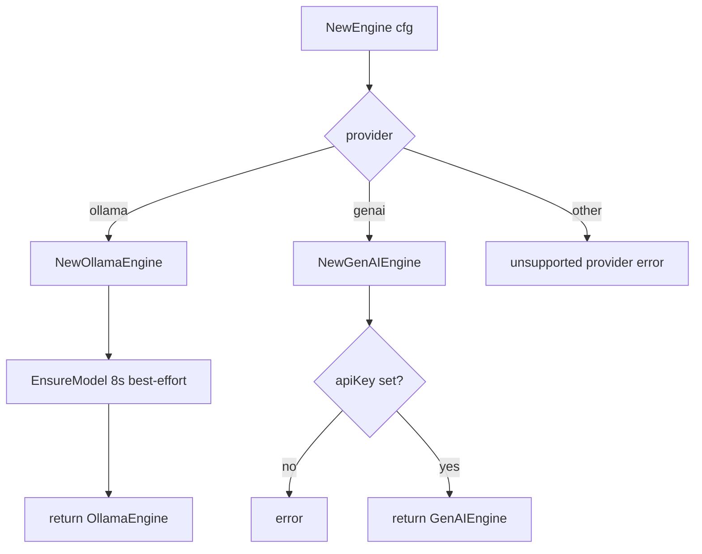

# codeNERD Embedding — Implemented Spec (Deep-Dive)

> Last verified against codebase: 2026-07-13  
> Status: Living Reference Document  
> Language: Go  
> Primary package: `internal/embedding/`  
> Scale: **6** non-test Go ≈ **1,498** lines; **7** tests ≈ **1,747** lines; **0** Mangle sources

## 1. Overview

`internal/embedding` is the **provider-abstracted vector generation layer** for codeNERD. Every subsystem that needs text→`[]float32` (knowledge vectors, prompt atoms, MCP tools, semantic intent patterns, campaign docs) obtains an `EmbeddingEngine` from this package and optionally uses task-type-aware methods, cosine similarity, and top-K helpers.

### What it is

| Capability | Where |
|------------|--------|
| Provider factory (`ollama` \| `genai`) | `engine.go` → `NewEngine` |
| Local Ollama HTTP client + auto-pull | `ollama.go` |
| Google Gemini EmbedContent client | `genai.go` |
| GenAI task-type selection / content detection | `task_selector.go` |
| Cosine similarity (pure Go / optional AVX2) | `math_generic.go`, `math_amd64.go` |
| Brute-force top-K by cosine | `FindTopK` in `engine.go` |

### What it is not

- **Not a store.** Persistence lives in `internal/store` (sqlite / sqlite-vec).
- **Not executive control.** No Mangle `Decl`, no `permitted(...)`, no `next_action`.
- **Not an LLM chat client.** Only embedding endpoints.
- **Not dimension-agnostic runtime discovery.** `Dimensions()` is hardcoded per engine family (768 Ollama / 3072 GenAI).

### Key characteristics

| Property | Value |
|----------|-------|
| Default provider | `ollama` (`DefaultConfig`) |
| Default Ollama model | `embeddinggemma:300m` |
| Default GenAI model | `gemini-embedding-001` |
| Default GenAI task type | `SEMANTIC_SIMILARITY` |
| Ollama vector dim (reported) | 768 |
| GenAI vector dim (reported + requested) | 3072 (`OutputDimensionality`) |
| GenAI sync batch limit | 100 texts/request (`maxBatchSize`) |
| GenAI multi-batch parallelism | 6 (`batchParallelism`, errgroup) |
| Ollama HTTP timeout | 60s (embed); pull client 30m |
| Ollama EnsureModel init budget | 8s at `NewEngine` |
| Logging category | `embedding` (`logging.CategoryEmbedding`) |

### Placement in the product

```
┌─────────────────────────────────────────────────────────────┐
│  Cortex boot (system.factory / chat.session_boot)           │
│    config.GetEmbeddingConfig → embedding.NewEngine          │
│    → LocalStore / LearningStore / AtomLoader / MCP / JIT    │
└───────────────────────────┬─────────────────────────────────┘
                            │ EmbeddingEngine
        ┌───────────────────┼───────────────────┐
        ▼                   ▼                   ▼
   store.vector_*     prompt.loader      perception.semantic
   reembed paths      CompilerVector     MCP tool store
   reflection         Searcher           campaign ingestor
```

Fact-flow reminder:

```
user input → perception (may use embeddings for semantic classify)
  → user_intent → kernel next_action → VirtualStore
  → articulation (JIT may use embeddings for atom retrieval)
```

Embeddings **inform** perception and prompt selection; they never replace the kernel.

---

## 2. Implementation status

| Component | Status | Evidence |
|-----------|--------|----------|
| `EmbeddingEngine` interface | **Implemented** | `engine.go` |
| `TaskTypeAwareEngine` | **Implemented** | interface + GenAI methods |
| `TaskTypeBatchAwareEngine` | **Implemented** | interface + GenAI `EmbedBatchWithTask` |
| `HealthChecker` | **Implemented** | Ollama only (`HealthCheck`) |
| `Config` / `DefaultConfig` / `NewEngine` | **Implemented** | `engine.go` |
| `OllamaEngine` + EnsureModel/pull | **Implemented** | `ollama.go` |
| `GenAIEngine` sync embed/batch | **Implemented** | `genai.go` |
| `GenAIEngine.EmbedBatchJob` async | **Implemented** | submit only; poll is caller-owned |
| Task type select/detect | **Implemented** | `task_selector.go` |
| `CosineSimilarity` generic | **Implemented** | `math_generic.go` (`!amd64 \|\| !simd`) |
| `CosineSimilarity` SIMD | **Implemented** | `math_amd64.go` (`amd64 && simd`) |
| `FindTopK` | **Implemented** | partial selection sort in `engine.go` |
| Unit / coverage tests | **Implemented** | 7 test files, mock HTTP for Ollama |
| Live integration tests | **Partial** | GenAI bench is opt-in; no CI live Ollama |
| Runtime `Dimensions()` discovery | **Not implemented** | hardcoded constants |
| Ollama native batch API | **N/A / sequential** | `EmbedBatch` loops `Embed` |
| GenAI `HealthChecker` | **Not implemented** | factory always attaches GenAI on construct success |
| Mangle surface | **None** | no `.mg` |

**Overall:** production substrate, actively wired — **not** pre-implementation.

---

## 3. Source inventory

### 3.1 Package layout

```
internal/embedding/
  engine.go                 # interfaces, Config, NewEngine, FindTopK
  genai.go                  # Google GenAI engine + async batch job
  ollama.go                 # local Ollama engine + model ensure/pull
  task_selector.go          # ContentType, Select/Detect/GetOptimalTaskType
  math_generic.go           # CosineSimilarity default build
  math_amd64.go             # CosineSimilarity AVX2 build tag
  *_coverage_test.go        # engine, genai, ollama, task_selector
  ollama_ensure_test.go     # model resolution / ensure paths
  task_selector_test.go     # focused task-type tests
  genai_bench_test.go       # optional live batch bench
```

### 3.2 Non-test sources (approx lines)

| Path | Lines | Role |
|------|------:|------|
| `internal/embedding/ollama.go` | 611 | Ollama HTTP, retries, EnsureModel, pull, resolution |
| `internal/embedding/genai.go` | 373 | GenAI client, batch chunk/parallel, EmbedBatchJob |
| `internal/embedding/engine.go` | 216 | Interfaces, factory, FindTopK, SimilarityResult |
| `internal/embedding/task_selector.go` | 198 | ContentType map → GenAI TaskType strings |
| `internal/embedding/math_amd64.go` | 57 | SIMD cosine (`//go:build amd64 && simd`) |
| `internal/embedding/math_generic.go` | 37 | Scalar cosine (default builds) |

### 3.3 Test sources (approx lines)

| Path | Lines | Focus |
|------|------:|-------|
| `ollama_coverage_test.go` | 486 | HTTP mock embed/batch/health/errors |
| `engine_coverage_test.go` | 448 | Config, NewEngine, Cosine, FindTopK |
| `task_selector_coverage_test.go` | 409 | Select/Detect/GetOptimal matrix |
| `ollama_ensure_test.go` | 176 | resolve/prefer/pull helpers |
| `genai_coverage_test.go` | 124 | construct + dimensions/name (limited live API) |
| `task_selector_test.go` | 60 | smaller unit cases |
| `genai_bench_test.go` | 44 | parallel batch bench skeleton |

### 3.4 Build tags

| File | Constraint |
|------|------------|
| `math_amd64.go` | `amd64 && simd` |
| `math_generic.go` | `!amd64 \|\| !simd` |

Default Windows/Linux builds without `-tags simd` use the generic loop. Both define the same exported `CosineSimilarity` symbol.

---

## 4. Public surface (summary)

Deep reference: [06-PUBLIC-API-AND-TYPES.md](06-PUBLIC-API-AND-TYPES.md).

### 4.1 Interfaces

```text
EmbeddingEngine
  Embed(ctx, text) ([]float32, error)
  EmbedBatch(ctx, texts) ([][]float32, error)
  Dimensions() int
  Name() string

TaskTypeAwareEngine : EmbeddingEngine
  EmbedWithTask(ctx, text, taskType) ([]float32, error)

TaskTypeBatchAwareEngine : EmbeddingEngine
  EmbedBatchWithTask(ctx, texts, taskType) ([][]float32, error)

HealthChecker
  HealthCheck(ctx) error
```

Callers **type-assert** optional interfaces. Pattern used throughout store/prompt/perception:

```go
if taskAware, ok := engine.(embedding.TaskTypeAwareEngine); ok && taskType != "" {
    vec, err = taskAware.EmbedWithTask(ctx, text, taskType)
} else {
    vec, err = engine.Embed(ctx, text)
}
```

### 4.2 Config and factory

| Symbol | Role |
|--------|------|
| `Config` | Provider + Ollama + GenAI fields (JSON tags) |
| `DefaultConfig()` | ollama / embeddinggemma:300m / gemini-embedding-001 / SEMANTIC_SIMILARITY |
| `NewEngine(cfg)` | switch provider; Ollama best-effort `EnsureModel` (8s) |

Unsupported provider → hard error. Empty provider → error (not silent default at factory; callers often inject `DefaultConfig` first — see `system/factory.go`).

### 4.3 Engines

| Type | Name format | Dim | Notes |
|------|-------------|-----|-------|
| `*OllamaEngine` | `ollama:<model>` | 768 | retries, auto-pull, HealthCheck |
| `*GenAIEngine` | `genai:<model>` | 3072 | batch + parallel + EmbedBatchJob |

`GenAIEngine` also exposes `Close()` (no-op) and `EmbedBatchJob` (async submit). Neither is on the base interface.

### 4.4 Task typing

| ContentType constant | Typical task (index) | Typical task (query) |
|----------------------|----------------------|----------------------|
| `code` | RETRIEVAL_DOCUMENT | CODE_RETRIEVAL_QUERY |
| `query` | RETRIEVAL_QUERY | — |
| `question` | QUESTION_ANSWERING | — |
| `answer` / `documentation` | RETRIEVAL_DOCUMENT | — |
| `fact` | FACT_VERIFICATION | — |
| `classification` | CLASSIFICATION | — |
| `clustering` | CLUSTERING | — |
| `knowledge_atom` / `prompt_atom` | RETRIEVAL_DOCUMENT | — |
| `conversation` / default | SEMANTIC_SIMILARITY | — |

`GetOptimalTaskType` runs `DetectContentType` then, if `isQuery`, remaps most types to `ContentTypeQuery` except code/classification/clustering.

### 4.5 Math helpers

| Symbol | Behavior |
|--------|----------|
| `CosineSimilarity(a,b)` | length check; zero-mag → 0,nil; else cos ∈ [-1,1] |
| `FindTopK(query, corpus, k)` | skip dim mismatches (warn); partial sort; default k=10 |
| `SimilarityResult` | `{Index, Similarity}` |

---

## 5. Deep dive — Ollama engine

### 5.1 Construction

`NewOllamaEngine(endpoint, model)`:

1. Default endpoint `http://localhost:11434`.
2. Empty or bare `embeddinggemma` → `embeddinggemma:300m`.
3. `http.Client` Timeout **60s** (cold start / load).
4. Does **not** dial Ollama at construct (except via `NewEngine` EnsureModel).

`NewEngine` for ollama additionally runs `EnsureModel` with **8s** timeout; failure is **warn-only** (“will retry on first Embed”).

### 5.2 Embed path

```
Embed(ctx, text)
  → EnsureModel (best-effort)
  → up to 3 attempts:
       POST {endpoint}/api/embeddings  {model, prompt}
       on network/5xx/decode errors → exponential backoff (300ms…)
       on model-not-found body → EnsureModel once, reset attempts
  → []float32
```

Model-not-found detection (`isModelNotFoundStatus`) accepts 404, or 400/other with body phrases like “not found”, “try pulling”.

### 5.3 EnsureModel state machine

Protected by `ensureMu`:

```
modelReady?
  yes → return
list /api/tags
  resolveInstalledModel(configured)? → set model, ready
  preferInstalledEmbeddingModel (known families only)? → remap, ready
  pullAttempted? → error
  pull pullTargetFor(configured)
    success → model = pullName, ready
    fail + known family → try nomic-embed-text fallback
```

**Known embed families** (only these auto-prefer / fallback):  
`embeddinggemma`, `nomic-embed-text`, `mxbai-embed-large`, `all-minilm`, `bge-m3`, `bge-large`, `snowflake-arctic-embed`.

Arbitrary names (e.g. unit-test `test-model`) are **not** remapped — they attempt pull of the configured string. This protects tests and custom models.

Pull uses a **separate** client with **30 minute** timeout, `stream:false`, NDJSON/error scanning.

### 5.4 Batch and health

- `EmbedBatch`: sequential `Embed` with shared preflight EnsureModel; cancels mid-batch on `ctx.Err()`.
- `HealthCheck`: GET `/api/tags` with **2s** timeout — used by `system.factory` boot to decide whether to attach the engine.

### 5.5 Dimensions honesty

`Dimensions()` always returns **768**. If a user configures a non-768 Ollama model, store schema / sqlite-vec assumptions can desync. Callers must treat this as a **contract**, not a probe.

---

## 6. Deep dive — GenAI engine

### 6.1 Construction

`NewGenAIEngine(apiKey, model, taskType)`:

1. Empty API key → error.
2. Default model `gemini-embedding-001`.
3. `normalizeTaskType` (upper/trim); empty → `SEMANTIC_SIMILARITY`.
4. `genai.NewClient` with `APIKey` only (Developer API path).

### 6.2 Sync embed

- Single: `Models.EmbedContent` with one content, `OutputDimensionality=3072`, optional `TaskType`.
- Batch ≤100: one EmbedContent with N contents.
- Batch >100: chunk to 100, **errgroup** limit 6, order preserved via slot array, first error cancels siblings.

### 6.3 Async batch job

`EmbedBatchJob` → `client.Batches.CreateEmbeddings` with inlined requests and display name `codenerd-embed-<nano>`.

Documented constraints in source:

- Developer API only (not Vertex).
- SDK experimental (as of comment).
- Caller must poll `Batches.Get` — **not implemented inside this package**.

Intended for large corpus reembed (tools like `corpus_builder`); everyday paths use sync `EmbedBatch`.

### 6.4 Task types

Engine holds a default `taskType` but callers prefer `EmbedWithTask` / `EmbedBatchWithTask` after `SelectTaskType` / `GetOptimalTaskType` so **queries and documents** land in different embedding spaces (critical for retrieval quality).

---

## 7. Deep dive — task selector

### 7.1 Priority order in `DetectContentType`

1. `metadata["content_type"]` string cast → trust.
2. `metadata["type"]` switch (`user_input`, `code`, `prompt_atom`, …).
3. Heuristics on lowercased text: code indicator score ≥3; question prefixes/`?`; short informal conversation; markdown/doc markers.
4. Default `ContentTypeConversation`.

Heuristics are intentionally shallow — package comment ethos elsewhere in the repo says **do not** use Mangle for fuzzy NL banks; embeddings + this light detector are the right layer.

### 7.2 Call-site conventions (evidence)

| Caller area | Typical ContentType / task |
|-------------|----------------------------|
| `store.vector_store` index | `GetOptimalTaskType(content, meta, false)` |
| `store.vector_store` query | `GetOptimalTaskType(query, nil, true)` |
| prompt atoms | `SelectTaskType(ContentTypePromptAtom, false)` → RETRIEVAL_DOCUMENT |
| reflection traces | `SelectTaskType(ContentTypeDocumentation, false)` |
| learnings | `SelectTaskType(ContentTypeKnowledgeAtom, false)` |
| MCP tools | documentation / query mixes |
| perception classifier | query + knowledge_atom |

---

## 8. Integration map

### 8.1 Boot paths

| Path | File | Behavior |
|------|------|----------|
| Shared Cortex factory | `internal/system/factory.go` `initIntelligenceLayer` | NewEngine; Ollama HealthCheck must pass or engine discarded; wire LocalDB, LearningStore, AtomLoader, MCP bridge, CompilerVectorSearcher |
| Interactive chat boot | `cmd/nerd/chat/session_boot.go` | NewEngine from config; attach stores; more lenient (no mandatory health gate) |
| `nerd init` | `internal/init/initializer.go` | Creates engine for workspace bootstrap embeds |
| Campaign docs | `internal/campaign/document_ingestor.go` | `NewEngine(embedCfg)` per ingestor |
| CLI embedding | `cmd/nerd/embedding_cmd.go` | set config / stats / reembed |
| Chat reembed / reflection | `cmd/nerd/chat/reembed.go`, `reflection.go` | NewEngine + store helpers |
| Tools | `cmd/tools/corpus_builder`, `prompt_builder` | GenAI-oriented offline corpus build |

### 8.2 Downstream consumers (import evidence)

| Package | Uses |
|---------|------|
| `internal/store` | SetEmbeddingEngine, Embed/Batch+task, CosineSimilarity brute force, reembed all |
| `internal/prompt` | AtomLoader, SyncEmbeddedToSQLite, CompilerVectorSearcher |
| `internal/perception` | Semantic classifier + learned corpus cosine |
| `internal/mcp` | Tool store embeddings, JIT tool compiler, analyzer |
| `internal/campaign` | DocumentIngestor |
| `internal/system` | Cortex.EmbeddingEngine field |
| `internal/init` | Workspace init |
| `cmd/nerd`, `cmd/nerd/chat` | CLI + TUI maintenance |
| `cmd/tools/*` | Offline builders |

### 8.3 Upstream deps of this package

| Import | Why |
|--------|-----|
| `codenerd/internal/logging` | CategoryEmbedding timers + structured logs |
| `net/http`, `encoding/json` | Ollama |
| `google.golang.org/genai` | GenAI |
| `golang.org/x/sync/errgroup` | GenAI parallel batches |
| `simd/archsimd` | optional AMD64 SIMD cosine only |

No import of `core`, `mangle`, `store`, or `prompt` — package stays a **leaf substrate**.

---

## 9. Control-flow diagrams

### 9.1 Factory



### 9.2 Store index path (typical)

```
LocalStore.AddVector / batch
  → GetOptimalTaskType(content, metadata, false)
  → type assert TaskTypeAwareEngine / TaskTypeBatchAwareEngine
  → Embed / EmbedBatchWithTask
  → persist []float32 + task_type + model metadata (store layer)
```

### 9.3 Retrieval path (typical)

```
query string
  → GetOptimalTaskType(query, nil, true)  // usually RETRIEVAL_QUERY
  → EmbedWithTask
  → sqlite-vec OR brute CosineSimilarity over corpus
  → top hits → structured facts / prompt atoms / tools
```

---

## 10. Observability (package-local)

| Mechanism | Usage |
|-----------|--------|
| `logging.StartTimer(CategoryEmbedding, op)` | NewEngine, Embed, EmbedBatch, HealthCheck, FindTopK, EmbedBatchJob |
| `logging.Embedding` / `EmbeddingDebug` | lifecycle, latencies, dimensions |
| `logging.Get(CategoryEmbedding).Warn/Error` | failures, dim mismatch skips, EnsureModel warnings |

No metrics registry, no OpenTelemetry in this package. Operators read `.nerd/logs/` category files / boot stderr warnings.

---

## 11. Gaps pointer

See [03-GAP-ANALYSIS.md](03-GAP-ANALYSIS.md) and [TODO.md](TODO.md). Headline gaps:

1. **Hardcoded dimensions** vs actual model output.
2. **Boot asymmetry**: factory drops Ollama on failed HealthCheck; chat boot does not.
3. **Provider dimension incompatibility** if DBs mixed across ollama/genai without reembed.
4. **FindTopK** O(n·k) sort; not used as primary production path (store has own search).
5. **EmbedBatchJob** submit without in-package poll/helpers.
6. **GenAI no HealthChecker** — first failure is first Embed.
7. **Ollama sequential batch** throughput ceiling for large reembeds.

---

## 12. Safety posture (summary)

- No code execution; network egress to Ollama host or Google GenAI only.
- API keys only for GenAI construct; not logged as full secrets (length may be logged at debug).
- Auto-pull can download large models (disk/time) — intentional for DX, gated by known families for remaps.
- Context cancellation honored on retries and batch loops.
- Does not bypass constitutional `permitted(...)` — callers in VirtualStore/tools still policy-gated.

Full treatment: [09-SAFETY-AND-INVARIANTS.md](09-SAFETY-AND-INVARIANTS.md).

---

## 13. Testing posture (summary)

Strong unit coverage for factory, cosine, task selection, Ollama HTTP mock, ensure helpers. Weak/zero automatic coverage for live GenAI EmbedContent, parallel batch under rate limits, and SIMD path (tag-gated). Commands in [10-TESTING-ALIGNMENT.md](10-TESTING-ALIGNMENT.md).

---

## 14. Non-goals (locked)

- Implementing vector DB or ANN index inside this package.
- Becoming a second LLM provider abstraction (chat/completion stays in perception).
- Encoding retrieval policy in Mangle inside `embedding` (policy stays core).
- Claiming “unused” when reverse deps are extensive — wiring audit required before any deletion.

---

## 15. Change discipline

When modifying this package:

1. Preserve interface compatibility (`EmbeddingEngine` + optional asserts).
2. Keep Ollama known-family remaps conservative (tests rely on non-remap of `test-model`).
3. Keep GenAI `OutputDimensionality` and `Dimensions()` aligned if Google changes defaults.
4. Run `go test ./internal/embedding/...` and at least one store package test that mocks the engine.
5. Update this corpus if public behavior changes.

---

## 16. File ↔ responsibility matrix

| Concern | Primary file |
|---------|--------------|
| Interface contracts | `engine.go` |
| Provider selection | `engine.go` `NewEngine` |
| Local inference UX | `ollama.go` |
| Cloud inference + batch scale | `genai.go` |
| Retrieval quality task types | `task_selector.go` |
| Similarity math | `math_*.go` |
| Top-K utility | `engine.go` `FindTopK` |

---

## 17. Historical notes (code comments preserved)

- Google embedding models moved from **768 → 3072** dims; GenAI engine reflects 3072.
- Ollama bare `embeddinggemma` often lacks `:latest`; code defaults to `:300m`.
- Perception `InitPerceptionLayer` historically unwired; chat boot now calls it so semantic classification can use embeddings when configured (`session_boot.go` comments).

---

## 18. Related CLI verbs

| Verb | Action |
|------|--------|
| `nerd embedding set ollama\|genai [key]` | Writes `.nerd/config.json` Embedding section |
| `nerd embedding stats` | LocalStore vector counts + engine dims |
| `nerd embedding reembed` | `store.ReembedAllDBsForce` over `.nerd` + `internal` roots |

TUI mirrors via `/embedding` (see CLI corpus). Config remains authoritative; commands print “restart to apply” for provider switches.

---

*End of IMPLEMENTED_SPEC — living document; regenerate only after source change or verification pass.*
