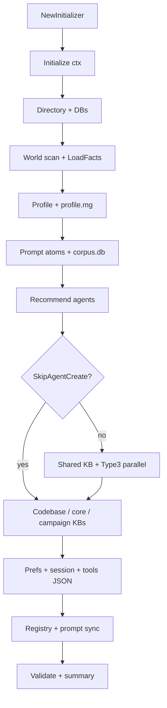

# init — Internal Architecture

> Last verified: 2026-08-15

## Component map

```
┌─────────────────────────────────────────────────────────────────┐
│                     Initializer (orchestrator)                   │
│  config, kernel, scanner, localDB, shardMgr, embed, grounding  │
└────────────┬────────────────────────────────────────────────────┘
             │
     ┌───────┴────────┬──────────────┬───────────────┬────────────┐
     ▼                ▼              ▼               ▼            ▼
 world.Scanner   Detection     Agents / KB      Strategic     Tools /
 ScanDirectory   (scanner.go)  (agents*.go)     knowledge     catalog
 LoadFacts       deps/locks    shared_kb        documents     (tools.go)
                 entry/build   registration                   stub gen
     │                │              │               │            │
     └────────────────┴──────────────┴───────────────┴────────────┘
                                    │
                                    ▼
                     .nerd/ artifacts + InitResult
                                    │
                     validation + printSummary
```

## 22-phase control flow

Phase list from `Initialize` / `DefaultPhaseDurations`:

```
setup → migration → directory → scanning → analysis → profile
  → facts → prompt_atoms → prompt_db → agents → shared_kb
  → kb_creation → codebase_kb → core_shards_kb → campaign_kb
  → tool_generation → preferences → session → tools
  → registry → prompt_sync → complete
```

### Phase narrative

| Phase | Behavior |
|-------|----------|
| **setup** | `StartSystemShards`; workspace banner |
| **migration** | If `.nerd` exists: `store.MigrateAllAgentDBs` |
| **directory** | `createDirectoryStructure`, mangle templates, `knowledge.db`, northstar store, embedding engine |
| **scanning** | `scanner.ScanDirectory` → `ToFacts` → `kernel.LoadFacts` |
| **analysis** | Stub messaging (JIT owns deep analysis) |
| **profile** | `buildProjectProfile` + `profile.json` |
| **facts** | `generateFactsFile` → `profile.mg` (identity, language/framework, patterns, entry points, `missing_tool_for` needs) |
| **prompt_atoms** | `buildProjectAtoms` → `knowledge.db`, held for corpus ingest |
| **prompt_db** | `initializePromptDatabase` → seed + reconcile `prompts/corpus.db`, then `ingestProjectAtomsIntoCorpus` |
| **agents** | `determineRequiredAgents` → `mergeTypeUAgents` → `curateAgents` |
| **shared_kb** | `CreateSharedKnowledgePool` |
| **kb_creation** | Parallel Type-3 KBs + `registerAgentsWithShardManager` |
| **codebase_kb** | Codebase KB + optional strategic knowledge |
| **core_shards_kb** | coder/reviewer/tester KBs |
| **campaign_kb** | Campaign-oriented knowledge atoms |
| **tool_generation** | Reports the tool needs recorded as facts in the **facts** phase; no generation here |
| **preferences** | `initPreferences` + merge-preserving write to `preferences.json` |
| **session** | `session.json` |
| **tools** | Static `available_tools.json` |
| **registry** | `agents.json` |
| **prompt_sync** | `prompt.ReloadAllPrompts` YAML→DB |
| **complete** | Grounding sources, summary, validation |



## Key types (runtime)

| Type | Responsibility |
|------|----------------|
| `Initializer` | Holds deps; runs phases |
| `InitConfig` | Workspace, LLM + provider/model labels, timeout, skip flags, progress, Context7 key |
| `ProjectProfile` | Durable project identity |
| `RecommendedAgent` / `CreatedAgent` | Desired vs materialised specialists |
| `InitResult` | Success, required failures, warnings, LLM metrics, files, agents, grounding |
| `InitProgress` / `ETATracker` | UX progress |
| `StrategicKnowledge` | LLM-derived architecture soul |
| `DocumentInfo` / `DocIngestionState` | Doc campaign tracking |
| `ToolDefinition` | Static/MCP tool templates |
| `SessionState` / `SessionHistory` | Chat continuity |

## Agent creation subgraph

```
determineRequiredAgents(profile)
        │  language / framework / deps switches
        ▼
createType3Agents
        │  loadExistingAgentRegistry
        │  createAgentsParallel (worker pool)
        ▼
createAgentKnowledgeBase
        │  inherit shared KB
        │  base atoms
        │  Context7 research (unless SkipResearch)
        ▼
generateAgentPromptsYAML → .nerd/agents/{name}/prompts.yaml
registerAgentsWithShardManager → DefineProfile
saveAgentRegistry → agents.json
```

## Detection subgraph

```
detectLanguageFromFiles  ─┐
detectDependencies       ─┼→ buildProjectProfile
detectBuildSystemDetails ─┤
detectProjectType        ─┤
detectEntryPoints        ─┘
         │
         └→ determineRequiredAgents / GenerateToolsForProject
```

Lockfiles (transitive): `go.sum`, package-lock, yarn, pnpm, Cargo.lock, Pipfile.lock, poetry.lock via `scanner_dependencies.go`.

## Strategic knowledge subgraph

```
buildCodebaseContext(profile, scan)
GatherProjectDocumentation → filterDocumentsByRelevance (LLM)
generateStrategicKnowledge (JSON schema prompt)
  optional Gemini CompleteWithGrounding + URL context
PersistStrategicKnowledge → knowledge.db atoms
```

Doc processing can assert `doc_ingestion` facts on the init kernel and persist `doc_ingestion_state.json` for resume (`strategic_documents.go`).

## Concurrency

- `createAgentsParallel` uses worker pool + result aggregation.
- `Initializer.mu` protects grounding sources and LLM outcome metrics.
- `ETATracker` uses `sync.RWMutex`.
- Progress sends are non-blocking.

## State machines (lightweight)

### Doc processing status

`/discovered` → `/analyzing` → `/extracting` → `/stored` → `/synthesized`  
branches: `/skipped`, `/failed`

### Agent creation status (progress)

`creating` → `researching` → `ready` | `failed`
