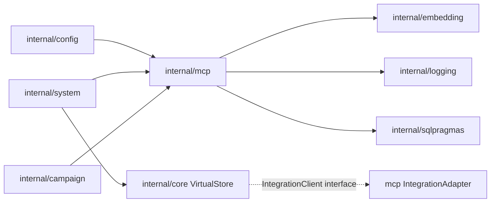

# 07 — Dependency Map: MCP

> Last verified against codebase: 2026-07-13

## 1. Upstream (what `internal/mcp` imports)

| Package | Use |
|---------|-----|
| `codenerd/internal/embedding` | Embed / EmbedWithTask / Dimensions / task types |
| `codenerd/internal/logging` | `CategoryTools` logs |
| `codenerd/internal/sqlpragmas` | `ApplyDefaultPragmas(..., ProfileHot)` on store DB |
| stdlib | `database/sql`, `net/http`, `os/exec`, `sync`, `context`, … |

**Does not import:** `internal/core`, `internal/config`, `internal/session`, `internal/prompt` (cycle avoidance).

## 2. Downstream (who imports `codenerd/internal/mcp`)

| Package / path | Use |
|----------------|-----|
| `internal/config` | `MCPServerConfig` conversion (`integrations.go`) |
| `internal/system` | Boot bridge + adapters (`factory.go`, `factory_adapters.go`) |
| `internal/campaign` | `*MCPToolStore` on pregenerator + intelligence gatherer |
| Tests under `internal/mcp` | Self |
| E2E | Uses VirtualStore MCP interfaces; may not import mcp package types |

`internal/core` talks to MCP via **interfaces** (`IntegrationClient`), not the mcp package.

## 3. Config dependency edge

```
internal/config ──imports──► internal/mcp (types only for conversion)
internal/mcp ──does not──► internal/config
```

Historical note: `LEAK_FINDINGS.md` documents a cycle risk involving config/mcp/store; store now uses `sqlpragmas` rather than config for pragmas. Re-audit if reintroducing config imports into mcp.

## 4. Kernel / schema adjacency (not Go imports)

```
kernel_init loads schemas_mcp.mg (defaults)
policy_mcp.mg sits in internal/mcp (policy rules)
compiler asserts/queries string facts at runtime
```

## 5. Embedding engine adjacency

Analyzer and compiler both depend on `embedding.EmbeddingEngine` and optionally `TaskTypeAwareEngine`:

- Tool analysis embeddings: documentation-style task  
- Query embeddings: query-style task (`SelectTaskType`)

## 6. VirtualStore adjacency

```
system/factory
  NewMCPIntegrationBridge
  for each server: vs.SetMCPClient(id, adapter)

core/VirtualStore
  mcpClients map
  GetMCPClient → mcpClientProxy
  actions/workflows call named servers (code_graph, scraper, …)
```

## 7. Campaign adjacency

```
ToolPregenerator.mcpStore *mcp.MCPToolStore
IntelligenceGatherer.mcpStore *mcp.MCPToolStore
  calculateToolAffinity(*mcp.MCPTool, goal)
```

Used for capability gap / intelligence — not the full bridge lifecycle.

## 8. Mermaid overview



## 9. Forbidden / discouraged edges

| Edge | Why |
|------|-----|
| mcp → core | Import cycle with VirtualStore / kernel |
| mcp → config | Historical cycle risk; keep conversion in config |
| Callers constructing transports outside manager | Bypasses status + discover lifecycle (tests excepted) |
