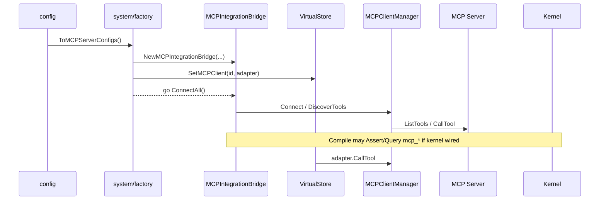

# codeNERD MCP — Implemented Spec (Deep-Dive)

> Last verified against codebase: 2026-09-09  
> Status: Living Reference Document  
> Language: Go  
> Primary package: `internal/mcp/`  
> Model-facing package: `internal/tools/mcpctl/`  
> Scale: **15** non-test Go sources in `internal/mcp/` plus **3** in `internal/tools/mcpctl/`  
> Related schema: `internal/core/defaults/schemas_mcp.mg` (Section 50, incl. 50.10)  
> Related policy: `internal/core/defaults/policy/policy_mcp.mg`, `constitution.mg`, `intent_routing_rules.mg`  
> Boot wiring: `internal/system/factory.go`, `internal/config/integrations.go`  
> Execution edge: `internal/core/virtual_store.go` + `virtual_store_mcp_proxy.go`

## 1. Overview

`internal/mcp` is codeNERD’s **Model Context Protocol client** and **JIT Tool Compiler**. It turns external MCP servers into a durable, selectable tool catalog that can be:

1. **Connected** over HTTP, stdio, or SSE  
2. **Discovered** and **analyzed** (LLM optional; heuristics always)  
3. **Persisted** with embeddings under `{workspace}/.nerd/mcp_tools.db`  
4. **Classified** into a verb facet and a blast-radius risk class, derived from the server's own annotations plus its schema  
5. **Fronted** by a fixed five-verb control plane the model actually sees, which discloses detail on demand  
6. **Invoked** through the control plane, or through `IntegrationAdapter` / VirtualStore `IntegrationClient`

### The economic problem the control plane solves

Discovering a server's tools and describing them to a model are two different
costs, and only the first is paid once. Rendering every discovered tool's schema
into a prompt charges for the whole catalog on **every turn**, forever, whether
or not the agent touches any of it. That standing cost is why a complete
selection stack can sit finished and unwired.

The control plane changes the shape of the bill. The model sees five verbs whose
count does not depend on how many servers are connected; everything that varies
is disclosed only to the turn that asks for it. Measured against a 26-tool
fixture server (`TestControlPlane_AtlasShouldCostFarLessThanTheRawCatalog`):

| Surface | Bytes |
|---------|------:|
| Raw catalog dump (name + description + inputSchema for every tool) | 10,905 |
| Compact atlas covering the same 26 tools | 667 |
| **Reduction** | **16.3x** |

And on results (`TestControlPlane_CallShouldShapeLargeResultAndRetainTheRest`), a
200-row payload of 74,723 bytes shapes to 1,008 bytes — **74x** — while
reporting its own structure and retaining the remainder under a handle.

### Key characteristics

| Property | Value |
|----------|-------|
| Role | MCP **client** (not server) |
| Selection philosophy | Logic-first hybrid (0.7 logic + 0.3 vector) with Go fallback |
| Render tiers | full ≥70, condensed ≥40, minimal ≥20 (defaults) |
| Token budget default | 4000 (approx 200/30/5 tokens per tier) |
| Model-facing surface | Fixed at **5 verbs**, independent of server or tool count |
| Disclosure views | `summary` / `compact` / `full`, default `compact` |
| Result shaping | Budgeted in **bytes**, items, depth, string width and object keys |
| Handles | Payload **retained**, expandable by RFC 6901 pointer, never re-invoked |
| Multi-server | Dynamic map of server IDs from config |
| Kernel Decls | Loaded (`schemas_mcp.mg`, Sections 50.1–50.10) |
| Kernel policy rules | Loaded from `internal/core/defaults/policy/policy_mcp.mg` |
| Fact emission on discover | Implemented (`facts.go` `FactEmitter`) |
| Risk gate authority | Mangle `mcp_tool_gated/1`; Go fallback only when no kernel is wired |
| Cycle safety | No import of `internal/core`; `mcpctl` imports `mcp`, never the reverse |

### High-level control flow

```
config integrations.servers
        │
        ▼
system factory ── NewMCPIntegrationBridge
        │              ├ MCPToolStore
        │              ├ ToolAnalyzer
        │              ├ MCPClientManager
        │              ├ JITToolCompiler
        │              └ ToolRenderer
        │
        ├─ VirtualStore.SetMCPClient(id, IntegrationAdapter)
        └─ go ConnectAll → DiscoverTools → SaveTool

later:
  next_action / workflow → GetMCPClient(id).CallTool → transport
  (optional) CompileToolsForShard → markdown for LLM
```

Fact-flow position:

```
user_intent → kernel next_action → VirtualStore
  → (if action needs external integration)
       GetMCPClient(server).CallTool → MCP server → result → articulation
```

Tool *serving* into prompts is a parallel JIT path (compile+render), sibling to prompt atoms.

---

## 2. Implementation status

| Component | Status | Notes |
|-----------|--------|-------|
| Domain types + defaults | **Implemented** | `types.go` |
| HTTP transport | **Implemented** | `transport_http.go` |
| Stdio transport | **Implemented** | `transport_stdio.go` |
| SSE transport | **Implemented** | `transport_sse.go` |
| Client manager | **Implemented** | connect/discover/call |
| Tool analyzer | **Implemented** | LLM + heuristic + embed |
| SQLite store + vec | **Implemented** | brute fallback |
| JIT compiler | **Implemented** | mangle query + fallback + budget |
| Renderer | **Implemented** | md / compact / JSON / invoke |
| Integration bridge + adapter | **Implemented** | VS-facing |
| Config conversion | **Implemented** | `config/integrations.go` |
| Boot adapter wiring | **Implemented** | when servers enabled |
| Async auto-connect | **Implemented** | fire-and-forget |
| VS proxy sanitization | **Implemented** | core package |
| Schema Decls boot-load | **Implemented** | `defaults/schemas_mcp.mg`, Sections 50.1–50.10 |
| Policy rules boot-load | **Implemented** | `defaults/policy/policy_mcp.mg`, swept by `kernel_init.go` |
| EDB assert on discover | **Implemented** | `facts.go` `FactEmitter`, subject-keyed replace |
| Facet + risk classification | **Implemented** | `facets.go`, derived at discovery, persisted |
| Result digest + byte budget | **Implemented** | `digest.go`, adaptive shrink |
| Handle retention + expansion | **Implemented** | `handles.go`, content-addressed, TTL + LRU |
| Progressive schema disclosure | **Implemented** | `signature.go`, schema returned on argument failure |
| Control plane | **Implemented** | `controlplane.go`, `controlplane_invoke.go` |
| Model-facing verbs | **Implemented** | `internal/tools/mcpctl/`, registered on both registries |
| Constitution + routing coverage | **Implemented** | `constitution.mg`, `intent_routing_rules.mg`, parity-tested |
| Bridge retained on bctx | **Implemented** | `Cortex.mcpBridge`, `Cortex.MCPBridge()` |
| Control plane reaches LLM prompt | **Implemented** | via `coreTools` → `cfg.AllowedTools` → both prompt paths |
| Campaign store consumers | **Partial** | optional injection |
| MCP server host mode | **Out of scope** | |

**Overall:** production-capable client infrastructure, Mangle-governed selection
and gating, and a fixed-size progressively-disclosed surface that reaches the
model. The remaining partial is campaign-side store injection.

---

## 3. Source inventory

### 3.1 Package layout

```
internal/mcp/
  types.go                  # domain model, MCPTransport, annotations, defaults
  client.go                 # MCPClientManager
  analyzer.go               # ToolAnalyzer
  store.go                  # MCPToolStore
  compiler.go               # JITToolCompiler
  renderer.go               # ToolRenderer
  integration.go            # Bridge + IntegrationAdapter + ControlPlane()
  facts.go                  # FactEmitter (kernel EDB mirror)
  facets.go                 # facet + risk classification
  digest.go                 # result shaping, byte budgets, shape sketch
  handles.go                # retained payload store, pointer expansion
  signature.go              # signature lines, full schema, argument validation
  controlplane.go           # ControlPlane, Atlas, Probe, catalog cache
  controlplane_invoke.go    # Call, Expand, Context, risk gate
  resources.go              # resources/* and prompts/* transport surfaces
  headers.go metrics.go redact.go
  transport_http.go transport_stdio.go transport_sse.go
  README.md
  *_test.go
  export_test.go

internal/tools/mcpctl/
  mcpctl.go                 # control-plane binding + arg coercion
  tools.go                  # mcp_map, mcp_probe, mcp_call, mcp_expand, mcp_context
  register.go               # RegisterAll
```

### 3.2 Largest sources

| Path | ~Lines | Purpose |
|------|------:|---------|
| `store.go` | 683 | Persistence, semantic search |
| `client.go` | 545 | Multi-server lifecycle |
| `analyzer.go` | 523 | Metadata extraction |
| `transport_stdio.go` | 478 | Subprocess JSON-RPC |
| `transport_sse.go` | 439 | SSE transport |
| `compiler.go` | 363 | JIT pipeline |
| `transport_http.go` | 291 | HTTP transport |
| `types.go` | 267 | Types |
| `renderer.go` | 227 | LLM formatting |
| `integration.go` | 183 | System façade |

### 3.3 External adjacency inventory

| Path | Role |
|------|------|
| `internal/core/defaults/schemas_mcp.mg` | Decl module |
| `internal/system/factory.go` | Boot |
| `internal/system/factory_adapters.go` | Kernel/LLM adapters |
| `internal/config/integrations.go` | Config → MCPServerConfig |
| `internal/core/virtual_store*.go` | Client map + proxy + call sites |
| `internal/campaign/tool_pregenerator.go` | MCPToolStore field |
| `internal/campaign/intelligence_gatherer.go` | Affinity over MCPTool |
| `tests/e2e/mcp_virtualstore_integration_test.go` | Proxy e2e |

---

## 4. Deep dive — transports

### 4.1 Interface

All transports implement `MCPTransport` (`types.go`): Connect, Disconnect, ListTools, CallTool, GetCapabilities, Ping, IsConnected.

### 4.2 HTTP (`transport_http.go`)

- JSON-RPC style requests (`jsonrpc`, `id`, `method`, `params`)  
- Connect probes capabilities  
- Methods used: tools list/call, capabilities (implementation-specific method names in file)  
- `http.Client` timeout from config  

### 4.3 Stdio (`transport_stdio.go`)

- Endpoint string split on whitespace → `exec.Command`  
- Pipes stdin/stdout/stderr  
- Pending request map by JSON-RPC id  
- Background stdout/stderr readers  
- Optional notification handler  

**Safety note:** subprocess is as powerful as the configured command — treat as trusted config.

### 4.4 SSE (`transport_sse.go`)

- GET with `Accept: text/event-stream`  
- Wait for endpoint event (timeout)  
- POST path for requests; pending response channels  
- Initialize capabilities after endpoint resolved  

### 4.5 Protocol selection

`MCPClientManager.Connect` switches on `Protocol(cfg.Protocol)`:

| Value | Constructor |
|-------|-------------|
| `http` | `NewHTTPTransport(BaseURL, timeout)` |
| `stdio` | `NewStdioTransport(Endpoint)` |
| `sse` | `NewSSETransport(BaseURL, timeout)` |

Invalid timeout → 30s. Empty protocol → error.

---

## 5. Deep dive — client manager

### 5.1 Responsibilities

- Hold `map[string]*MCPServerConnection`  
- Create transports from config  
- Persist servers  
- Discover + process tools  
- Route CallTool by `server/tool` ID  
- Fire callbacks  

### 5.2 Discovery & analysis cache

`processToolSchema`:

1. toolID = `serverID/name`  
2. If store has tool with non-zero `AnalyzedAt` → return cached  
3. Else analyze (if analyzer non-nil)  
4. Default condensed = truncate(description, 80)  
5. SaveTool  

### 5.3 Call path protections

- Nil args → empty map  
- Clone args (`maps.Copy`)  
- JSON marshal validation  
- Traversal reject on tool name  
- Offline → soft fail result  
- Map context deadline/cancel to protocol errors  
- Truncate output at 500KiB  
- Async `RecordToolUsage` with recover  

### 5.4 ConnectAll semantics

Only `Enabled && AutoConnect` configs. Accumulates **last** error; continues other servers.

---

## 6. Deep dive — analyzer

### 6.1 LLM path

- Template prompt with name, description, schemas  
- Expect JSON: categories, capabilities, domain, shard_affinities, use_cases, condensed  
- Normalize enums (categories whitelist, capabilities with `/` prefix, domains, affinities 0–100)  
- Embed composite text (name, description, categories, capabilities, use cases)  

### 6.2 Heuristic path (`analyzeWithoutLLM`)

- Keyword inference for categories/capabilities  
- Domain `/general`  
- Default shard affinities  
- Same embedding attempt  

### 6.3 Resilience

Any LLM/build/parse failure falls back to heuristic. Context cancel tested.

---

## 7. Deep dive — store

### 7.1 Schema

Tables `mcp_servers`, `mcp_tools` (+ indexes). Optional `mcp_tool_vec` via sqlite-vec `vec0`.

### 7.2 Semantic search

1. If `vectorExt`: cosine distance query → score = 1 - distance  
2. Else: scan embeddings, `cosineSimilarity`, sort, topK  
3. Vec query failure falls back to brute  

### 7.3 Usage update formula

Running average latency with REAL cast to avoid overflow; increments usage/success; sets last_used.

### 7.4 Pragmas

`sqlpragmas.ApplyDefaultPragmas(db, ProfileHot)` — avoids store→config coupling.

---

## 8. Deep dive — JIT compiler

### 8.1 Phases

| Phase | Action |
|------:|--------|
| 0 | Normalize token budget |
| 1 | Load all tools from store |
| 2 | Vector search on task description |
| 3 | Assert vector scores to kernel |
| 4 | selectTools (mangle or fallback) |
| 5 | buildToolSet |
| 6 | fitBudget demotion |
| 7 | Retract vector scores |
| 8 | Log stats |

### 8.2 fallbackSelect

For each tool:

```
logic = ShardAffinities[shardType]  # strip leading /
vec   = int(vectorScore * 100)
final = (logic*7 + vec*3) / 10
```

Sort descending; assign modes by thresholds; exclude below minimal.

### 8.3 mangleSelect

Query `mcp_tool_selected(%q, ToolID, RenderMode)` for shard type; map mode strings.

### 8.4 fitBudget

Estimated costs: full 200, condensed 30, minimal 5 tokens. Demote full→condensed while over budget and full count > MaxFullTools; then condensed→minimal; then drop minimal.

### 8.5 Skeleton/flesh counters

In `buildToolSet`, full tools increment `SkeletonTools`; condensed/minimal increment `FleshTools` (naming is approximate vs policy skeleton concept).

---

## 9. Deep dive — renderer

`Render` produces markdown:

```markdown
## Available MCP Tools (selected of total)
### Primary Tools
#### name
description
**Capabilities:** …
**Parameters:** ```json … ```
### Secondary Tools
- **name**: condensed
### Additional Tools (N more)
Available on request: a, b, c
```

Also: `RenderCompact`, `RenderJSON`, `RenderForInvocation`. Schema pretty-print truncated at `maxSchemaLen` (default 500).

---

## 10. Deep dive — control plane (progressive disclosure)

`controlplane.go` + `controlplane_invoke.go` + `facets.go` + `digest.go` +
`handles.go` + `signature.go`, surfaced by `internal/tools/mcpctl/`.

### 10.1 The five verbs

The model-facing surface is fixed at five tools regardless of how many servers
or tools are connected. That constancy is the entire economic argument; a sixth
verb costs every prompt forever, so the bar for adding one is that it changes
which call an agent makes.

| Verb | Effect | Purpose |
|------|--------|---------|
| `mcp_map` | read | Atlas: servers, status, tool counts, facets, sample names. No schemas. |
| `mcp_probe` | read | Zoom: signature lines for a facet/query; full schema for one named tool. |
| `mcp_call` | external | Invoke, with the result shaped to a view and the remainder handled. |
| `mcp_expand` | read | Reopen a retained payload by handle and JSON pointer. Never re-invokes. |
| `mcp_context` | external | The non-tool half: ranked server resources and prompt templates. |

The ladder is taught in each tool's `Description`, because progressive
disclosure only saves anything if the model starts at the cheap rung.

### 10.2 Facets and risk (`facets.go`)

Every discovered tool is classified into one of six verb facets — `read`,
`search`, `analyze`, `write`, `execute`, `manage` — and one of four risk
classes — `safe`, `mutating`, `destructive`, `arbitrary`.

Classification is derived, never configured, so a server nobody has
hand-described still arrives describable. Signals, strongest first:

1. **Server annotations** (`readOnlyHint`, `destructiveHint`). The server is
   describing itself; an inference that contradicts a declaration is a bug.
2. **Name tokens**, split across snake_case, kebab-case and camelCase so
   `listPullRequests` and `list_pull_requests` classify identically.
3. **Analyzer capabilities**, consulted only where they are not overruled by a
   stronger signal — capability extraction is substring matching over prose and
   routinely tags a read tool `/write` for containing the word "updated".
4. **Input schema shape**: a `code` or `command` parameter means arbitrary
   execution whatever the tool is called.

Risk evidence is never weaker than facet evidence, and a tool that matches
nothing is classified `mutating`, not `safe`: the classifier ran out of
evidence, which is not the same as finding none.

`ClassificationSource` is retained alongside each verdict so policy can tell a
declaration from a guess.

### 10.3 Result shaping (`digest.go`)

Budgets are enforced on five axes — bytes, items, depth, string width, object
keys — because a payload can be too big in five independent ways and clamping
any four still lets the fifth through. Item-count clamping alone is the obvious
approach and it fails on the most common real payload there is: one object with
one enormous string in it.

| View | MaxBytes | MaxItems | MaxDepth | MaxStringBytes | MaxObjectKeys |
|------|---------:|---------:|---------:|---------------:|--------------:|
| `summary` | 600 | 3 | 3 | 120 | 12 |
| `compact` | 2,400 | 20 | 5 | 400 | 32 |
| `full` | 16,000 | 200 | 12 | 4,000 | 100 |

`full` is bounded rather than unbounded on purpose: it means "everything within
a budget you can afford".

When a shaped render still overruns `MaxBytes`, `shapeToFit` halves the item,
string and key budgets and reshapes, up to five times, before falling back to
discarding. Returning fewer whole rows is the answer; nulling the payload
answers a request for a smaller result with no result.

**The shape sketch** is the highest-value line in the surface: one line such as
`{items: [200 x {body: text, id: str, status: str, title: str}], next_cursor: str}`
describes 200 records in about twenty tokens. String sketches are bucketed
(`str` / `text`) rather than exact-length, so structurally identical rows
collapse to one term instead of reading as `mixed`.

Every cut is reported as an `Elision` carrying an RFC 6901 pointer **into the
original payload**, which is what makes truncation actionable rather than merely
honest.

### 10.4 Handles (`handles.go`)

The handle store **retains** payloads rather than re-deriving them, and this is
a deliberate departure from the browser-side progressive tools, where expanding
a handle re-runs the observation. Re-running is defensible for a read of a live
page. It is not defensible here: this plane fronts arbitrary MCP servers, so the
call behind a handle may have opened a pull request or deleted a branch.
"Expand what you already told me" must never be able to fire a second side
effect.

Handles are content-addressed over `(toolID, payload)`, so an identical result
is stored once and a handle quoted from an earlier turn still resolves.
Retention is bounded on three axes at once — entries (64), bytes (8 MB) and TTL
(30 min) — because they fail differently. Expansion is itself budgeted: the
reason a result was elided is that it was too big.

### 10.5 Progressive schema disclosure (`signature.go`)

Browsing shows a signature — `get_issue(id: str[, as_of: str, expand: []str])` —
at roughly fifteen tokens. The full JSON Schema is disclosed only when a tool is
named in `mcp_probe`, or when a call fails validation: `ValidateArgs` returns an
`ArgumentError` **carrying the schema**, because the moment an agent gets an
argument wrong is the one moment where spending those tokens is certainly worth
it. Validation is deliberately shallow (required-presence, top-level types); a
client-side gate stricter than the server would refuse calls the server would
have served.

### 10.6 Risk gating

`mcp_call` checks arguments, then risk, then dispatches. The order matters: a
malformed call is answered with the schema rather than a warning about blast
radius, and the agent meets the risk gate once, on a call it is ready to make.

Gating authority is Mangle. `KernelRiskGate` queries `mcp_tool_gated(ToolID)`;
the Go constant is a fallback used only when no kernel is wired, and it is the
stricter reading of the two. A kernel query that *fails* is treated as gated —
dispatching an unclassified remote call because the check itself broke is the
one outcome that must never happen quietly.

`confirm_risk` is not a security boundary; the agent can set it. It is a
deliberateness boundary, and that is the failure it prevents: a tool with an
innocuous name turns out to delete a branch, and nothing in the transcript shows
that anyone decided it should.

### 10.7 JIT context (`Context`)

MCP servers expose three primitive kinds; tools are one. `mcp_context` ranks a
server's published resources and prompt templates against a query, and with
`read=true` fetches and excerpts the top few. Many servers publish exactly the
context an agent would otherwise infer from tool descriptions — a query dialect,
a field reference, a worked example. Catalogs are cached per server with a
5-minute TTL, because a context lookup that re-listed every resource per call
would make the cheap operation the expensive one.

---

## 11. Deep dive — integration bridge

`NewMCPIntegrationBridge`:

1. dbPath = `filepath.Join(workspace, ".nerd", "mcp_tools.db")`  
2. NewMCPToolStore  
3. NewToolAnalyzer  
4. NewMCPClientManager  
5. NewJITToolCompiler  
6. NewToolRenderer  

`GetAdapter` lazily creates per-server `IntegrationAdapter`.  
`CompileToolsForShard` = Compile + Render.  
`Close` = DisconnectAll + store.Close.

`IntegrationAdapter.CallTool` builds `serverID/tool` and maps MCPCallResult to `(any, error)`.

---

## 12. Integration map (cross-system)



### Named consumer servers (core)

- `code_graph` — impact analysis action  
- `scraper` — workflow scraping  

These IDs must match config map keys.

### Campaign

Store pointer used for gap detection / affinity scoring — not transport ownership.

---

## 13. Mangle surface (summary)

Full detail: [09-MANGLE-SURFACE.md](09-MANGLE-SURFACE.md).

| Layer | Path | Status |
|-------|------|--------|
| Decl | `internal/core/defaults/schemas_mcp.mg` | Loaded (Sections 50.1–50.10) |
| Rules | `internal/core/defaults/policy/policy_mcp.mg` | Loaded by the `defaults/policy/*.mg` sweep |
| Temp facts | `mcp_tool_vector_score` | Asserted during compile, retracted by exact fact |
| Permanent EDB | server/tool/capability/affinity/facet/risk/handle | Asserted by `facts.go` `FactEmitter` |
| Constitution | `constitution.mg` | `safe_action` for all five `mcp_*` verbs |
| Routing | `intent_routing_rules.mg` | `modular_tool_allowed` for all five, any intent |

### Control-plane predicates (Section 50.10)

| Predicate | Kind | Meaning |
|-----------|------|---------|
| `mcp_tool_facet(ToolID, Facet)` | EDB | `/read` `/search` `/analyze` `/write` `/execute` `/manage` |
| `mcp_tool_risk(ToolID, Risk)` | EDB | `/safe` `/mutating` `/destructive` `/arbitrary` |
| `mcp_tool_risk_source(ToolID, Source)` | EDB | `/annotation` `/capability` `/name` `/schema` `/default` |
| `mcp_result_handle(Handle, ToolID, Bytes)` | EDB | An outstanding, still-expandable shaped result |
| `mcp_tool_gated(ToolID)` | IDB | Needs `confirm_risk` before dispatch |
| `mcp_tool_browsable(ToolID)` | IDB | Safe enough for an unfiltered exploratory listing |
| `mcp_server_facet_available(ServerID, Facet)` | IDB | This server currently fills this facet |

`mcp_tool_gated` fires on `/destructive`, on `/arbitrary`, and on `/mutating`
whose risk source is `/default` — a class nothing said was safe, arrived at
because the classifier ran out of evidence.

Selection uses the Mangle path when the kernel derives a tool set and logs
`path=mangle`; `fallbackSelect` is the mirrored Go heuristic used otherwise.

---

## 14. Safety summary

| Control | Location |
|---------|----------|
| Arg clone + JSON check | `client.go` |
| Tool name traversal reject | `client.go` |
| Output 500KiB cap | `client.go` |
| Proxy primitive-only args | `virtual_store_mcp_proxy.go` |
| Null-byte strip results | proxy |
| Panic recovery | proxy + bg goroutines |
| Timeout defaults | client connect |
| Soft fail offline | CallTool result |

Constitutional permission is **outside** this package.

---

## 15. Observability summary

- Category: `Tools`  
- Compile Info line with timings and tier counts  
- Usage counters in SQLite  
- Boot Info per wired server  
- Status/usage persist failures elevated to Warn  

---

## 16. Testing summary

Dense unit/coverage tests for manager, store, compiler, analyzer, renderer, transports; e2e for VS proxy. Gaps: real servers, mangle golden, factory integration. Commands in [10-TESTING-ALIGNMENT.md](10-TESTING-ALIGNMENT.md).

---

## 17. Gaps pointer

Prioritized gaps live in [03-GAP-ANALYSIS.md](03-GAP-ANALYSIS.md). Top three:

1. Load `policy_mcp.mg` into kernel program  
2. Assert tool/server EDB on discover/save  
3. Retain bridge for compile path + readiness after ConnectAll  

---

## 18. Public API quick reference

Constructors: `NewMCPIntegrationBridge`, `NewMCPClientManager`, `NewMCPToolStore`, `NewToolAnalyzer`, `NewJITToolCompiler`, `NewToolRenderer`, `NewHTTPTransport`, `NewStdioTransport`, `NewSSETransport`, `NewIntegrationAdapter`, `DefaultToolSelectionConfig`.

See [06-PUBLIC-API-AND-TYPES.md](06-PUBLIC-API-AND-TYPES.md) for full tables.

---

## 19. Verify

```powershell
go test ./internal/mcp/...
# optional e2e
go test ./tests/e2e/ -run MCP -count=1
```

---

## 20. Document map

| Doc | Role |
|-----|------|
| [README.md](README.md) | Index |
| [00-ALIGNMENT-VISION-REVIEW.md](00-ALIGNMENT-VISION-REVIEW.md) | Scores |
| [01-VISION.md](01-VISION.md) | Target |
| [02-CURRENT-STATE.md](02-CURRENT-STATE.md) | Inventory |
| [03-GAP-ANALYSIS.md](03-GAP-ANALYSIS.md) | Gaps |
| [04-ARCHITECTURAL-PRINCIPLES.md](04-ARCHITECTURAL-PRINCIPLES.md) | Principles |
| [05-INTERNAL-ARCHITECTURE.md](05-INTERNAL-ARCHITECTURE.md) | Internals |
| [06-PUBLIC-API-AND-TYPES.md](06-PUBLIC-API-AND-TYPES.md) | API |
| [07-DEPENDENCY-MAP.md](07-DEPENDENCY-MAP.md) | Deps |
| [08-WIRING-AND-INTEGRATION.md](08-WIRING-AND-INTEGRATION.md) | Wiring |
| [09-SAFETY-AND-INVARIANTS.md](09-SAFETY-AND-INVARIANTS.md) | Safety |
| [09-MANGLE-SURFACE.md](09-MANGLE-SURFACE.md) | Mangle |
| [10-TESTING-ALIGNMENT.md](10-TESTING-ALIGNMENT.md) | Tests |
| [11-OBSERVABILITY.md](11-OBSERVABILITY.md) | Logs |
| [12-FAILURE-MODES.md](12-FAILURE-MODES.md) | Failures |
| [TODO.md](TODO.md) / [OPEN-QUESTIONS.md](OPEN-QUESTIONS.md) | Backlog |

---

## 21. Changelog of understanding (rebuild)

| Date | Note |
|------|------|
| 2026-07-13 | Full corpus rebuild to SUBAGENT_INSTRUCTIONS + cli quality bar; code-grounded wiring audit; thin stub set replaced |

**End of IMPLEMENTED_SPEC** — this is the flagship living document for `internal/mcp`.
