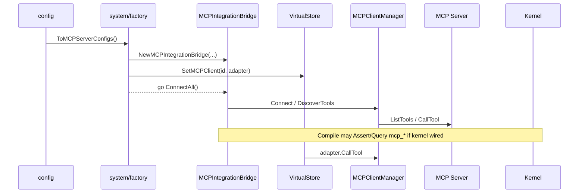

# codeNERD MCP — Implemented Spec (Deep-Dive)

> Last verified against codebase: 2026-07-13  
> Status: Living Reference Document  
> Language: Go  
> Primary package: `internal/mcp/`  
> Scale: **10** non-test Go sources ≈ **4.0k** lines; **16** test files; **1** local policy `.mg`  
> Related schema: `internal/core/defaults/schemas_mcp.mg`  
> Boot wiring: `internal/system/factory.go`, `internal/config/integrations.go`  
> Execution edge: `internal/core/virtual_store.go` + `virtual_store_mcp_proxy.go`

## 1. Overview

`internal/mcp` is codeNERD’s **Model Context Protocol client** and **JIT Tool Compiler**. It turns external MCP servers into a durable, selectable tool catalog that can be:

1. **Connected** over HTTP, stdio, or SSE  
2. **Discovered** and **analyzed** (LLM optional; heuristics always)  
3. **Persisted** with embeddings under `{workspace}/.nerd/mcp_tools.db`  
4. **Compiled** into a budgeted full/condensed/minimal set for LLM context  
5. **Invoked** through `IntegrationAdapter` / VirtualStore `IntegrationClient`

### Key characteristics

| Property | Value |
|----------|-------|
| Role | MCP **client** (not server) |
| Selection philosophy | Logic-first hybrid (0.7 logic + 0.3 vector) with Go fallback |
| Render tiers | full ≥70, condensed ≥40, minimal ≥20 (defaults) |
| Token budget default | 4000 (approx 200/30/5 tokens per tier) |
| Multi-server | Dynamic map of server IDs from config |
| Kernel Decls | Loaded (`schemas_mcp.mg`) |
| Kernel policy rules | Present as `policy_mcp.mg`; **load not confirmed** |
| Fact emission on discover | **Not implemented** in Go |
| Cycle safety | No import of `internal/core` |

### High-level control flow

```
config integrations.servers
        │
        ▼
system factory ── NewMCPIntegrationBridge
        │              ├ MCPToolStore
        │              ├ ToolAnalyzer
        │              ├ MCPClientManager
        │              ├ JITToolCompiler
        │              └ ToolRenderer
        │
        ├─ VirtualStore.SetMCPClient(id, IntegrationAdapter)
        └─ go ConnectAll → DiscoverTools → SaveTool

later:
  next_action / workflow → GetMCPClient(id).CallTool → transport
  (optional) CompileToolsForShard → markdown for LLM
```

Fact-flow position:

```
user_intent → kernel next_action → VirtualStore
  → (if action needs external integration)
       GetMCPClient(server).CallTool → MCP server → result → articulation
```

Tool *serving* into prompts is a parallel JIT path (compile+render), sibling to prompt atoms.

---

## 2. Implementation status

| Component | Status | Notes |
|-----------|--------|-------|
| Domain types + defaults | **Implemented** | `types.go` |
| HTTP transport | **Implemented** | `transport_http.go` |
| Stdio transport | **Implemented** | `transport_stdio.go` |
| SSE transport | **Implemented** | `transport_sse.go` |
| Client manager | **Implemented** | connect/discover/call |
| Tool analyzer | **Implemented** | LLM + heuristic + embed |
| SQLite store + vec | **Implemented** | brute fallback |
| JIT compiler | **Implemented** | mangle query + fallback + budget |
| Renderer | **Implemented** | md / compact / JSON / invoke |
| Integration bridge + adapter | **Implemented** | VS-facing |
| Config conversion | **Implemented** | `config/integrations.go` |
| Boot adapter wiring | **Implemented** | when servers enabled |
| Async auto-connect | **Implemented** | fire-and-forget |
| VS proxy sanitization | **Implemented** | core package |
| Schema Decls boot-load | **Implemented** | defaults |
| Policy rules boot-load | **Missing** | `policy_mcp.mg` orphaned from loader |
| EDB assert on discover | **Missing** | blocks true mangle select |
| Bridge retained on bctx | **Partial** | local factory var |
| Compile→prompt assembly default | **Partial** | API exists; not standard hot path |
| Campaign store consumers | **Partial** | optional injection |
| MCP server host mode | **Out of scope** | |

**Overall:** production-capable **client infrastructure** with designed JIT compiler; **Mangle executive selection is incomplete**. Heuristic completeness ~**85–90%** of client design.

---

## 3. Source inventory

### 3.1 Package layout

```
internal/mcp/
  types.go              # domain model, MCPTransport, defaults
  client.go             # MCPClientManager
  analyzer.go           # ToolAnalyzer
  store.go              # MCPToolStore
  compiler.go           # JITToolCompiler
  renderer.go           # ToolRenderer
  integration.go        # Bridge + IntegrationAdapter
  transport_http.go
  transport_stdio.go
  transport_sse.go
  policy_mcp.mg         # Section 50 rules (local)
  README.md
  *_test.go             # 16 test files
  export_test.go
```

### 3.2 Largest sources

| Path | ~Lines | Purpose |
|------|------:|---------|
| `store.go` | 683 | Persistence, semantic search |
| `client.go` | 545 | Multi-server lifecycle |
| `analyzer.go` | 523 | Metadata extraction |
| `transport_stdio.go` | 478 | Subprocess JSON-RPC |
| `transport_sse.go` | 439 | SSE transport |
| `compiler.go` | 363 | JIT pipeline |
| `transport_http.go` | 291 | HTTP transport |
| `types.go` | 267 | Types |
| `renderer.go` | 227 | LLM formatting |
| `integration.go` | 183 | System façade |

### 3.3 External adjacency inventory

| Path | Role |
|------|------|
| `internal/core/defaults/schemas_mcp.mg` | Decl module |
| `internal/system/factory.go` | Boot |
| `internal/system/factory_adapters.go` | Kernel/LLM adapters |
| `internal/config/integrations.go` | Config → MCPServerConfig |
| `internal/core/virtual_store*.go` | Client map + proxy + call sites |
| `internal/campaign/tool_pregenerator.go` | MCPToolStore field |
| `internal/campaign/intelligence_gatherer.go` | Affinity over MCPTool |
| `tests/e2e/mcp_virtualstore_integration_test.go` | Proxy e2e |

---

## 4. Deep dive — transports

### 4.1 Interface

All transports implement `MCPTransport` (`types.go`): Connect, Disconnect, ListTools, CallTool, GetCapabilities, Ping, IsConnected.

### 4.2 HTTP (`transport_http.go`)

- JSON-RPC style requests (`jsonrpc`, `id`, `method`, `params`)  
- Connect probes capabilities  
- Methods used: tools list/call, capabilities (implementation-specific method names in file)  
- `http.Client` timeout from config  

### 4.3 Stdio (`transport_stdio.go`)

- Endpoint string split on whitespace → `exec.Command`  
- Pipes stdin/stdout/stderr  
- Pending request map by JSON-RPC id  
- Background stdout/stderr readers  
- Optional notification handler  

**Safety note:** subprocess is as powerful as the configured command — treat as trusted config.

### 4.4 SSE (`transport_sse.go`)

- GET with `Accept: text/event-stream`  
- Wait for endpoint event (timeout)  
- POST path for requests; pending response channels  
- Initialize capabilities after endpoint resolved  

### 4.5 Protocol selection

`MCPClientManager.Connect` switches on `Protocol(cfg.Protocol)`:

| Value | Constructor |
|-------|-------------|
| `http` | `NewHTTPTransport(BaseURL, timeout)` |
| `stdio` | `NewStdioTransport(Endpoint)` |
| `sse` | `NewSSETransport(BaseURL, timeout)` |

Invalid timeout → 30s. Empty protocol → error.

---

## 5. Deep dive — client manager

### 5.1 Responsibilities

- Hold `map[string]*MCPServerConnection`  
- Create transports from config  
- Persist servers  
- Discover + process tools  
- Route CallTool by `server/tool` ID  
- Fire callbacks  

### 5.2 Discovery & analysis cache

`processToolSchema`:

1. toolID = `serverID/name`  
2. If store has tool with non-zero `AnalyzedAt` → return cached  
3. Else analyze (if analyzer non-nil)  
4. Default condensed = truncate(description, 80)  
5. SaveTool  

### 5.3 Call path protections

- Nil args → empty map  
- Clone args (`maps.Copy`)  
- JSON marshal validation  
- Traversal reject on tool name  
- Offline → soft fail result  
- Map context deadline/cancel to protocol errors  
- Truncate output at 500KiB  
- Async `RecordToolUsage` with recover  

### 5.4 ConnectAll semantics

Only `Enabled && AutoConnect` configs. Accumulates **last** error; continues other servers.

---

## 6. Deep dive — analyzer

### 6.1 LLM path

- Template prompt with name, description, schemas  
- Expect JSON: categories, capabilities, domain, shard_affinities, use_cases, condensed  
- Normalize enums (categories whitelist, capabilities with `/` prefix, domains, affinities 0–100)  
- Embed composite text (name, description, categories, capabilities, use cases)  

### 6.2 Heuristic path (`analyzeWithoutLLM`)

- Keyword inference for categories/capabilities  
- Domain `/general`  
- Default shard affinities  
- Same embedding attempt  

### 6.3 Resilience

Any LLM/build/parse failure falls back to heuristic. Context cancel tested.

---

## 7. Deep dive — store

### 7.1 Schema

Tables `mcp_servers`, `mcp_tools` (+ indexes). Optional `mcp_tool_vec` via sqlite-vec `vec0`.

### 7.2 Semantic search

1. If `vectorExt`: cosine distance query → score = 1 - distance  
2. Else: scan embeddings, `cosineSimilarity`, sort, topK  
3. Vec query failure falls back to brute  

### 7.3 Usage update formula

Running average latency with REAL cast to avoid overflow; increments usage/success; sets last_used.

### 7.4 Pragmas

`sqlpragmas.ApplyDefaultPragmas(db, ProfileHot)` — avoids store→config coupling.

---

## 8. Deep dive — JIT compiler

### 8.1 Phases

| Phase | Action |
|------:|--------|
| 0 | Normalize token budget |
| 1 | Load all tools from store |
| 2 | Vector search on task description |
| 3 | Assert vector scores to kernel |
| 4 | selectTools (mangle or fallback) |
| 5 | buildToolSet |
| 6 | fitBudget demotion |
| 7 | Retract vector scores |
| 8 | Log stats |

### 8.2 fallbackSelect

For each tool:

```
logic = ShardAffinities[shardType]  # strip leading /
vec   = int(vectorScore * 100)
final = (logic*7 + vec*3) / 10
```

Sort descending; assign modes by thresholds; exclude below minimal.

### 8.3 mangleSelect

Query `mcp_tool_selected(%q, ToolID, RenderMode)` for shard type; map mode strings.

### 8.4 fitBudget

Estimated costs: full 200, condensed 30, minimal 5 tokens. Demote full→condensed while over budget and full count > MaxFullTools; then condensed→minimal; then drop minimal.

### 8.5 Skeleton/flesh counters

In `buildToolSet`, full tools increment `SkeletonTools`; condensed/minimal increment `FleshTools` (naming is approximate vs policy skeleton concept).

---

## 9. Deep dive — renderer

`Render` produces markdown:

```markdown
## Available MCP Tools (selected of total)
### Primary Tools
#### name
description
**Capabilities:** …
**Parameters:** ```json … ```
### Secondary Tools
- **name**: condensed
### Additional Tools (N more)
Available on request: a, b, c
```

Also: `RenderCompact`, `RenderJSON`, `RenderForInvocation`. Schema pretty-print truncated at `maxSchemaLen` (default 500).

---

## 10. Deep dive — integration bridge

`NewMCPIntegrationBridge`:

1. dbPath = `filepath.Join(workspace, ".nerd", "mcp_tools.db")`  
2. NewMCPToolStore  
3. NewToolAnalyzer  
4. NewMCPClientManager  
5. NewJITToolCompiler  
6. NewToolRenderer  

`GetAdapter` lazily creates per-server `IntegrationAdapter`.  
`CompileToolsForShard` = Compile + Render.  
`Close` = DisconnectAll + store.Close.

`IntegrationAdapter.CallTool` builds `serverID/tool` and maps MCPCallResult to `(any, error)`.

---

## 11. Integration map (cross-system)



### Named consumer servers (core)

- `code_graph` — impact analysis action  
- `scraper` — workflow scraping  

These IDs must match config map keys.

### Campaign

Store pointer used for gap detection / affinity scoring — not transport ownership.

---

## 12. Mangle surface (summary)

Full detail: [09-MANGLE-SURFACE.md](09-MANGLE-SURFACE.md).

| Layer | Path | Status |
|-------|------|--------|
| Decl | `internal/core/defaults/schemas_mcp.mg` | Loaded |
| Rules | `internal/mcp/policy_mcp.mg` | **Not loaded (evidence)** |
| Temp facts | `mcp_tool_vector_score` | Asserted during compile |
| Permanent EDB | registered/capability/affinity | **Not asserted by Go** |

Consequently production selection is **primarily `fallbackSelect`**.

---

## 13. Safety summary

| Control | Location |
|---------|----------|
| Arg clone + JSON check | `client.go` |
| Tool name traversal reject | `client.go` |
| Output 500KiB cap | `client.go` |
| Proxy primitive-only args | `virtual_store_mcp_proxy.go` |
| Null-byte strip results | proxy |
| Panic recovery | proxy + bg goroutines |
| Timeout defaults | client connect |
| Soft fail offline | CallTool result |

Constitutional permission is **outside** this package.

---

## 14. Observability summary

- Category: `Tools`  
- Compile Info line with timings and tier counts  
- Usage counters in SQLite  
- Boot Info per wired server  
- Status/usage persist failures elevated to Warn  

---

## 15. Testing summary

Dense unit/coverage tests for manager, store, compiler, analyzer, renderer, transports; e2e for VS proxy. Gaps: real servers, mangle golden, factory integration. Commands in [10-TESTING-ALIGNMENT.md](10-TESTING-ALIGNMENT.md).

---

## 16. Gaps pointer

Prioritized gaps live in [03-GAP-ANALYSIS.md](03-GAP-ANALYSIS.md). Top three:

1. Load `policy_mcp.mg` into kernel program  
2. Assert tool/server EDB on discover/save  
3. Retain bridge for compile path + readiness after ConnectAll  

---

## 17. Public API quick reference

Constructors: `NewMCPIntegrationBridge`, `NewMCPClientManager`, `NewMCPToolStore`, `NewToolAnalyzer`, `NewJITToolCompiler`, `NewToolRenderer`, `NewHTTPTransport`, `NewStdioTransport`, `NewSSETransport`, `NewIntegrationAdapter`, `DefaultToolSelectionConfig`.

See [06-PUBLIC-API-AND-TYPES.md](06-PUBLIC-API-AND-TYPES.md) for full tables.

---

## 18. Verify

```powershell
go test ./internal/mcp/...
# optional e2e
go test ./tests/e2e/ -run MCP -count=1
```

---

## 19. Document map

| Doc | Role |
|-----|------|
| [README.md](README.md) | Index |
| [00-ALIGNMENT-VISION-REVIEW.md](00-ALIGNMENT-VISION-REVIEW.md) | Scores |
| [01-VISION.md](01-VISION.md) | Target |
| [02-CURRENT-STATE.md](02-CURRENT-STATE.md) | Inventory |
| [03-GAP-ANALYSIS.md](03-GAP-ANALYSIS.md) | Gaps |
| [04-ARCHITECTURAL-PRINCIPLES.md](04-ARCHITECTURAL-PRINCIPLES.md) | Principles |
| [05-INTERNAL-ARCHITECTURE.md](05-INTERNAL-ARCHITECTURE.md) | Internals |
| [06-PUBLIC-API-AND-TYPES.md](06-PUBLIC-API-AND-TYPES.md) | API |
| [07-DEPENDENCY-MAP.md](07-DEPENDENCY-MAP.md) | Deps |
| [08-WIRING-AND-INTEGRATION.md](08-WIRING-AND-INTEGRATION.md) | Wiring |
| [09-SAFETY-AND-INVARIANTS.md](09-SAFETY-AND-INVARIANTS.md) | Safety |
| [09-MANGLE-SURFACE.md](09-MANGLE-SURFACE.md) | Mangle |
| [10-TESTING-ALIGNMENT.md](10-TESTING-ALIGNMENT.md) | Tests |
| [11-OBSERVABILITY.md](11-OBSERVABILITY.md) | Logs |
| [12-FAILURE-MODES.md](12-FAILURE-MODES.md) | Failures |
| [TODO.md](TODO.md) / [OPEN-QUESTIONS.md](OPEN-QUESTIONS.md) | Backlog |

---

## 20. Changelog of understanding (rebuild)

| Date | Note |
|------|------|
| 2026-07-13 | Full corpus rebuild to SUBAGENT_INSTRUCTIONS + cli quality bar; code-grounded wiring audit; thin stub set replaced |

**End of IMPLEMENTED_SPEC** — this is the flagship living document for `internal/mcp`.
