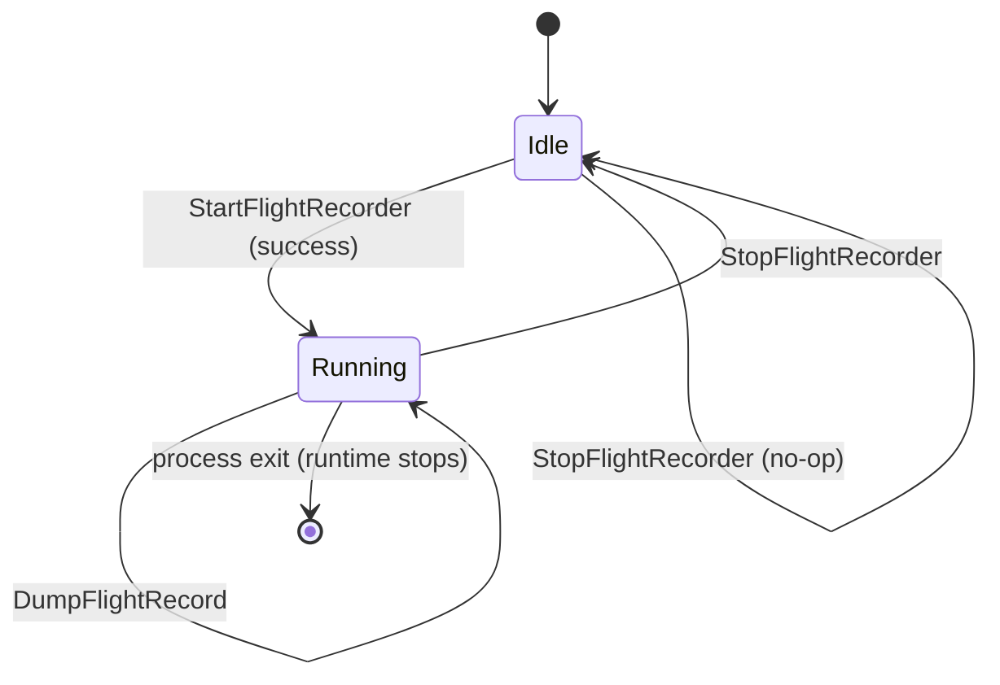

# observability — Implemented Spec (Deep-Dive)

> Last verified against codebase: 2026-07-13  
> Status: Living Reference Document  
> Language: Go  
> Module: `codenerd` (`go 1.26.0`, toolchain `go1.26.3`)  
> Primary sources: `internal/observability/`  
> Scale: **2** non-test Go files ≈ **326** lines; **3** test files ≈ **369** lines; **0** Mangle sources  

## 1. Overview

`internal/observability` is a **leaf diagnostics package** for the `nerd` process. It answers two operator questions that the Mangle kernel and chat stack do not:

1. **What was the runtime shape at boot?** — scheduler, GC, heap, GOMAXPROCS, Green Tea GC status.  
2. **What was the process doing just before it died?** — a rolling `runtime/trace` window dumped on panic.

It is intentionally small. Broader product observability (glass box, transparency, categorized file logs, prompt manifests) lives elsewhere. This package exists so crash dumps and boot telemetry share one place with **zero import cycles** into core/session/shards.

### Key characteristics

| Property | Value |
|----------|-------|
| Package role | Leaf host diagnostics |
| Exported surface | 5 functions, 0 exported types |
| Dependencies | stdlib + `codenerd/internal/logging` only |
| Production caller | `cmd/nerd/main.go` only |
| Feature gate | `features.IsFlightRecorderEnabled()` (`NERD_FLIGHTREC` / `features.flight_recorder`) |
| Startup metrics | Always attempted after `logging.Initialize` |
| Flight recorder defaults (prod) | 64 MiB ring, 30 s min age |
| Trace artifacts | `<workspace>/.nerd/traces/flight_<UTC>.trace` |
| Mangle / shards / prompts | None |
| Constitutional safety | N/A as policy actor; must not block or bypass kernel |

### High-level control flow

```
main()
  │
  ├─ logging.Initialize(cwd)          // so CategoryBoot can capture metrics
  ├─ config.GlobalConfig()            // features.SetActive side effect
  ├─ observability.LogStartupMetrics()
  │     └─ runtime/metrics.Read + greenTeaStatus → logging.CategoryBoot
  │
  └─ if features.IsFlightRecorderEnabled():
        observability.StartFlightRecorder(64MiB, 30s)
        defer recover → DumpFlightRecord(workspace) → re-panic
        rootCmd.Execute()
```

Fact-flow (for orientation — **this package is off-path**):

```
user input → perception → user_intent → kernel next_action
  → VirtualStore / shards / tools → articulation
```

Observability only wraps the **process host** around that loop.

---

## 2. Implementation status

| Component | Status | Notes |
|-----------|--------|-------|
| Package docs (`package observability`) | **Implemented** | `runtime_metrics.go` header |
| `LogStartupMetrics` | **Implemented** | `runtime_metrics.go` |
| Canonical metric path list | **Implemented** | `startupMetricPaths` + support test |
| Green Tea GC detection | **Implemented** | env + build-info `GOEXPERIMENT` |
| Structured + human boot log | **Implemented** | `Info` summary + `StructuredLog("runtime_metrics_startup")` |
| `StartFlightRecorder` | **Implemented** | singleton, double-start no-op |
| `StopFlightRecorder` | **Implemented** | tests + optional shutdown hooks |
| `FlightRecorderEnabled` | **Implemented** | diagnostics/tests |
| `DumpFlightRecord` | **Implemented** | buffer-then-write; keeps recorder running |
| Panic dump wiring in `main` | **Implemented** | `cmd/nerd/main.go` |
| Feature flag wiring | **Implemented** | `internal/features` + config JSON |
| Operator dump on demand (`/diag flightrec`) | **Missing** | Comment in `features.go` claims it; no chat/CLI handler calls `DumpFlightRecord` except panic path |
| Continuous metrics / scrape endpoint | **Not planned here** | Out of package scope |
| OTEL / Prometheus export | **Not present** | Would be a different package if added |
| Kernel / shard evaluation traces | **Not present** | Use logging + glass box + prompt manifest |

**Overall:** living production diagnostics leaf — **not** pre-implementation. Completeness of the *host* mission is high; product-facing on-demand dump and wider telemetry remain outside or unfinished.

---

## 3. Source inventory

### 3.1 Package layout

```
internal/observability/
  runtime_metrics.go              # LogStartupMetrics + metric helpers + Green Tea
  flight_recorder.go              # Start / Stop / Enabled / Dump
  runtime_metrics_test.go         # metric path support + formatting unit tests
  flight_recorder_test.go         # start/stop/dump edge cases
  flight_recorder_lifecycle_test.go  # panic capture + double-dump contracts
```

### 3.2 File sizes (approx line counts)

| Path | Lines | Role |
|------|------:|------|
| `internal/observability/runtime_metrics.go` | 188 | Startup metrics + Green Tea |
| `internal/observability/flight_recorder.go` | 138 | Flight recorder singleton |
| `internal/observability/flight_recorder_lifecycle_test.go` | 147 | Panic + double-dump lifecycle |
| `internal/observability/flight_recorder_test.go` | 121 | API edge cases |
| `internal/observability/runtime_metrics_test.go` | 101 | Metric path + format tests |

### 3.3 Public API (complete)

| Symbol | File | Purpose |
|--------|------|---------|
| `LogStartupMetrics()` | `runtime_metrics.go` | One-shot boot snapshot |
| `StartFlightRecorder(sizeBytes int, period time.Duration) error` | `flight_recorder.go` | Start process-wide ring |
| `StopFlightRecorder() error` | `flight_recorder.go` | Stop + clear singleton |
| `FlightRecorderEnabled() bool` | `flight_recorder.go` | Query active state |
| `DumpFlightRecord(nerdDir string) (string, error)` | `flight_recorder.go` | Snapshot to disk |

No exported types, interfaces, or constructors. State is package-private.

### 3.4 Unexported surface (behavioral)

| Symbol | Role |
|--------|------|
| `startupMetricPaths` | Canonical `runtime/metrics` name list |
| `metricFieldKey` | Path → structured field key |
| `shortMetric` | Compact human summary label |
| `formatSample` | KindUint64 / Float64 / histogram / bad |
| `greenTeaStatus` | `nogreenteagc` detection |
| `flightMu`, `flight` | Singleton mutex + `*trace.FlightRecorder` |
| `resetFlightRecorder` (tests) | Stop before each test |
| `hasGoTraceMagic` (tests) | `"go 1."` header check |

---

## 4. Deep dive: startup metrics

### 4.1 Contract

`LogStartupMetrics` is documented as:

- Invoked from `main()` **after** `logging.Initialize`.
- Safe before metric values “stabilize” — one-shot diagnostics, not monitoring.
- Emits **both** a human one-liner and a structured event.

### 4.2 Sampled metric paths

Hard-coded in `startupMetricPaths`:

| `runtime/metrics` path | Structured field key (approx) | Summary short label |
|------------------------|-------------------------------|---------------------|
| `/sched/goroutines:goroutines` | `sched_goroutines` | `goroutines` |
| `/sched/gomaxprocs:threads` | `sched_gomaxprocs` | `gomaxprocs` |
| `/gc/heap/goal:bytes` | `gc_heap_goal` | `heap_goal` |
| `/gc/heap/live:bytes` | `gc_heap_live` | `heap_live` |
| `/gc/cycles/total:gc-cycles` | `gc_cycles_total` | `cycles_total` |
| `/cpu/classes/gc/total:cpu-seconds` | `cpu_classes_gc_total` | `gc_total` |
| `/memory/classes/total:bytes` | `memory_classes_total` | `classes_total` |

Plus always-on fields:

| Field | Source |
|-------|--------|
| `go_version` | `runtime.Version()` |
| `gomaxprocs` | `runtime.GOMAXPROCS(0)` |
| `num_cpu` | `runtime.NumCPU()` |
| `greentea_gc` | bool from `greenTeaStatus` |
| `greentea_detail` | human detail string |

### 4.3 Green Tea GC

Go 1.26 defaults Green Tea GC on. The package treats presence of `nogreenteagc` in:

- process env `GOEXPERIMENT`, and/or  
- build-info setting `GOEXPERIMENT` from `debug.ReadBuildInfo()`,

as **disabled**. When disabled, it emits a **WARN** on the boot logger with the combined experiment string. Empty experiments → enabled (`default (GOEXPERIMENT unset)`).

### 4.4 Logging shape

```
CategoryBoot.Info("runtime metrics snapshot: go=… GOMAXPROCS=…/… … greentea=…")
CategoryBoot.StructuredLog("info", "runtime_metrics_startup", fields)
// optional:
CategoryBoot.Warn("Green Tea GC appears disabled …")
```

Unsupported sample kinds surface as display `"n/a"` so keys still exist for parsers.

### 4.5 Upgrade safety

`TestStartupMetricPaths_AllSupported` fails the build if any hard-coded path disappears from `runtime/metrics.All()` after a Go upgrade. That is the package’s primary forward-compat gate.

---

## 5. Deep dive: flight recorder

### 5.1 Why a singleton

Go’s runtime currently allows **one** active `FlightRecorder` per process. The package mirrors that with:

```text
var (
  flightMu sync.Mutex
  flight   *trace.FlightRecorder
)
```

`StartFlightRecorder` under lock: if `flight != nil`, return nil (preserve existing). Otherwise configure, `Start()`, assign.

### 5.2 Configuration parameters

| Arg | Meaning | Production (`main.go`) | Zero means |
|-----|---------|------------------------|------------|
| `sizeBytes` | Max in-memory ring bytes | `64 << 20` (64 MiB) | runtime default (~10 MiB) |
| `period` | Min age retained in window | `30 * time.Second` | runtime default (~seconds) |

Mapped to `trace.FlightRecorderConfig{MaxBytes, MinAge}`.

### 5.3 Lifecycle



Documented contracts:

- Safe to leave running for process lifetime; runtime stops at exit — **no Stop required for correctness**.
- Dump does **not** stop the recorder (double-dump tests enforce this).
- Stop is for tests and explicit shutdown hooks.

### 5.4 Dump path layout

`DumpFlightRecord(nerdDir)`:

1. Reject if no recorder / not enabled / empty `nerdDir`.
2. `MkdirAll(nerdDir/.nerd/traces, 0755)`.
3. Filename: `flight_<UTC 20060102T150405Z>.trace`.
4. `fr.WriteTo` into a `bytes.Buffer` **first** (failed disk write must not tear the recorder).
5. `os.WriteFile` with mode `0644`.
6. Boot log: `flight recorder dumped: path=… bytes=…`.
7. Return absolute path.

### 5.5 Panic path (production)

In `cmd/nerd/main.go`, after a successful start:

```text
defer func() {
  if r := recover(); r != nil {
    DumpFlightRecord(workspaceRoot)
    // print path to stderr on success
    panic(r)  // rethrow
  }
}()
```

Scope note: this recover only covers panics that unwind through `main` after the defer is installed — typically panics during `rootCmd.Execute` on that goroutine. Chat-internal recovers (`cmd/nerd/chat/process.go` etc.) are separate and do **not** automatically dump via this package unless they re-panic to main.

### 5.6 Trace consumption

Files begin with Go execution-trace magic (`"go 1."…`). Operators use:

```bash
go tool trace .nerd/traces/flight_....trace
```

Tests assert magic bytes rather than depending on private `runtime/trace.Reader`.

---

## 6. Integration map

### 6.1 Production wiring

| Step | Location | Call |
|------|----------|------|
| Init file logging | `cmd/nerd/main.go` `main()` | `logging.Initialize(ws)` |
| Load user config / features | same | `config.GlobalConfig()` |
| Metrics | same | `observability.LogStartupMetrics()` |
| Gate | same | `features.IsFlightRecorderEnabled()` |
| Start | same | `StartFlightRecorder(64<<20, 30*time.Second)` |
| Panic dump | same defer | `DumpFlightRecord(nerdDir)` |

### 6.2 Feature flag resolution

`IsFlightRecorderEnabled` (`internal/features/features.go`):

1. Env `NERD_FLIGHTREC` if set to true/false tokens (`1`/`true` / `0`/`false`).  
2. Else active `FeaturesConfig.FlightRecorder` from config.  
3. Else compile-time default **true** (cheap ring; default on).

JSON key: `features.flight_recorder` in `.nerd/config.json`.

Note: `features.go` comment mentions dump “on panic **and on /diag flightrec**”. As of 2026-07-13, **no** `cmd/nerd` slash or Cobra path invokes `DumpFlightRecord` outside the panic defer. Treat `/diag flightrec` as aspirational documentation in the features package, not a wired operator command.

### 6.3 Import graph (evidence)

**Importers of `codenerd/internal/observability`:**

| Importer | Use |
|----------|-----|
| `cmd/nerd/main.go` | LogStartupMetrics, StartFlightRecorder, DumpFlightRecord |

No other non-test Go package imports it (grep 2026-07-13).

**Imports by observability:**

| Import | Use |
|--------|-----|
| `codenerd/internal/logging` | CategoryBoot Info/Warn/StructuredLog |
| stdlib | `runtime`, `runtime/metrics`, `runtime/debug`, `runtime/trace`, `sync`, `os`, `bytes`, `fmt`, `path/filepath`, `time`, `strings` |

### 6.4 Naming collision: prompt “Flight Recorder”

| Concept | Package | Artifact |
|---------|---------|----------|
| Execution trace ring | `internal/observability` | `.nerd/traces/flight_*.trace` |
| Prompt compilation manifest | `internal/prompt` (`manifest.go`, `compiler.go`) | In-memory / log “why atoms selected” |

Do not conflate them in operator docs or triage playbooks.

---

## 7. Relationship to codeNERD north star

| North-star idea | How this package relates |
|-----------------|--------------------------|
| LLM creative / Mangle executive | Package is host plumbing; does not blur the split |
| `permitted(...)` default deny | No action routing; cannot grant permissions |
| JIT prompt atoms | Unrelated (see prompt corpus) |
| Wiring before deletion | Flight recorder is wired from main; do not treat as dead code |
| Long-horizon campaigns | Traces help debug panics during long runs; not campaign-aware |

---

## 8. Gaps pointer

See [03-GAP-ANALYSIS.md](03-GAP-ANALYSIS.md) and [TODO.md](TODO.md). Highest-value product gaps:

1. On-demand dump command (documented but missing).  
2. Panic dump only on main’s goroutine (chat recovers may hide dumps).  
3. No graceful-shutdown dump (only panic + optional Stop).  
4. Startup metrics are one-shot only (no mid-session sample API).  

---

## 9. Verification commands

```powershell
go test ./internal/observability/...
go test -race ./internal/observability/...
```

Manual:

```powershell
# Force enable and run nerd; crash intentionally only in controlled env
$env:NERD_FLIGHTREC = "1"
# After panic: inspect .nerd/traces/
```

---

## 10. Document governance

| Doc | Use when |
|-----|----------|
| This file | Default architecture answer |
| [05-INTERNAL-ARCHITECTURE.md](05-INTERNAL-ARCHITECTURE.md) | State machine / data flow |
| [08-WIRING-AND-INTEGRATION.md](08-WIRING-AND-INTEGRATION.md) | Boot sequence detail |
| [10-TESTING-ALIGNMENT.md](10-TESTING-ALIGNMENT.md) | Test inventory |
| [12-FAILURE-MODES.md](12-FAILURE-MODES.md) | Incident playbook |

Last full corpus rebuild: 2026-07-13 (quality bar: `Docs/architecture/cli/`).
