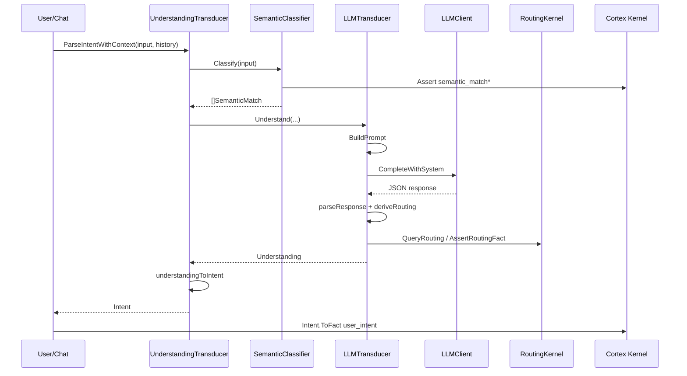

# 05 — Internal Architecture (perception)

> Last verified: **2026-07-13**

## Component diagram

```
┌──────────────────────────────────────────────────────────────────┐
│                         perception package                         │
│                                                                    │
│  ┌─────────────────────┐   ┌──────────────────────────────────┐  │
│  │ Understanding       │──►│ LLMTransducer                    │  │
│  │ Transducer          │   │  BuildPrompt → Complete → parse  │  │
│  │ (+ GeminiThinking)  │   │  deriveRouting → assert facts    │  │
│  └──────────┬──────────┘   └──────────────▲───────────────────┘  │
│             │                             │                       │
│             │ semantic matches            │ LLMClient             │
│             ▼                             │                       │
│  ┌─────────────────────┐   ┌──────────────┴───────────────────┐  │
│  │ SemanticClassifier  │   │ Factory: API / CLI / OAuth       │  │
│  │ embed+learned stores│   │ + classification tier + worker   │  │
│  └──────────┬──────────┘   └──────────────────────────────────┘  │
│             │ facts                                               │
│             ▼                                                     │
│  ┌─────────────────────┐   ┌──────────────────────────────────┐  │
│  │ TaxonomyEngine      │   │ TracingLLMClient + metrics       │  │
│  │ + Consolidation     │   │ ReasoningTrace → learning queue  │  │
│  └─────────────────────┘   └──────────────────────────────────┘  │
│                                                                    │
│  xaioauth/  (OAuth Grok client, credential store, probes)         │
└──────────────────────────────────────────────────────────────────┘
         │ user_intent / semantic_match / routing facts
         ▼
      core.Kernel / session / chat
```

## Data flow A — Interactive turn (canonical)



## Data flow B — Verb corpus path

```
input → getRegexCandidates (≤2000 chars)
      → SemanticClassifier.Classify (facts)
      → TaxonomyEngine.ClassifyInput(candidates)
      → VerbEntry {verb, category, shard, confidence}
      → default /explain @ 0.3
```

## Data flow C — Learning sleep cycle

```
Shard LLM call → TracingLLMClient → ReasoningTrace store
TaxonomyEngine.QueueForLearning(traces)
ConsolidationWorker (async, cap 100)
  → LearnFromInteraction (critic LLM)
  → learned_exemplar fact
  → taxonomy file + optional AddLearnedPattern
```

## Key type relationships

```
UnderstandingEnvelope
  └── Understanding
        ├── Scope
        ├── Signals
        ├── SuggestedApproach   (LLM)
        └── *Routing            (harness)

Intent  ◄── understandingToIntent(Understanding)
  └── ToFact() → core.Fact user_intent

SemanticMatch ──► prompt exemplars + semantic_match facts
VerbEntry ──► regex/synonym candidates
```

## State machines / lifecycle

### UnderstandingTransducer

| State | Behavior |
|-------|----------|
| Constructed | holds client; may be GeminiThinking wrapper |
| First Parse | `initialize` loads prompt, builds LLMTransducer |
| Per turn | semantic → understand → convert; cache lastUnderstanding |
| Kernel set | `SetKernel` installs `RealKernelRouter` |

### SemanticClassifier

| State | Behavior |
|-------|----------|
| Full | both stores + embed engine |
| Degraded | nil engine/stores; Classify returns empty |
| Closed | `CloseSharedSemanticClassifier` |

### ConsolidationWorker

| State | Behavior |
|-------|----------|
| Started | goroutine select on queue/quit |
| Enqueue | non-blocking; drop if full |
| Stop | once; drain then exit |

### Provider client session

Most clients are **stateless per call** except:

- Anthropic system cache enable flag  
- ZAI semaphore  
- Gemini thinking/tool last-call metrics  
- CLI process invocations  
- xaioauth token refresh store  

## Concurrency notes

- `verbCorpusMu` protects corpus slice.  
- TaxonomyEngine `mu` for schema/workspace.  
- Semantic stores use RWMutex.  
- TracingLLMClient mu for shard context.  
- Shared HTTP transport is process-wide (safe for concurrent use).  
- Break tests include verb corpus data race scenarios.

## Extension points

| Hook | Use |
|------|-----|
| `PromptAssembler` | JIT system prompt for classifier |
| `RoutingKernel` / `KernelAsserter` | Mangle routing |
| `TraceStore` | Persist reasoning traces |
| `ProviderConfig.Engine` | Subscription backends |
| `Worker` config block | Cheap secondary model |
| Optional interfaces | ThinkingProvider, schemaCapableClient, DisableSemaphore |
