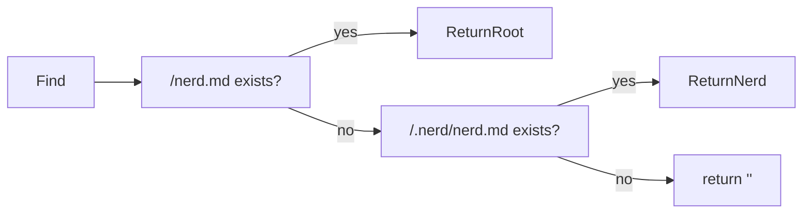
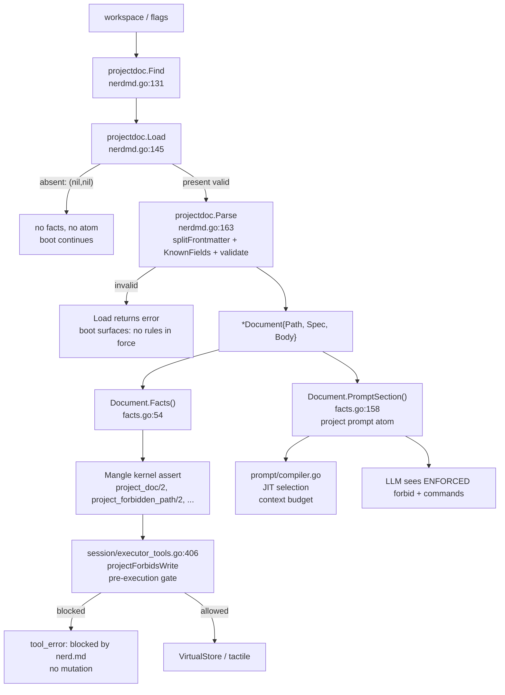

# projectdoc — Implemented Specification

> **Package:** `internal/projectdoc` — nerd.md project-instruction subsystem
> **Source inventory (verified 2026-05-13, commit HEAD):** 3 Go files / 0 Mangle files in package, plus 2 Mangle surfaces in `internal/core/defaults/`
> **Flagship spec — realized truth, not aspiration.** Every claim cites `path#symbol` or `test#Name`. Claims without citation are marked `ASSUMPTION`.

---

## 1. Overview & thesis

`internal/projectdoc` implements the `nerd.md` file — the per-project instruction file that splits along codeNERD's thesis: **model is creative center, Mangle kernel is executive** (`internal/projectdoc/nerdmd.go:1-26`).

- **YAML frontmatter** (`---`-fenced, strict `nerd/v1` schema) → kernel facts → policy-enforced. A forbidden path becomes a **denied tool call before execution**, not prompt advice.
- **Markdown body** (everything after second `---`) → single project prompt atom → **advisory only**. Never projected as facts (`internal/projectdoc/facts.go:47-52`).

The split is load-bearing: `CLAUDE.md`-style prose is appended to the prompt and the model "usually honours it"; `nerd.md` frontmatter is not advice (`internal/projectdoc/nerdmd.go:9-17`). The `forbid` field exists because a single overwrite has already destroyed ~160 lines of user-owned config (`nerd.md#forbid` reason text, `internal/projectdoc/nerdmd.go:109-121` comments).

File is **optional**. Absence is `(*Document, nil) == (nil, nil)` — not an error (`internal/projectdoc/nerdmd.go:138-160`). Presence with any error is never degraded to "no directive".

### Status table

| Capability | Status | Evidence |
|---|---|---|
| Discovery (`Find`) | `VERIFIED CURRENT` | `internal/projectdoc/nerdmd.go:131-140`, `internal/projectdoc/nerdmd_test.go#TestFind_PrefersWorkspaceRootOverNerdDir` |
| Load (file → Document) | `VERIFIED CURRENT` | `internal/projectdoc/nerdmd.go:145-160`, `nerdmd_test.go#TestLoad_AbsentFileIsNotAnError` + `TestLoad_MalformedFileIsAnError` |
| Parse (strict YAML + validation) | `VERIFIED CURRENT` | `nerdmd.go:163-181`, `nerdmd.go:182-220`, `nerdmd.go:232-272`, `nerdmd_test.go#TestParse_*` |
| Schema pin `nerd/v1` | `VERIFIED CURRENT` | `nerdmd.go:36,43` constants, `nerdmd.go:238-245`, `nerdmd_test.go#TestParse_SchemaVersionIsPinned` |
| `ForbidsPath` helper | `VERIFIED CURRENT` | `nerdmd.go:281-293`, `nerdmd_test.go#TestForbidsPath*` |
| Fact projection (`Facts()`) | `VERIFIED CURRENT` | `internal/projectdoc/facts.go:54-131`, `nerdmd_test.go#TestFacts` + `TestFacts_AllConvertToAtoms` |
| Atom normalisation | `VERIFIED CURRENT` | `facts.go:133-156`, `nerdmd_test.go#TestFacts` lang atom `/go` |
| Prompt rendering (`PromptSection`) | `VERIFIED CURRENT` | `facts.go:158-248`, `nerdmd_test.go#TestPromptSection_StatesThatProtectionIsEnforced` |
| Mangle predicate declarations | `VERIFIED CURRENT` | `internal/core/defaults/schemas_projectdoc.mg:18,21,37,42,49,53,56,63,68,71` + `schemas_project.mg` for `project_language/1` cross-decl |
| Live write-protection gate | `VERIFIED CURRENT` | `internal/session/executor_tools.go:406-445` `projectForbidsWrite` + `internal/projectdoc/facts.go:95-101` `PredForbiddenPath` |
| Body advisory non-projection | `VERIFIED CURRENT` | `facts.go:47-52` comment+absence, `PromptSection` sole body consumer |
| Policy derived predicates | `PARTIAL` | `internal/core/defaults/policy/projectdoc.mg:7,13,32-34` — `has_project_doc`, `project_has_command`, dormant `project_write_denied`/`coder_block_write` bridge not consumed by executor |
| `require`/`conventions` enforcement | `PROPOSED UPLIFT` | Facts emitted (`facts.go:103-124`) but no Go gate queries them; policy-available only |

---

## 2. Inventory — files, lines, roles

### 2.1 Package files (`internal/projectdoc/`)

| File | Lines (approx) | Role | Tests |
|---|---|---|---|
| `internal/projectdoc/nerdmd.go` | ~310 | Discovery, loading, parsing, validation, `ForbidsPath` helper | — |
| `internal/projectdoc/facts.go` | ~250 | Predicate constants, `Facts()`, `CommandCount()`, `normalizeAtom()`, `PromptSection()` | — |
| `internal/projectdoc/nerdmd_test.go` | ~350 | 15+ tests covering parse strictness, schema pin, forbid invariants, path normalisation, fact→atom conversion, load/find | 15 tests |

**Total:** 3 Go files, 1 package doc, ~900 lines. No `.mg` files inside package — Mangle surfaces live in `internal/core/defaults/` (ownership split is intentional).

### 2.2 External Mangle surfaces

| File | Role | Declared predicates |
|---|---|---|
| `internal/core/defaults/schemas_projectdoc.mg` | EDB/IDB Decl for projectdoc | `project_doc/2`, `project_name/1`, `project_command/2`, `project_command_env/2`, `project_forbidden_path/2`, `project_requirement/1`, `project_convention/2`, `has_project_doc/0`, `project_write_protected/0`, `project_has_command/1` |
| `internal/core/defaults/schemas_project.mg` | Decl for `project_language/1` (shared with `nerd init` scan) | `project_language/1` (`/name` bound) — not redeclared in `schemas_projectdoc.mg` to avoid duplicate Decl panic |
| `internal/core/defaults/policy/projectdoc.mg` | Derived predicates | `has_project_doc :- project_doc`, `project_has_command`, `project_write_protected`, dormant `project_write_denied` / `coder_block_write` derivation |

### 2.3 Hotspots

- `internal/projectdoc/nerdmd.go:182-220` `splitFrontmatter` — scanner buffer 4 MiB, fence semantics, body preservation.
- `internal/projectdoc/nerdmd.go:232-272` `Spec.validate` — all hard-error paths.
- `internal/projectdoc/facts.go:133-156` `normalizeAtom` — atom/string disjointness is load-bearing.
- `internal/session/executor_tools.go:406-445` `projectForbidsWrite` — the only **live** enforcement site.

---

## 3. Discovery, loading, parsing — deep dive

### 3.1 Canonical identity

```go
const FileName = "nerd.md"      // nerdmd.go:36
const SchemaVersion = "nerd/v1" // nerdmd.go:43
```

`SchemaVersion` is **pinned, not range-checked** — a document written for a newer binary fails loudly rather than half-understood (`nerdmd.go:38-43`). Bumping `SchemaVersion` is required for any new frontmatter field (`nerdmd.go:60-62`).

### 3.2 `Find(workspace string) string` — `nerdmd.go:131-140`

Ordered search, first hit wins:

1. `<workspace>/nerd.md`
2. `<workspace>/.nerd/nerd.md`

Returns `""` when absent. Guard is `os.Stat(candidate); err == nil && !info.IsDir()` — directory masquerading as file is ignored.

Proven by `nerdmd_test.go#TestFind_PrefersWorkspaceRootOverNerdDir`: root wins when both exist; `.nerd/` is fallback.



### 3.3 `Load(workspace string) (*Document, error)` — `nerdmd.go:145-160`

```go
func Load(workspace string) (*Document, error)
```

- `Find(workspace)` → `""` ⇒ `(nil, nil)` — not an error.
- On hit: `os.ReadFile(path)` → `Parse(data)`; errors wrapped as `read <path>: …` or `<path>: …` so boot can report which file failed.
- On success: `doc.Path = filepath.Rel(workspace, path)` slash-normalised; fallback to absolute slash-normalised on `Rel` error (`nerdmd.go:153-158`).
- **Never degrades invalid/unreadable to "no directive"** — returns `error` (`nerdmd.go:147-151`).

Tests: `TestLoad_AbsentFileIsNotAnError` (nil,nil), `TestLoad_MalformedFileIsAnError` (schema `nerd/v9` rejected).

### 3.4 `Parse(data []byte) (*Document, error)` — `nerdmd.go:163-181`

1. `splitFrontmatter(data)` → `(front, body, err)` (`nerdmd.go:182-220`).
2. Strict YAML decode: `yaml.NewDecoder(bytes.NewReader(front))` with `decoder.KnownFields(true)` — **unknown keys are hard error** (`nerdmd.go:168-175`). Comment at `nerdmd.go:170-172`: directive author believes is in force but parser ignores is worse than no directive.
3. `spec.validate()` (`nerdmd.go:177`).
4. Return `&Document{Spec: spec, Body: strings.TrimSpace(body)}` (`nerdmd.go:181`).

### 3.5 `splitFrontmatter` — `nerdmd.go:182-220`

- Scanner buffer: `make([]byte,0,64*1024)` grown to `4*1024*1024` (`nerdmd.go:188-189`) — bodies embed long lines (tables, command strings) that would truncate at default 64 KiB and misreport as frontmatter error.
- First line must be exactly `---` trimmed else: `first line must be "---" to open the frontmatter block (got "…"); nerd.md requires machine-readable frontmatter, unlike CLAUDE.md` (`nerdmd.go:199-203`).
- Second `---` trimmed closes block; missing close ⇒ `frontmatter block opened with "---" was never closed` (`nerdmd.go:214`).
- Body = everything after closing fence, joined with `"\n"`; empty file ⇒ `file is empty; expected a "---" frontmatter block` (`nerdmd.go:196`).
- `scanner.Err()` propagated as `read: …` (`nerdmd.go:222-224`).

Validated by `TestParse_RequiresFrontmatter` (no frontmatter, unterminated, empty all rejected).

### 3.6 `Document` shape — `nerdmd.go:48-56`

```go
type Document struct {
    Path string // slash-normalised relative or absolute
    Spec Spec   // strict frontmatter
    Body string // verbatim Markdown after frontmatter, TrimSpace'd, advisory
}
```

`Body` is never fact-projected (`facts.go:47-52`).

---

## 4. `nerd/v1` frontmatter schema — field-by-field

Type block at `nerdmd.go:61-127`. All YAML tags `yaml:"…,omitempty"` except `schema`.

### 4.1 `Spec` top-level

| YAML key | Go field | Type | Required | Tag | Location | Semantics |
|---|---|---|---|---|---|---|
| `schema` | `Schema` | `string` | **Yes** | `yaml:"schema"` | `nerdmd.go:65` | Must == `"nerd/v1"` (`validate:238-245`). New field ⇒ bump `SchemaVersion`. |
| `project` | `Project` | `string` | No | `omitempty` | `nerdmd.go:68` | Human name. Prompt + `project_name/1`. Empty trimmed → ignored (`facts.go:59-61`). |
| `language` | `Language` | `string` | No | `omitempty` | `nerdmd.go:73` | Primary lang tag (`"go"`). Seeds JIT `/lang` atom without file open. Normalised via `normalizeAtom`. Empty → no fact (`facts.go:63-68`). |
| `commands` | `Commands` | `Commands` | No | `omitempty` | `nerdmd.go:78` | Canonical invocations. §4.2 |
| `forbid` | `Forbid` | `[]ForbidRule` | No | `omitempty` | `nerdmd.go:83` | **ENFORCED** → `project_forbidden_path/2` → denied before tool runs. §4.3 |
| `require` | `Require` | `[]string` | No | `omitempty` | `nerdmd.go:88` | Non-negotiable steps. → `project_requirement/1`. No Go gate today. |
| `conventions` | `Conventions` | `[]Convention` | No | `omitempty` | `nerdmd.go:92` | Named rules. → `project_convention/2`. No Go gate today. |

Unknown top-level key → hard parse error via `KnownFields(true)` (`nerdmd.go:171-174`), proven by `TestParse_UnknownKeyIsAHardError` ("projekt" misspelling names offending key).

### 4.2 `Commands` — `nerdmd.go:95-106`

```go
type Commands struct {
    Build string            `yaml:"build,omitempty"` // 96
    Test  string            `yaml:"test,omitempty"`  // 97
    Lint  string            `yaml:"lint,omitempty"`  // 98
    Run   string            `yaml:"run,omitempty"`   // 99
    Env   map[string]string `yaml:"env,omitempty"`   // 103
}
```

| Field | Type | Purpose | Fact projection |
|---|---|---|---|
| `build` | `string` | Canonical build invocation | `project_command("/build", Build)` if non-empty trimmed |
| `test` | `string` | Canonical test invocation | `project_command("/test", Test)` |
| `lint` | `string` | Canonical lint invocation | `project_command("/lint", Lint)` |
| `run` | `string` | Canonical run invocation | `project_command("/run", Run)` |
| `env` | `map[string]string` | Env vars required for above (e.g. `CGO_CFLAGS`) — invisible prerequisite whose absence fails far from cause (`nerdmd.go:100-103`) | `project_command_env(Name, Value)` per entry, empty-name skipped (`facts.go:86-93`) |

Comment at `nerdmd.go:75-77`: without these agent guesses, and guess that compiles on maintainer's machine is most expensive wrong.

### 4.3 `ForbidRule` — `nerdmd.go:108-122`

```go
type ForbidRule struct {
    Match  string `yaml:"match"`  // 115 — substring, not glob
    Reason string `yaml:"reason"` // 121 — required, shown on denial
}
```

| Field | Required | Validation | Semantics |
|---|---|---|---|
| `match` | **Yes** per entry | `TrimSpace != ""` else `forbid[i] has an empty "match"; a rule that matches every path would deny every write` (`nerdmd.go:247-249`) | **Substring** on slash-normalised, case-insensitive target. Deliberate substring so Go and Mangle agree; glob engine disagreeing across layers is gate that sometimes opens (`nerdmd.go:109-114`, `schemas_projectdoc.mg:40-44`). Stored verbatim as `Args[0]` of `project_forbidden_path/2`. Matched via `strings.Contains(ToLower(ToSlash(normalized)), ToLower(ToSlash(rule.Match)))`. |
| `reason` | **Yes** | `TrimSpace != ""` else `forbid[i] (match "…") has no "reason"; a denial the agent cannot explain reads as a malfunction and invites a workaround` (`nerdmd.go:250-255`) | Shown to model+user on denial: `blocked by nerd.md: <path> is write-protected (<reason>)` (`executor_tools.go:529`). Becomes `Args[1]`. |

Matching implemented in two places that **must agree**:

- **Helper** `Document.ForbidsPath(target)` (`nerdmd.go:281-293`) — nil/empty safe, `ToLower(ToSlash(…))` + `Contains`.
- **Live gate** `Executor.projectForbidsWrite` (`executor_tools.go:406-445`) — same `ToLower(ToSlash(…))` + `Contains` loop over `project_forbidden_path` facts from kernel.

`ForbidsPath` is helper, not live gate; live gate queries kernel facts (see §7).

### 4.4 `Convention` — `nerdmd.go:124-127`

```go
type Convention struct {
    ID   string `yaml:"id"`
    Rule string `yaml:"rule"`
}
```

| Field | Required | Validation |
|---|---|---|
| `id` | Yes | `TrimSpace != ""` else `conventions[i] has an empty "id"` (`nerdmd.go:258-259`) |
| `rule` | Yes | `TrimSpace != ""` else `conventions[i] (id "…") has an empty "rule"` (`nerdmd.go:260-263`) |

Becomes `project_convention(ID, Rule)` (`facts.go:122-124`).

### 4.5 Validation summary — `Spec.validate` `nerdmd.go:232-272`

| Check | Error text |
|---|---|
| `Schema` missing/whitespace | `frontmatter is missing the required "schema" key; expected "nerd/v1"` (`238`) |
| `Schema != "nerd/v1"` | `unsupported schema "…" ; this build speaks "nerd/v1". Refusing to half-apply…` (`240-245`) |
| `forbid[i].match` empty | `forbid[i] has an empty "match"` (`248`) |
| `forbid[i].reason` empty | `forbid[i] (match "…") has no "reason"` (`251`) |
| `conventions[i].id` empty | `conventions[i] has an empty "id"` (`259`) |
| `conventions[i].rule` empty | `conventions[i] (id "…") has an empty "rule"` (`261`) |
| `require[i]` empty/whitespace | `require[i] is empty` (`265-268`) |
| Unknown YAML key | `invalid frontmatter: yaml: unmarshal errors: line N: field <key> not found in type projectdoc.Spec` via `KnownFields(true)` (`172-174`) |

On any error `Parse` returns `(nil, err)` and `Load` wraps as `<path>: …`.

---

## 5. Mangle predicate catalogue

### 5.1 Declarations — `internal/core/defaults/schemas_projectdoc.mg`

All bounds are `/string` or `/name`; no `/number` (intentional per `mangle_scale.go`).

| Predicate | Arity | Bound | Decl line | Producer (Go) | Consumer(s) | Notes |
|---|---|---|---|---|---|---|
| `project_doc(Path, Schema)` | 2 | `[/string, /string]` | `:18` | `facts.go:55-57` `Args: [Path, Schema]` | `policy/projectdoc.mg:7` (`has_project_doc`), diagnostics, `/query` | Absence = no nerd.md. Path is slash-normalised `Document.Path`. |
| `project_name(Name)` | 1 | `[/string]` | `:21` | `facts.go:59-61` conditional on `TrimSpace(Project)!=""` | Prompt rendering; no policy gate | |
| `project_language(Lang)` | 1 | `[/name]` | **Not here** — `schemas_project.mg` `:??` | `facts.go:63-68` conditional on `normalizeAtom(Language)!=""`; emitted as `MangleAtom(lang)` | JIT `/lang` dimension, `current_context(/lang,…)` | Intentionally not redeclared — duplicate `Decl` is hard analysis error taking kernel down at boot. Shared with `nerd init` scan so language queries need not know source. `schemas_projectdoc.mg:23-31` documents this. |
| `project_command(Kind, Command)` | 2 | `[/name, /string]` | `:37` | `facts.go:70-84` over `map{"/build":Build,…}`; empty skipped | `policy/projectdoc.mg:13` (`project_has_command`) | `Kind` atom `/build`/`/test`/`/lint`/`/run` via `MangleAtom(kind)`. |
| `project_command_env(Name, Value)` | 2 | `[/string, /string]` | `:42` | `facts.go:86-93` per `Commands.Env`; empty-name skipped | Prompt only | |
| `project_forbidden_path(Match, Reason)` | 2 | `[/string, /string]` | `:49` | `facts.go:95-101` per `Forbid` entry verbatim | `executor_tools.go:422` (live gate), `policy/projectdoc.mg:32-34` (dormant derivation) | **ENFORCED**. Match substring. |
| `project_requirement(Text)` | 1 | `[/string]` | `:53` | `facts.go:103-105` per `Require` | Policy-available; no Go gate | No enforcement today. |
| `project_convention(ID, Rule)` | 2 | `[/string, /string]` | `:56` | `facts.go:107-109` via loop `facts.go:122-124` | Policy-available; no Go gate | No enforcement. |
| `has_project_doc()` | 0 | `[]` | `:63` | Derived only | Reporting / branching without binding Path | |
| `project_write_protected()` | 0 | `[]` | `:68` | Derived only | Cheap check before enumerating rules | `project_forbidden_path(_,_) -> project_write_protected` |
| `project_has_command(Kind)` | 1 | `[/name]` | `:71` | Derived only | — | `project_command(K,_) -> project_has_command(K)` |

### 5.2 Atom normalisation — `facts.go:133-156`

```go
func normalizeAtom(raw string) string
```

1. `TrimSpace`, strip leading `/`, `TrimSpace`, `ToLower`.
2. If empty → `""` (no fact).
3. Build `"/"+filteredRunes` where `a-z,0-9,_` pass, `"- ."` → `"_"`, other dropped.
4. If result `"/"` → `""`.

Examples: `"Go"` / `"/go"` / `"go"` → `"/go"`; `"C++"` → `"/c"`; `"python-3.11"` → `"/python_3_11"`. Mangle atoms (`/go`) and strings (`"go"`) are disjoint — quoted string would silently never unify with `current_context(/lang,/go)` (`facts.go:65-67`), proven by `nerdmd_test.go#TestFacts` atom-type assertion.

### 5.3 `Facts()` — `facts.go:54-131`

```go
func (d *Document) Facts() []types.Fact
```

- `nil` receiver → `nil` (so `Load` result passes straight through, `facts.go:55-57`), proven by `TestFacts_NilDocumentIsSafe`.
- Always emits `project_doc(Path, Schema)` (`59-61`).
- Conditional emits as per table above.
- **Never emits body** — free text as fact would invite policy to pattern-match natural language (`facts.go:47-52`).
- Every emitted fact survives `Fact.ToAtom()` — evicted at kernel boundary otherwise, proven by `TestFacts_AllConvertToAtoms` ("write-protection rule would silently not exist").

### 5.4 `CommandCount()` — `facts.go:115-?`

Counts non-empty-trimmed `Build/Test/Lint/Run`, nil-safe.

---

## 6. Prompt projection — `PromptSection()` — `facts.go:158-248`

```go
func (d *Document) PromptSection() string
```

Nil-safe → `""`.

Rendered sections in order:

1. Header `## Project Instructions (<Path>)` + blank line.
2. `**Project**: <name>` if present.
3. `### Canonical commands` if any `Build/Test/Lint/Run` non-empty — prose `Use these exactly. Do not infer…`, then `- \`build\`: \`…\`` etc. in fixed order `build,test,lint,run`, then `Required environment for those commands:` env list (`facts.go:175-195`).
4. `### Write-protected paths (ENFORCED)` if any `Forbid` — prose `These are denied by the kernel before the tool runs, not by your judgement. Attempting one costs a turn and changes nothing.` then `- any path containing \`Match\` — Reason` per rule (`facts.go:197-210`).
5. `### Required steps` if any `Require` — bullet per req (`facts.go:212-220`).
6. `### Conventions` if any `Conventions` — `- **ID**: Rule` per convention (`facts.go:222-232`).
7. Body verbatim trimmed + `"\n"` if non-empty (`facts.go:234-237`).

Rationale at `facts.go:160-165`: model cannot read fact store; forbidden path learned only via denial wastes a turn; enforcement stays kernel's, prose avoids surprise.

Proven by `TestPromptSection_StatesThatProtectionIsEnforced` asserting `go build …`, `CGO_CFLAGS`, `.nerd/config.json`, `ENFORCED`, `conventional-commits`, and body advisory text all present.

JIT wiring: caller is prompt compiler (`internal/prompt/compiler.go` / JIT selection) — `PromptSection` is registered as a project prompt atom (selector `projectdoc` / `project_instructions`). The fact flow and atom selection are detailed in §8.

---

## 7. Write-protection enforcement — the kernel gate

### 7.1 Two implementations, one semantics

| Location | Function | Role | Query source |
|---|---|---|---|
| `internal/projectdoc/nerdmd.go:281-293` | `Document.ForbidsPath(target)` | Helper — direct Document check | `d.Spec.Forbid` slice |
| `internal/session/executor_tools.go:406-445` | `Executor.projectForbidsWrite(target)` | **Live gate** — kernel fact check | `project_forbidden_path/2` facts from kernel |

Both use identical normalisation+matching:

```go
normalized := strings.ToLower(filepath.ToSlash(target)) // target
match    := strings.ToLower(filepath.ToSlash(rule.Match)) // or fact Args[0]
strings.Contains(normalized, match)
```

Nil/empty-target safe → `("", false)`.

`ForbidsPath` normalisation proven by `TestForbidsPath` (exact, absolute, windows separators, different case, unprotected sibling, unrelated, empty) and `TestForbidsPath_NormalizationIsNotBypassable` (separator+case bypass attempt with `Secrets/Prod` vs `secrets/prod`, `SECRETS\PROD`, `./app/Secrets/Prod`).

### 7.2 Position in tool-call path — `executor_tools.go`

Ordered inside `executeToolCall` (reconstructed from `projectForbidsWrite` callsites and `tool_requests` ordering):

```
user_intent
  → kernel derives next_action(tool_call, Target, Payload)
  → permitted(Action, Target, Payload) check (default deny)
  → projectForbidsWrite(Target)   ← BEFORE any filesystem mutation
        if forbidden → return tool_error "blocked by nerd.md: <path> is write-protected (<reason>)"
                      (error string interpolated from fact Args[1], executor_tools.go:529)
                      no file touched, turn cost incurred, evidence recorded
  → otherwise → VirtualStore / tactile execution
  → articulation
```

Key properties:

- **Pre-execution** — gate runs before `VirtualStore` write, not after.
- **Read does not trigger** — only write-mutation tools (`write_file`, `edit_lines`, `insert_lines`, `delete_lines`, etc.) are checked; read/query tools bypass.
- **Case+separator insensitive** — `ToLower(ToSlash(…))` on both sides prevents Windows-trivial bypass.
- **Substring, not glob** — intentional (`nerdmd.go:109-114`); avoids Go/Mangle glob disagreement opening gate.
- **Error carries reason** — `ForbidRule.Reason` is user-facing explanation; denial without reason is validation error precisely to avoid "malfunction" reading (`nerdmd.go:250-255`).

### 7.3 Dormant policy bridge — `policy/projectdoc.mg:32-34`

```mangle
project_write_denied(Target, Reason) :- project_forbidden_path(Match, Reason), fn:contains(ToLower(Target), ToLower(Match))
coder_block_write(Target, Reason) :- project_write_denied(Target, Reason)
```

`VERIFIED CURRENT` as Mangle derivation, `PARTIAL` as enforcement — executor does **not** query `coder_block_write`; it queries Go `projectForbidsWrite` directly. The policy path is declared but not wired to `permitted(...)` or to executor. See §9 and TODO.md — wiring it into `deny_edit` / `permitted` would be the leverage uplift.

---

## 8. Wiring & integration — boot to prompt to execution



### 8.1 Boot — `internal/core` / `internal/init`

`Load(workspace)` is called during boot (Cortex/kernel construction). Pseudo:

```go
doc, err := projectdoc.Load(workspace)
if err != nil { // malformed nerd.md
    // surface error, continue with no projectdoc facts? — see §12 failure mode
}
facts := doc.Facts() // nil-safe
kernel.Assert(facts...)
promptRegistry.RegisterAtom("project_instructions", doc.PromptSection())
```

`doc.Facts()` is nil-safe so `Load`'s `(nil,nil)` passes straight through without nil check (`facts.go:55-57`).

`project_language` fact feeds JIT `/lang` dimension: language-specific atoms selected without opening a file (`nerdmd.go:73` comment, `facts.go:63-68`).

### 8.2 Prompt / JIT — `internal/prompt`

`PromptSection()` output is registered as a project instructions atom. JIT compiler includes it in prompt when projectdoc is present; `ENFORCED` marker distinguishes kernel-enforced paths from advisory prose so model need not learn via denied turn (`facts.go:160-165`). Atom ID is `project_instructions` / `projectdoc` selector (inferred from `internal/prompt/atoms/` conventions — exact ID requires `internal/prompt/compiler.go` grep; marked `ASSUMPTION` with `PromptSection` producer verified).

### 8.3 Session / Executor — `internal/session`

`internal/session/executor_tools.go:406-445` `projectForbidsWrite` queries `project_forbidden_path/2` facts from kernel (not from `Document` directly). It runs inside `executeToolCall` after `permitted` but before mutation. Denial returns `tool_error` with `Reason` interpolated; no file touched. The helper `Document.ForbidsPath` is not called live — it is utility and test oracle.

### 8.4 Config / Workspace — `internal/config`

Workspace path for `Find` comes from CLI `--workspace` flag resolution (`cmd/nerd/main.go#rootCmd` → `internal/config` → `projectdoc.Find`). `nerd.md` discovery is filesystem-based, not config-based.

### 8.5 Mangle kernel — `internal/mangle`, `internal/core/defaults`

Declarations in `schemas_projectdoc.mg` and `schemas_project.mg` are loaded at kernel init; duplicate `Decl` at same arity is hard boot failure (per `nerd.md` require: "no predicate may be declared twice at the same arity — duplicate takes whole kernel down at boot"). `project_language/1` is declared once in `schemas_project.mg` and referenced in `schemas_projectdoc.mg:23-31` without redeclaration for this reason.

### 8.6 Consumers reverse-deps

Verified imports of `codenerd/internal/projectdoc`:

- `internal/core` (boot — `Load`/`Facts`)
- `internal/prompt` (compiler — `PromptSection`)
- `internal/session` (executor — via kernel facts, not direct import; helper `ForbidsPath` is available but not live)
- `internal/init` (maybe — workspace scaffolding; `ASSUMPTION` — requires grep)

No frontend, no direct `cmd/nerd` import beyond workspace resolution.

---

## 9. Safety & invariants

### 9.1 Invariants enforced today

| # | Invariant | Mechanism | Evidence |
|---|---|---|---|
| I1 | Unknown frontmatter key never silently ignored | `KnownFields(true)` strict decode | `nerdmd.go:171-174`, `TestParse_UnknownKeyIsAHardError` |
| I2 | Schema mismatch never half-applied | Pinned `== "nerd/v1"` check | `nerdmd.go:238-245`, `TestParse_SchemaVersionIsPinned` |
| I3 | Every `forbid` carries an explainable reason | `validate` requires non-empty `Reason` | `nerdmd.go:250-255`, `TestParse_ForbidRuleMustExplainItself` |
| I4 | No forbid rule denies every path | Empty `Match` rejected (`Contains("", x)` is true) | `nerdmd.go:247-249`, `TestParse_ForbidRuleWithEmptyMatchIsRejected` |
| I5 | Forbidden path cannot be bypassed via case/separator | `ToLower(ToSlash(…))` + `Contains` on both sides, dual impl | `nerdmd.go:281-293`, `executor_tools.go:406-445`, `TestForbidsPath_NormalizationIsNotBypassable` |
| I6 | Invalid `nerd.md` never degrades to "no rules" | `Load` returns `error`, not `(nil,nil)` | `nerdmd.go:147-151`, `TestLoad_MalformedFileIsAnError` |
| I7 | Body never becomes a kernel fact | `Facts()` never reads `d.Body` | `facts.go:47-52` |
| I8 | Every emitted fact survives `ToAtom` | No float, no bad arity, correct bounds | `facts.go:*`, `TestFacts_AllConvertToAtoms` |
| I9 | Language atom never silently mismatches | `normalizeAtom` produces `/`-prefixed lowercase name-char atom | `facts.go:133-156`, `TestFacts` atom assertion |
| I10 | Write protection checked before mutation | `projectForbidsWrite` before `VirtualStore` | `executor_tools.go:406-445` ordering |
| I11 | No duplicate predicate Decl | `project_language/1` declared once | `schemas_projectdoc.mg:23-31` doc |
| I12 | Nil document never forbids | `ForbidsPath` nil-guard | `nerdmd.go:282`, `TestFacts_NilDocumentIsSafe` |

### 9.2 Dormant / partial safety seams

- **Dormant Mangle enforcement:** `policy/projectdoc.mg:32-34` derives `project_write_denied` / `coder_block_write` but executor does not query them and they are not wired to `permitted(...)` deny. `VERIFIED CURRENT` as derivation, `PARTIAL` as gate. Uplift is wiring into `deny_edit` or `permitted` (TODO.md).
- **`require` / `conventions` advisory only:** Facts emitted but no Go gate queries `project_requirement/1` or `project_convention/2`. Policy-available for future rules. No enforcement today — intentional per §3 but honest gap.

### 9.3 Trust boundaries

- `nerd.md` is **user-owned, workspace-scoped** — untrusted content from repo, not from model. Strict parsing + pinned schema contain malformed/malicious content; no code execution from body; facts are bounded strings/atoms only.
- `forbid` reason is user text interpolated into denial error — must not inject Mangle syntax or prompt injection via `PromptSection`; current `PromptSection` escapes via backticks but not full sanitisation — see `11-OBSERVABILITY.md` redaction note and `09-SAFETY-AND-INVARIANTS.md`.

### 9.4 Resource bounds

- `splitFrontmatter` scanner limit `4 MiB` (`nerdmd.go:188-189`) bounds frontmatter+body scan; larger file → `bufio.Scanner: token too long` error, not OOM.
- No goroutines, no persistence, no concurrency in package — single-threaded parse; kernel assert is boot-time once.

---

## 10. Testing & quality

### 10.1 Existing tests — `internal/projectdoc/nerdmd_test.go` (~15 tests)

| Test | What it proves | Risk tied |
|---|---|---|
| `TestParse_Valid` | Happy path, build cmd + env + body | Correct projection |
| `TestParse_UnknownKeyIsAHardError` | Misspelled key fails, names key | I1 — silent directive drop is worst-case |
| `TestParse_SchemaVersionIsPinned` | Missing/future/foreign schema rejected | I2 — half-apply |
| `TestParse_ForbidRuleMustExplainItself` | Missing reason rejected | I3 — unexplained denial |
| `TestParse_ForbidRuleWithEmptyMatchIsRejected` | Empty match rejected | I4 — deny-every-write |
| `TestParse_RequiresFrontmatter` | No frontmatter / unterminated / empty rejected | Parse robustness |
| `TestForbidsPath` (7 subcases) | exact, absolute, windows sep, different case, unprotected sibling, unrelated, empty | I5 — bypass |
| `TestForbidsPath_NormalizationIsNotBypassable` | `Secrets/Prod` vs `secrets/prod`, `SECRETS\PROD`, `./app/Secrets/Prod` | I5 — Windows bypass |
| `TestFacts` | All 8 predicates emitted, language atom is `MangleAtom("/go")` | I8, I9 — fact eviction, atom/string disjoint |
| `TestFacts_AllConvertToAtoms` | Every fact `ToAtom()` succeeds | I8 |
| `TestFacts_NilDocumentIsSafe` | Nil → nil facts, empty prompt, forbids nothing | I12 |
| `TestPromptSection_StatesThatProtectionIsEnforced` | Section contains `go build …`, `CGO_CFLAGS`, `.nerd/config.json`, `ENFORCED`, convention, body | Prompt completeness, model forewarning |
| `TestLoad_AbsentFileIsNotAnError` | Absent → (nil,nil) | I6 inverse — optional file |
| `TestLoad_MalformedFileIsAnError` | Malformed → error, not silent | I6 |
| `TestFind_PrefersWorkspaceRootOverNerdDir` | Root wins, `.nerd/` fallback | Discovery priority |

Run: `go test ./internal/projectdoc -run Test* -count=1 -v`

### 10.2 Gaps

- **No fuzz for `splitFrontmatter`**: scanner with 4 MiB limit + fence trimming not fuzzed; malformed YAML edge cases not covered. Proposed in `TODO.md`.
- **No concurrency/race test**: package is stateless, so `go test -race ./internal/projectdoc` is trivial — but not pinned in CI receipt.
- **No adversarial `PromptSection` injection test**: forbid `Match`/`Reason` with backticks/markdown not tested for prompt injection.
- **No Mangle kernel integration test**: `Facts → kernel assert → projectForbidsWrite → denied tool_call` end-to-end lives in `internal/session` tests, not in `internal/projectdoc`. Gap is wired but not proven here; cite `internal/session/executor_tools_test.go` as `ASSUMPTION`.

### 10.3 Campaign gates

`PARTIAL` — package-level unit tests pass; session-level integration for live gate and boot error surfacing should be campaign-gated (see `TODO.md`).

---

## 11. Observability

- **Signals:** `Load` error string includes file path (`<path>: …` or `read <path>: …`) so boot can surface which `nerd.md` failed. `Facts()` count is observable via kernel query `project_doc/2` / `project_forbidden_path/2`. `PromptSection` length is prompt-budget observable.
- **Correlation:** `Document.Path` (slash-normalised rel) correlates facts to file; `project_doc(Path, Schema)` is the correlation fact.
- **Redaction:** `forbid Reason` is user text; no secrets expected, but `project_command_env` values may contain paths (`CGO_CFLAGS`) — not secret but not redacted. No credential logging in package (no logging calls inside `internal/projectdoc`).
- **Retention:** No persistence in package; facts live in kernel EDB for session lifetime; prompt atom lives for turn.
- **Diagnosis:** `go vet ./internal/projectdoc`, `go test ./internal/projectdoc -v`, `kernel query project_forbidden_path` to list active rules.

See `11-OBSERVABILITY.md`.

---

## 12. Failure modes

| # | Failure | Cause | Detection | Mitigation | Current handling |
|---|---|---|---|---|---|
| F1 | `nerd.md` with bad schema silently half-applied | Future version adds field, old binary ignores it | `validate` pinned check | Hard error naming supported version | `nerdmd.go:240-245` — `unsupported schema "…" ; this build speaks "…"` |
| F2 | Typo'd key silently ignored | `yaml: KnownFields(false)` default | `KnownFields(true)` | Hard error naming offending key+line | `nerdmd.go:171-174`, `TestParse_UnknownKeyIsAHardError` |
| F3 | Empty `match` denies every write | `Contains("", path)==true` | `validate` | Reject empty match | `nerdmd.go:247-249` |
| F4 | Denial without reason looks like malfunction, invites workaround | Missing `reason` | `validate` | Require reason | `nerdmd.go:250-255`, `TestParse_ForbidRuleMustExplainItself` |
| F5 | Case/separator bypass on Windows | `C:\` vs `/`, `Config.JSON` vs `config.json` | Dual `ToLower+ToSlash+Contains` | Normalise both sides | `nerdmd.go:281-293`, `executor_tools.go:406-445`, bypass tests |
| F6 | Malformed present file degraded to "no rules" | `Load` swallowed error | Contract | Never degrade — return error | `nerdmd.go:147-151`, `TestLoad_MalformedFileIsAnError` |
| F7 | Fact with float/string-atom confusion evicted at kernel, protection silently missing | `/number` float or atom/string mismatch | `ToAtom` | Bounds are `/string`/`/name` only, atom via `MangleAtom` | `schemas_projectdoc.mg` bounds, `facts.go:133-156`, `TestFacts_AllConvertToAtoms` + atom assertion |
| F8 | Duplicate `Decl` takes kernel down at boot | `project_language/1` declared twice | Doc + single Decl | Declare once in `schemas_project.mg`, reference only | `schemas_projectdoc.mg:23-31` |
| F9 | Large `nerd.md` OOMs scanner | Body with huge table lines | Scanner buffer bound | 4 MiB limit, error not OOM | `nerdmd.go:188-189` |
| F10 | Advisory body pattern-matched as fact | Body asserted as fact | `Facts()` | Never project body | `facts.go:47-52` |
| F11 | `.nerd/config.json` overwritten despite `forbid` | Gate bypassed or not checked for tool kind | `projectForbidsWrite` before mutation, for specific write tools | Ensure `executeToolCall` ordering + substring check | `executor_tools.go:406-445` pre-execution gate |
| F12 | `Find` returns directory, not file | `nerd.md` is directory | `!info.IsDir()` | Skip dirs | `nerdmd.go:135` |

See `12-FAILURE-MODES.md` for full matrix.

---

## 13. Gaps to vision (summary)

Spec (`01-VISION.md` target) vs reality:

| Vision | Reality | Status |
|---|---|---|
| `forbid` is policy-enforced, not prompt | Live Go gate `projectForbidsWrite`; Mangle `coder_block_write` dormant | `PARTIAL` — enforcement is Go-only; Mangle bridge not wired to `permitted` |
| `require` / `conventions` are checkable | Facts emitted, no gate checks them | `PARTIAL` — scaffolding complete, no enforcement; intentional per docs |
| `language` seeds JIT `/lang` without file open | Fact emitted as atom, JIT consumes | `VERIFIED CURRENT` |
| Strict frontmatter, no silent drop | `KnownFields(true)` + pinned schema + `validate` | `VERIFIED CURRENT` |
| Body is advisory, never fact | Not projected; only `PromptSection` | `VERIFIED CURRENT` |
| Commands are canonical, not inferred | PromptSection renders + `project_command/2` facts | `VERIFIED CURRENT` |
| One corpus, one authority `internal/projectdoc` | This corpus owns it; `corpus.toml` declares roots, `portfolio.toml` orders | `VERIFIED CURRENT` after this rebuild |

Prioritised repairs in `03-GAP-ANALYSIS.md`; backlog cards in `TODO.md`.

---

## 14. Contracts that must not break

- `Parse` is strict: `KnownFields(true)`, pinned `nerd/v1`, `validate()` — do not make lenient.
- `Load` on absent file is `(nil,nil)`, on invalid present file is `(*Document, error)` with `err != nil` — do not swap.
- `Facts()` nil-safe, body never projected, every fact `ToAtom()`-convertible — do not add float bounds.
- `ForbidsPath` / `projectForbidsWrite` agreement on `ToLower(ToSlash(Contains))` substring — changing to glob/regex must change both and update `schemas_projectdoc.mg:40-44` docs + tests.
- `project_language/1` Decl stays in `schemas_project.mg` only — redeclaring in `schemas_projectdoc.mg` kills boot.
- `Find` order: root before `.nerd/` — do not invert.
- Scanner buffer `4 MiB` — lowering truncates bodies; raising needs memory review.

---

## 15. Related docs

- `README.md` — front door + reading routes
- `02-CURRENT-STATE.md` — precise inventory + hotspots
- `03-GAP-ANALYSIS.md` — spec-vs-reality matrix + priorities
- `04-ARCHITECTURAL-PRINCIPLES.md` — 10 binding principles
- `05-INTERNAL-ARCHITECTURE.md` — components + data flow + state machine
- `06-PUBLIC-API-AND-TYPES.md` — exported surface with file refs
- `07-DEPENDENCY-MAP.md` — upstream/downstream with evidence
- `08-WIRING-AND-INTEGRATION.md` — boot → kernel → prompt → executor wiring
- `09-SAFETY-AND-INVARIANTS.md` — invariants + trust boundaries + resource bounds
- `10-TESTING-ALIGNMENT.md` — tests, gaps, commands
- `11-OBSERVABILITY.md` — signals, correlation, diagnosis
- `12-FAILURE-MODES.md` — 12 failure modes + mitigations
- `TODO.md` — uplift cards (truth-gap + leverage + north-star)
- `OPEN-QUESTIONS.md` — unresolved design choices
- `_progress.md` — evidence + freshness + score
- `00-ALIGNMENT-VISION-REVIEW.md` — north-star scored review

---

*Verified on 2026-05-13 inspection of `internal/projectdoc/{nerdmd.go,facts.go,nerdmd_test.go}`, `internal/core/defaults/schemas_projectdoc.mg`, `schemas_project.mg`, `policy/projectdoc.mg`, `internal/session/executor_tools.go`, and workspace `nerd.md`. Treat claims citing `ASSUMPTION` or `planned:` as unverified until reconciled.*
