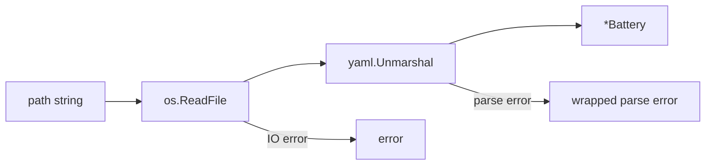
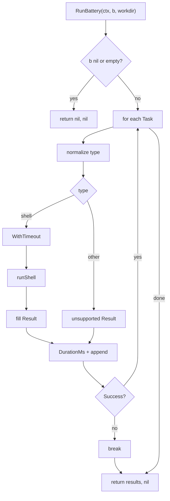

# regression — Internal Architecture

> Last verified against codebase: **2026-07-13**  
> Source: `internal/regression/battery.go`

---

## 1. Component diagram

```
┌────────────────────────────────────────────────────────────┐
│                   internal/regression                       │
│                                                            │
│  DefaultBatteryPath(workspace) ──► path string             │
│                                                            │
│  LoadBattery(path)                                         │
│       │                                                    │
│       ├─ os.ReadFile                                       │
│       └─ yaml.Unmarshal ──► *Battery { Version, Tasks[] }  │
│                                                            │
│  RunBattery(ctx, *Battery, workdir)                        │
│       │                                                    │
│       ├─ early exit: nil/empty → (nil, nil)                │
│       └─ sequential Task loop                              │
│              │                                             │
│              ├─ type normalize                             │
│              ├─ shell ──► runShell(tctx, cmd, workdir)     │
│              │               │                             │
│              │               ├─ powershell … (windows)     │
│              │               └─ bash -l      (else)        │
│              │               └─ CombinedOutput             │
│              ├─ unsupported ──► Result failure             │
│              └─ fail-fast break                            │
│                     │                                      │
│                     ▼                                      │
│              []Result                                      │
└────────────────────────────────────────────────────────────┘
```

There are **no** interfaces, registries, or background workers.

---

## 2. Data flow

### 2.1 Load path



### 2.2 Run path



---

## 3. Key types and ownership

| Type | Owns | Owned by |
|------|------|----------|
| `Battery` | Task list + version | Caller after `LoadBattery` |
| `Task` | One command spec | `Battery.Tasks` |
| `Result` | One execution outcome | Returned slice from `RunBattery` |

No shared mutable package state. Functions are stateless relative to the package.

---

## 4. State machine (per task)

```
                    ┌──────────┐
                    │  pending │
                    └────┬─────┘
                         │ start timer
                         ▼
                 ┌───────────────┐
                 │ type resolve  │
                 └───────┬───────┘
            ┌────────────┼────────────┐
            ▼            ▼            ▼
      ┌──────────┐ ┌──────────┐ ┌────────────┐
      │  shell   │ │unsupported│ │ (future)   │
      └────┬─────┘ └────┬─────┘ └────────────┘
           │            │
           ▼            │
   ┌──────────────┐     │
   │ spawn+wait   │     │
   └──────┬───────┘     │
          │             │
     success/fail       fail
          │             │
          ▼             ▼
     ┌─────────────────────┐
     │ terminal Result     │
     └─────────────────────┘
```

Suite-level state: `running` → `completed_all` | `stopped_fail_fast`.

---

## 5. Context and cancellation tree

```
parent ctx
   │
   └─ per-task child = WithTimeout(parent, taskTimeout)
           │
           └─ exec.CommandContext(child, shell, …)
```

If parent cancels mid-suite, the **current** task’s `ctx.Err()` is preferred over the process error when non-nil. Subsequent tasks are not started only if the current task is marked unsuccessful (cancel ⇒ error ⇒ fail-fast stop).

---

## 6. Error channel design

| Stage | Channel |
|-------|---------|
| Missing/unreadable file | `LoadBattery` error |
| YAML parse | `LoadBattery` error (wrapped) |
| Empty command | `Result.Error` via shell |
| Non-zero exit | `Result.Error` |
| Timeout/cancel | `Result.Error` (`ctx.Err()`) |
| Unsupported type | `Result.Error` |
| Empty suite | no error, nil results |

Architectural consequence: **aggregating “did the suite pass?” is a host responsibility** — e.g. fold `Success` over results, treating nil results as pass (vacuous truth) or as “nothing ran” depending on product needs.

---

## 7. Extension points (natural)

Without redesign, hosts can:

1. Pass custom path to `LoadBattery` (not only default).  
2. Pass workdir to `RunBattery` (e.g. module root).  
3. Parent-timeout the whole suite via `ctx`.  
4. Pre-filter `Battery.Tasks` before calling `RunBattery`.  
5. Serialize `[]Result` themselves.

Would require package changes:

- New task types  
- Expected output  
- Fail-all mode  
- Env injection map  
- Streaming output callbacks  
