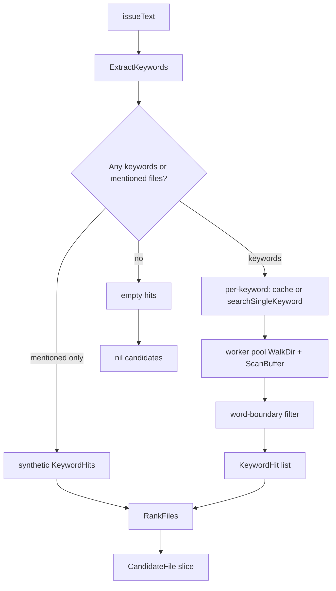

# retrieval — Implemented Spec (Deep-Dive)

> Last verified against codebase: **2026-07-13**  
> Status: Living Reference Document  
> Language: Go  
> Primary sources: `internal/retrieval/`  
> Scale: **4** non-test Go files ≈ **1,488** lines; **6** test files; **0** `.mg`

## 1. Overview

`internal/retrieval` is a **sparse, keyword-first file discovery layer** aimed at large repositories (comments cite SWE-bench-scale trees). It turns natural-language issue / problem text into:

1. Structured **keywords** (primary / secondary / tertiary + weights + mentioned files/symbols)
2. **Keyword hits** on disk (line/column/context) via native buffer scan
3. **Ranked candidate files** with relevance scores and context tiers 1–4
4. Optionally a **tiered context pack** (mentioned → keyword → import neighbors → symbol-definition heuristics)

It is **not** a vector RAG stack. Semantic expansion (Tier 4) is explicitly a placeholder that falls back to symbol-definition heuristics without embeddings.

### Design intent (from package comments)

```
// Package retrieval provides efficient file discovery for large codebases.
// SparseRetriever uses keyword-based search (ripgrep) to quickly identify
// relevant files without loading the entire repository into memory.
```

**Historical note:** comments and `parseRipgrepOutput` still speak of ripgrep. The live search path is **native Go**: `filepath.WalkDir` + worker pool + `ScanBuffer` (generic `bytes.Index` or optional `amd64 && simd` path). External `rg` is **not** invoked.

### Position in the agent loop

```
                    ┌─────────────────────────────────────┐
                    │  internal/retrieval (this package)  │
                    │  ExtractKeywords / SparseRetriever  │
                    │  TieredContextBuilder               │
                    └──────────────┬──────────────────────┘
                                   │ pure data structures
           ┌───────────────────────┼────────────────────────┐
           ▼                       ▼                        ▼
  chat.process_seed          Model.Retriever          (unwired)
  ExtractKeywords only       constructed at boot      TieredContextBuilder
  → issue_* facts            never called for search  tests only
           │
           ▼
  kernel EDB (schemas_knowledge.mg)
  → internal/context compressor & activation
  → JIT / prompt selection
```

North-star fit: retrieval is **transduction support** (NL issue → structured atoms). The **executive** remains the Mangle kernel (`permitted`, `next_action`). Retrieval must not become an LLM-driven planner.

---

## 2. Implementation status

| Component | Status | Evidence |
|-----------|--------|----------|
| `ExtractKeywords` heuristics | **Implemented** | `sparse.go`; chat `process_seed.go` |
| `SparseRetriever` native search | **Implemented** | `searchSingleKeyword`, `ScanBuffer` |
| LRU + TTL keyword hit cache | **Implemented** | `KeywordHitCache` |
| File ranking + tiers 1–4 | **Implemented** | `RankFiles`, `determineTier` |
| `FindRelevantFiles` convenience | **Implemented** | extract → search → rank |
| `TieredContextBuilder` T1–T3 | **Implemented** | mentioned, keyword, Python imports |
| Tier 4 semantic expansion | **Partial / placeholder** | symbol defs via keyword scan; no vectors |
| SIMD `ScanBuffer` | **Implemented (build-tag)** | `scanner_amd64.go` (`amd64 && simd`) |
| Generic `ScanBuffer` | **Implemented (default)** | `scanner_generic.go` |
| `parseRipgrepOutput` | **Implemented (orphan helper)** | tests only; not on search path |
| Chat boot constructs retriever | **Wired** | `session_boot.go`, `session_shared_boot.go` |
| Chat uses `Model.Retriever` search | **Unwired** | no callers of `.Retriever` after set |
| Chat seeds issue facts | **Partial wire** | `ExtractKeywords` only; T1 mentioned files |
| Assert `keyword_hit` / `candidate_file` | **Not done** | Decls exist in schemas; no producer |
| Full `BuildContext` → kernel facts | **Not done** | only manual T1 `tiered_context_file` |
| Go/Rust/TS import graph (T3) | **Not done** | Python `from`/`import` only |
| Embedding-backed T4 | **Not done** | comments describe intended design |

**Overall:** living library with **strong unit/integration tests** and **partial production wiring**. Treat as realized substrate, not pre-implementation.

---

## 3. Source inventory

### 3.1 Layout

```
internal/retrieval/
  sparse.go                      # SparseRetriever, keywords, cache, rank
  tiered_context.go              # TieredContextBuilder + ContextFile helpers
  scanner_generic.go             # //go:build !amd64 || !simd
  scanner_amd64.go               # //go:build amd64 && simd
  sparse_test.go                 # unit: extract, cache, rank, gaps
  sparse_search_test.go          # unit: ScanBuffer, search, e2e
  sparse_bench_test.go           # BenchmarkExtractKeywords
  sparse_integration_test.go     # //go:build integration
  tiered_context_test.go         # T1 + BuildContext e2e
  tiered_context_coverage_test.go# helpers + config coverage
```

### 3.2 Non-test sources (approximate lines)

| Path | Lines | Role |
|------|------:|------|
| `internal/retrieval/sparse.go` | ~814 | Core retriever, extract, search, rank, cache |
| `internal/retrieval/tiered_context.go` | ~546 | 4-tier context assembly |
| `internal/retrieval/scanner_amd64.go` | ~99 | SIMD-flavored first-byte filter + prefix check |
| `internal/retrieval/scanner_generic.go` | ~29 | `bytes.Index` loop |

### 3.3 Test sources (approximate lines)

| Path | Lines | Role |
|------|------:|------|
| `tiered_context_coverage_test.go` | ~357 | Coverage of builder helpers |
| `sparse_test.go` | ~293 | Extract/rank/cache/gap remediation |
| `sparse_search_test.go` | ~205 | Scan + search unit |
| `sparse_integration_test.go` | ~205 | Temp-tree suite + cancellation |
| `tiered_context_test.go` | ~75 | Mentioned files + BuildContext |
| `sparse_bench_test.go` | ~17 | ExtractKeywords bench |

---

## 4. Core domain model

### 4.1 Keyword extraction (`IssueKeywords`)

| Field | Meaning | Typical weight |
|-------|---------|----------------|
| `Primary` | Error/class-like symbols (`FooError`) | 0.9 (class def 0.85) |
| `Secondary` | Function/method call shapes | 0.7 |
| `Tertiary` | Quoted identifiers | 0.5 |
| `Weights` | Per-token importance map | 0.0–1.0 |
| `MentionedFiles` | Paths with known extensions | 1.0 |
| `MentionedSymbols` | Symbols also tracked for T4 | — |

Regex surfaces (package-level, compiled once):

| Pattern var | Purpose |
|-------------|---------|
| `filePathPattern` | `*.py|go|js|ts|rs|java|rb|cpp|c|h` |
| `pythonSymbolPattern` | PascalCase / `*Error`/`*Exception`/`*Warning` |
| `functionPattern` | `name(` |
| `methodPattern` | `.name(` |
| `classPattern` | `class Name` |
| `quotedPattern` | `"`, `'`, backtick identifiers |

`isCommonWord` drops English stopwords, short tokens (≤2), and noisy code words (`def`, `self`, `test`, …). Paths normalize `\` → `/` via `normalizePathSeparators`.

Empty / whitespace issue text short-circuits to empty `IssueKeywords` (no regex storm).

### 4.2 Hits and candidates

```
KeywordHit { FilePath, Keyword, Line, Column, Context, Count }
CandidateFile {
  FilePath, TotalHits, UniqueKeywords, RelevanceScore,
  Tier (1-4), Hits[], Keywords[]
}
```

**Ranking formula (conceptual):**

```
score = Σ weight(unique keyword)   # default weight 0.3 if missing
if uniqueKeywords > 1:
  score *= 1.0 + 0.2 * (uniqueKeywords - 1)
sort by score desc; apply limit
```

**Tier assignment (`determineTier`):**

| Tier | Condition |
|------|-----------|
| 1 | Path suffix/contains a `MentionedFiles` entry |
| 2 | `score >= 2.0` |
| 3 | `score >= 1.0` |
| 4 | else |

### 4.3 Tiered context budgets

Defaults from `DefaultTieredContextConfig`:

| Tier | Budget fraction | Role |
|------|----------------:|------|
| 1 | 30% | Explicitly mentioned files |
| 2 | 40% | Keyword matches |
| 3 | 20% | Import neighbors (Python) |
| 4 | 10% | Semantic / symbol definition heuristic |
| MaxTotal | 50 files | Cap for budget math |

`maxTierN = int(MaxTotal * tierNBudget)`.

---

## 5. Deep dives — main flows

### 5.1 Extract → Search → Rank (`FindRelevantFiles`)



**Search mechanics (`searchSingleKeyword`):**

1. Per-keyword context timeout (`searchTimeout`, default 30s)
2. `filepath.WalkDir(workDir)` with `excludePatterns` (`filepath.Match` on name)
3. Up to `parallelism` workers (default 4, or `NumCPU` if ≤0) reading files
4. Case-insensitive match: lowercased buffer vs lowercased keyword bytes
5. `ScanBuffer` → offsets; `isWordBoundary` requires non-alnum/`_` neighbors
6. Map offset → line/column via line-start index + binary search
7. On deadline/cancel: return partial hits **and** error

**Parallel keyword fan-out (`SearchKeywords`):**

- Semaphore limited by `parallelism`
- Cache hit skips work
- Errors logged via `logging.Context`; first-wave collection still returns aggregated hits (errors are observed but do not always fail the whole call)

### 5.2 Cache (`KeywordHitCache`)

- Map + `container/list` LRU
- TTL checked on `Get` (expired entries deleted)
- `Get`/`Set` clone hit slices (anti-aliasing)
- `Set` promotes existing keys; evicts back of list at capacity
- Default: size 1000, TTL 5 minutes

### 5.3 Tiered context build (`BuildContext`)

```
BuildContext(issueText)
  keywords = ExtractKeywords(issueText)
  Tier1 = extractMentionedFiles (resolve partial path under workDir)
  Tier2 = searchKeywordFiles (SearchKeywords + RankFiles)
  Tier3 = expandImportGraph (Python imports from T1–T2 files)
  Tier4 = semanticExpansion (findSymbolDefinitions heuristics)
  dedupe via addedFiles map
```

**Known implementation quirks (honest):**

1. **Tier 2 double path:** `searchKeywordFiles` first calls `FindRelevantFiles(ctx, "", …)` with empty text (always empty extract), then does the real `SearchKeywords` with the builder’s keywords. The first call is dead weight.
2. **Tier 4 “class X” patterns** are passed through `searchSingleKeyword`, which treats the whole pattern as a **literal case-insensitive keyword with word boundaries** — anchors like `^class` do **not** act as regex. Symbol discovery quality is therefore limited.
3. **Import graph is Python-only** (`from x import` / `import y`).
4. **`LoadContent`** fills `ContextFile.Content` until `maxBytes` total; silent skip on read error; no per-file truncation.

### 5.4 ScanBuffer dual implementation

| Build tags | File | Algorithm |
|------------|------|-----------|
| `!amd64 \|\| !simd` (default) | `scanner_generic.go` | `bytes.Index` loop, non-overlapping advances by `len(keyword)` |
| `amd64 && simd` | `scanner_amd64.go` | 16-byte first-char filter via `simd/archsimd`, then `bytes.HasPrefix` |

Both export the same signature: `func ScanBuffer(buf, keyword []byte) []int`.

---

## 6. Integration map

### 6.1 Production callers

| Caller | What it uses | Path |
|--------|--------------|------|
| Chat issue seed | `ExtractKeywords` only | `cmd/nerd/chat/process_seed.go` |
| Chat boot (legacy) | `NewSparseRetriever` → `Model.Retriever` | `cmd/nerd/chat/session_boot.go` |
| Chat boot (shared) | same | `cmd/nerd/chat/session_shared_boot.go` |
| Chat model field | `*retrieval.SparseRetriever` | `cmd/nerd/chat/model_types.go` |

**Seed fact mapping** (`seedIssueFacts`, verbs `/fix|/debug|/review|/security`):

| Fact | Args | Source |
|------|------|--------|
| `issue_text` | IssueID, Text (≤4000 chars) | raw input |
| `issue_keyword` | IssueID, Keyword, Weight | `Weights` map |
| `file_mentioned` | File, IssueID | `MentionedFiles` |
| `tiered_context_file` | IssueID, File, `/tier1`, relevance, 0 | mentioned files only |

### 6.2 Downstream consumers (outside package)

| Consumer | Use of facts |
|----------|----------------|
| `internal/context/compressor.go` | Reads issue_* / tiered_context_file for activation |
| `internal/context/types.go` | Priority weights for those predicates |
| `internal/core/defaults/schemas_knowledge.mg` | Decl surface for issue/keyword/tier predicates |

### 6.3 Declared but not produced by retrieval

Schemas also Decl:

- `keyword_weight`, `keyword_hit`, `candidate_file`, `context_tier`, `issue_context`

No code in `internal/retrieval` or chat seed currently asserts these from a full sparse search pass.

### 6.4 Dependencies of this package

| Import | Role |
|--------|------|
| stdlib only + `codenerd/internal/logging` | Logging via `logging.Context` convenience |
| `simd/archsimd` | Only in `scanner_amd64.go` under `simd` tag |

No kernel, store, embedding, or perception imports — intentional purity for testability.

---

## 7. Configuration surface

### `SparseRetrieverConfig`

| Field | Default | Notes |
|-------|---------|-------|
| WorkDir | caller / `.` | Search root |
| MaxResults | 100 | Used by `FindRelevantFiles` when limit 0 |
| SearchTimeout | 30s | Per keyword |
| Parallelism | 4 | Keyword fan-out + file workers |
| ExcludePatterns | pyc, git, node_modules, vendor, venv, … | Name match |
| CacheSize | 1000 | LRU capacity |
| CacheTTL | 5m | Per-entry |

### `TieredContextConfig`

| Field | Default |
|-------|---------|
| Tier budgets | 0.30 / 0.40 / 0.20 / 0.10 |
| MaxTotal | 50 |
| Retriever | optional; else built from WorkDir |

---

## 8. Gaps pointer

Full matrix: [03-GAP-ANALYSIS.md](03-GAP-ANALYSIS.md). Headline gaps:

1. **`Model.Retriever` dormant** — boot-only wiring.
2. **No full search → Mangle EDB pipeline** (`keyword_hit`, `candidate_file`, multi-tier `tiered_context_file`).
3. **Tier 4 not semantic** — no embedding bridge.
4. **Language bias** — extract + T3 favor Python idioms; Go multi-package repos under-served for imports.
5. **Comment/docs drift** — “ripgrep” vs native scan.
6. **T2 empty-string `FindRelevantFiles`** call waste.

---

## 9. Testing summary

| Layer | Command | Coverage character |
|-------|---------|-------------------|
| Unit | `go test ./internal/retrieval/` | Extract, rank, cache race, ScanBuffer, search, tier helpers |
| Integration | `go test -tags=integration ./internal/retrieval/` | Temp trees, exclusions, cancel hang guard |
| Bench | `go test -bench=. ./internal/retrieval/` | ExtractKeywords |

See [10-TESTING-ALIGNMENT.md](10-TESTING-ALIGNMENT.md).

---

## 10. North-star alignment (summary)

| Principle | Fit |
|-----------|-----|
| LLM creative / logic executive | Good when facts land in kernel; weak while search stays off the loop |
| Constitutional safety | N/A direct; retrieval is read-only FS scan |
| JIT prompt atoms | Indirect — issue facts feed selection, package does not own prompts |
| Wiring before deletion | **Critical** — do not delete “unused” retriever; boot + schemas await full wire |

---

## 11. Related corpora

- `Docs/architecture/context/` — activation / compression of issue facts  
- `Docs/architecture/cli/` — chat boot and seed path  
- `Docs/architecture/embedding/` — true semantic retrieval (T4 vision peer)  
- `Docs/architecture/core/` — schemas and kernel EDB  

---

## 12. Change discipline

When changing this package:

1. Prefer extending pure retrieval APIs over embedding kernel deps.
2. If asserting new facts, update `schemas_knowledge.mg` Decl first.
3. Wire chat or session executor intentionally; update this corpus.
4. Keep SIMD and generic scanners behaviorally equivalent for tests.
5. Run `go test ./internal/retrieval/...` (+ race for cache changes).
