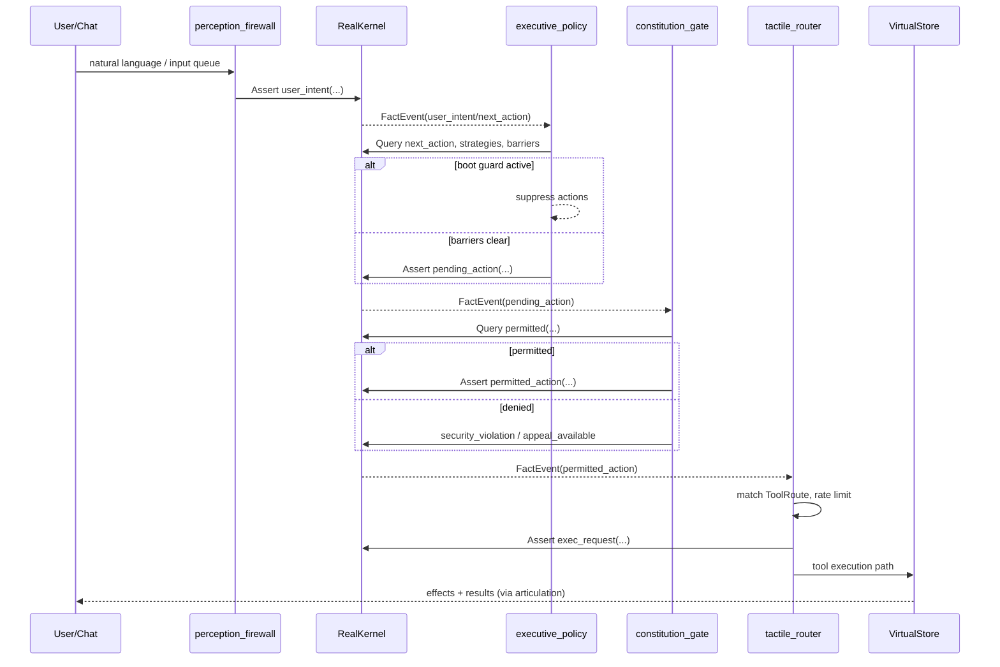

# 05 — Internal Architecture: shards

> Last verified against codebase: 2026-07-13  
> Components, data flow, lifecycle state machines

## 1. Component map

```
┌──────────────────────────────────────────────────────────────────┐
│                     internal/shards (package)                    │
│  registration │ matching │ consultation │ observers │ interrogator│
└───────────────┬──────────────────────────────────────────────────┘
                │ factories construct
                ▼
┌──────────────────────────────────────────────────────────────────┐
│                  internal/shards/system                          │
│  BaseSystemShard ─ CostGuard ─ AutopoiesisLoop                   │
│       │                                                          │
│       ├─ PerceptionFirewallShard                                 │
│       ├─ ExecutivePolicyShard (+intent +autopoiesis)             │
│       ├─ ConstitutionGateShard                                   │
│       ├─ TactileRouterShard                                      │
│       ├─ WorldModelIngestorShard                                 │
│       ├─ SessionPlannerShard                                     │
│       ├─ CampaignRunnerShard                                     │
│       ├─ LegislatorShard                                         │
│       └─ MangleRepairShard                                       │
└───────────────┬──────────────────────────────────────────────────┘
                │ uses
                ▼
┌────────────────────┐   ┌─────────────────┐   ┌──────────────────┐
│ core.RealKernel    │   │ core.VirtualStore│   │ core/shards.Mgr  │
│ fact bus / Query   │   │ tools / learning │   │ Start/Spawn      │
└────────────────────┘   └─────────────────┘   └──────────────────┘
```

## 2. OODA data flow (detail)



## 3. Lifecycle state machine (system shard)

```
                 New…Shard()
                      │
                      ▼
                   Idle ──────────────────────────┐
                      │ StartSystemShards / Execute│
                      ▼                            │
                   Running ◄── fact events / ticks │
                      │                            │
           StopCh / ctx.Done / idle timeout        │
                      │                            │
                      ▼                            │
                 Completed ────────────────────────┘
                      │
                      └── persistLearning, unsubscribe bus
```

**Idle timeout:** primarily on-demand shards (router, planner, world model) via CostGuard / lastActivity.

## 4. Executive evaluatePolicy steps

1. `queryActiveStrategies`  
2. `checkBarriers` → if strict + blocked, assert `executive_blocked`, return  
3. `queryNextActions`  
4. Update OODA timeout tracking  
5. If boot guard, return  
6. Truncate to `MaxActionsPerTick`  
7. For each action: hydrate from intent → assert `pending_action` → retract one-shot raw fact → metrics  

## 5. Constitution checkPermitted steps

1. Active appeal override?  
2. Dangerous pattern on target?  
3. Network action domain allowlisted?  
4. Query all `permitted` facts; match action/target/payload  
5. StrictMode default deny; optional autopoiesis unhandled record  

## 6. Router selection

- Exact/pattern match on `ActionPattern` (including prefix patterns like `campaign_`, `ouroboros_`)  
- Rate limiter per tool when `RateLimit > 0`  
- `RequiresSafe` documents constitution expectation (gate already ran for permitted stream)  
- Unmapped → fail when `AllowUnmappedActions=false`  

## 7. Specialist matching flow

```
verb + files + AgentRegistry
        │
        ▼
DefaultVerbConfigs[verb]  (mode, min confidence, prefer/exclude)
        │
        ▼
for each file × CoreTechnologyPatterns → score
        │
        ▼
map tech → agent name; filter ready agents
        │
        ▼
classify (executor/advisor/observer); ShouldExecute if conf>0.8
        │
        ▼
top-N SpecialistMatch sorted by score
```

Execution modes (`ModeParallel`, `ModeAdvisory`, `ModeAdvisoryWithCritique`, `ModeSpecialistDirect`) guide chat/campaign orchestration, not system OODA.

## 8. Observer event loop

```
Start() → eventLoop + periodicCheckLoop
SendEvent → eventChan (buffer 100)
processEvent → NorthstarHandler OR ObserverSpawner
            → ObserverAssessment → callbacks
Stop() → cancel + WaitGroup
```

## 9. Key internal types (system)

| Type | File | Purpose |
|------|------|---------|
| `BaseSystemShard` | base.go | Shared DI + lifecycle |
| `CostGuard` | base.go | LLM budget |
| `AutopoiesisLoop` | base.go | Unhandled case buffer |
| `ActionDecision` | executive.go | Derived action record |
| `SecurityViolation` | constitution.go | Audit denial |
| `ToolRoute` / `ToolCall` | router.go | Routing table / runtime |
| `AgendaItem` / `PlanView` | planner.go | Planning surface |
| `RepairResult` | mangle_repair.go | Repair outcome |

See [06-PUBLIC-API-AND-TYPES.md](06-PUBLIC-API-AND-TYPES.md) for full exported surface.
