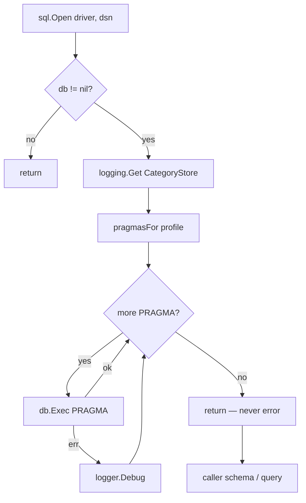

# sqlpragmas — Implemented Spec

> Last verified against codebase: **2026-07-13**  
> Status: Living Reference Document — code-grounded  
> Language: Go  
> Primary source: `internal/sqlpragmas/pragmas.go`  
> Scale: **1** production file (~125 LOC), **2** test files (~290 LOC combined), **0** `.mg`  

---

## 1. Overview

`sqlpragmas` centralizes SQLite connection tuning for codeNERD. Before this leaf existed, pragma lists were copy-pasted (or silently missing) across store open paths. The package now owns a **four-profile preset table** and a single apply function used after every intentional `sql.Open` that wants workstation-class performance without hard-failing on driver or platform differences.

### Why a separate package

```
internal/mcp ──X──► internal/store   (import cycle risk)
internal/mcp ────► internal/sqlpragmas  (leaf: ok)
internal/store ──► internal/sqlpragmas  (re-exports as store.ApplyDefaultPragmas)
```

Package comment in `pragmas.go` states the contract explicitly: depend only on `database/sql`, `fmt`, and `internal/logging` so upstream packages (mcp, autopoiesis, prompt, core, system, init, northstar, perception, context, CLI chat paths) can import it without cycling through `internal/store`.

### Place in agent architecture

sqlpragmas is **not** part of:

```
user_intent → kernel → next_action → VirtualStore → articulation
```

It is **precondition infrastructure** for every SQLite-backed subsystem that *does* participate in that loop (LocalStore, prompt atom DB, MCP registry store, learned store, northstar, feedback stores, predicate corpus, etc.). If open-time pragmas are wrong, the agent still “works,” but under concurrent writers, large mmap-less caches, or default rollback-journal contention.

### Key characteristics

| Property | Value |
|----------|-------|
| Public API surface | 1 type, 4 consts, 1 exported func, 1 unexported helper |
| Failure model | Best-effort; Debug log; never returns error; never closes `db` |
| nil safety | `ApplyDefaultPragmas(nil, _)` is a no-op |
| FK enforcement | **Intentionally omitted** from defaults |
| Target host | Workstation-class (large RAM, NVMe); smaller hosts OK (SQLite treats sizes as caps) |
| Drivers | Tolerates mattn/go-sqlite3 and modernc.org/sqlite partial pragma support |

---

## 2. Implementation status

| Component | Status | Notes |
|-----------|--------|-------|
| `PragmaProfile` enum | **Implemented** | iota: Hot, BulkBuild, Query, ReadOnly |
| `pragmasFor` preset table | **Implemented** | Ordered PRAGMA strings per profile |
| `ApplyDefaultPragmas` | **Implemented** | Best-effort apply loop |
| Unit tests (per profile + nil) | **Implemented** | `pragmas_test.go` (mattn driver) |
| Cross-profile integration | **Implemented** | `pragma_integration_test.go` |
| Idempotency test | **Implemented** | Re-apply ProfileHot |
| `store` re-export façade | **Implemented** | `internal/store/pragmas.go` |
| Wide call-site adoption | **Implemented** | 20+ direct + store-path opens |
| Config-driven sizes | **Not present** | Hardcoded GiB/MiB constants |
| Runtime host profiling | **Not present** | No RAM detection |
| FK opt-in helper | **Not present** | Callers must `db.Exec` themselves |
| modernc driver CI test | **Partial** | Tests import mattn only |
| Mangle / policy surface | **N/A** | No predicates |

**Overall:** production leaf utility — **complete for its stated contract**, not a stub. Heuristic completeness for *scope of this package*: **~95%**. Remaining work is policy/ergonomics (config, FK helper, dual-driver CI), not core apply logic.

---

## 3. Source inventory

### 3.1 Package layout

```
internal/sqlpragmas/
  pragmas.go                   # package doc, PragmaProfile, ApplyDefaultPragmas, pragmasFor
  pragmas_test.go              # unit tests: Hot/Bulk/Query/ReadOnly + nil
  pragma_integration_test.go   # table-driven all-profiles + idempotency
```

### 3.2 Line roles

| Path | ~Lines | Role |
|------|-------:|------|
| `pragmas.go` | 125 | Entire production surface |
| `pragmas_test.go` | 116 | Per-profile assertions, mmap soft check, nil safety |
| `pragma_integration_test.go` | 171 | All-profiles matrix + idempotency |

### 3.3 Related façade (not this package, but part of the product surface)

| Path | Role |
|------|------|
| `internal/store/pragmas.go` | Type alias `PragmaProfile`, const aliases, `var ApplyDefaultPragmas = sqlpragmas.ApplyDefaultPragmas` |

Callers that already import `store` use `store.ApplyDefaultPragmas`. Callers that **cannot** import `store` use `sqlpragmas` directly.

---

## 4. Public API (complete)

### 4.1 `PragmaProfile`

```go
type PragmaProfile int

const (
    ProfileHot       PragmaProfile = iota // long-lived agent stores
    ProfileBulkBuild                      // one-pass builders
    ProfileQuery                          // short-lived read-mostly
    ProfileReadOnly                       // mode=ro / no writes from this handle
)
```

Documented intent from source comments:

| Profile | Workload | Cache | mmap | WAL suite |
|---------|----------|------:|-----:|-----------|
| `ProfileHot` | LocalStore, learned, prompt cache, MCP, northstar, feedback, classifiers | 2 GB (`-2097152` KiB) | 8 GB | Yes + `wal_autocheckpoint=10000` |
| `ProfileBulkBuild` | corpus/prompt/predicate builders, ingest, init bulk, migrations bulk path | 4 GB | 16 GB | Yes + checkpoint `20000` |
| `ProfileQuery` | query-kb, agent atom count, init validation | 512 MB | 4 GB | Yes (no autocheckpoint pragma) |
| `ProfileReadOnly` | predicate corpus RO, embedded store RO | 512 MB | 4 GB | **No** journal/sync/checkpoint |

### 4.2 `ApplyDefaultPragmas`

**Signature:** `func ApplyDefaultPragmas(db *sql.DB, profile PragmaProfile)`

**Contract (from source):**

1. If `db == nil`, return immediately.
2. Resolve logger via `logging.Get(logging.CategoryStore)`.
3. For each PRAGMA from `pragmasFor(profile)`, `db.Exec(p)`.
4. On error: `logger.Debug("pragma %q failed: %v", p, err)` — continue.
5. Never return an error; never close `db`.

**Caller timing:** once, right after `sql.Open()`, before schema init or first real query, so the pool’s first connection is already tuned.

**Important SQLite nuance (tested):** PRAGMA settings are **per-connection**. Tests force `SetMaxOpenConns(1)` / `SetMaxIdleConns(1)` so reads observe the same connection writes hit. Production multi-conn pools: new connections get defaults unless the driver re-runs setup or callers re-apply / use `Conn` hooks. codeNERD largely relies on early apply + typical small pools for agent DBs.

### 4.3 Unexported `pragmasFor`

Returns ordered `[]string` of `PRAGMA ...` statements. **Order matters:** `journal_mode` first so WAL-dependent settings (`wal_autocheckpoint`, `synchronous=NORMAL` safety claims) land on a WAL journal.

Shared pragmas across writable profiles:

- `journal_mode = WAL`
- `synchronous = NORMAL`
- `temp_store = MEMORY`
- `busy_timeout = 10000` (10s)
- profile-specific `mmap_size` and `cache_size`
- Hot/Bulk: `wal_autocheckpoint`

ReadOnly omits journal_mode, synchronous, wal_autocheckpoint.

Unknown / future iota values fall through to **default = ProfileHot**.

---

## 5. Profile deep dive

### 5.1 ProfileHot — long-lived agent stores

**Why:** Sessions keep DB handles open for the lifetime of chat/boot. Concurrent readers+writers need WAL. 2 GB page cache + 8 GB mmap favors large knowledge / atom / vector-adjacent SQLite files on workstation hosts.

**Representative call sites:**

| Call site | Profile |
|-----------|---------|
| `internal/store/local_core.go` | Hot (via store re-export) |
| `internal/store/learned_store.go`, `learning.go`, `tool_store.go` | Hot |
| `internal/mcp/store.go` | Hot (direct) |
| `internal/prompt/loader.go`, `compiler_db.go`, `sync/synchronizer.go` | Hot |
| `internal/northstar/store.go` | Hot |
| `internal/context/feedback_store.go` | Hot |
| `internal/autopoiesis/prompt_evolution/{strategy_store,feedback_collector}.go` | Hot |
| `internal/perception/semantic_classifier.go` | Hot |
| `internal/system/factory.go` (project DB) | Hot |
| `cmd/nerd/chat/session_boot.go` | Hot |

### 5.2 ProfileBulkBuild — one-pass writers

**Why:** Builders create a fresh DB in one process lifetime and want maximum write throughput: larger cache, larger mmap, larger WAL checkpoint window (fewer fsync checkpoints mid-build).

**Representative call sites:**

| Call site | Profile |
|-----------|---------|
| `cmd/tools/corpus_builder/main.go` | BulkBuild (direct) |
| `cmd/tools/prompt_builder`, `predicate_corpus_builder` | BulkBuild (via store) |
| `cmd/nerd/chat/ingest.go` | BulkBuild |
| `internal/init/profile.go` | BulkBuild |
| `internal/prompt/loader_embedding.go` | BulkBuild |
| `internal/system/factory.go` (bulk path) | BulkBuild |
| `internal/store/migrations.go` | BulkBuild (one path) |

### 5.3 ProfileQuery — short-lived read-mostly

**Why:** Tools open briefly, run SELECTs, exit. Smaller cache (512 MB) reduces RAM spike when many tools run. Still enables WAL so a concurrent agent writer does not block the reader under default rollback-journal locking as aggressively.

**Call sites:** `internal/init/validation.go`, `internal/system/agent_registry.go`, `cmd/query-kb/*` (via store), `internal/store/migrations.go` (query path).

### 5.4 ProfileReadOnly — no write pragmas

**Why:** SQLite rejects write-class pragmas on `mode=ro` (or truly RO handles); failures would spam Debug on every open. ReadOnly still sets temp_store, busy_timeout, mmap, cache.

**Call sites:** `internal/core/predicate_corpus.go` (two opens), `internal/store/embedded_store.go`.

---

## 6. Design decisions encoded in code

### 6.1 Foreign keys omitted

Comment block in `pragmasFor` (~lines 76–80): several schemas declare `FOREIGN KEY` (northstar, strategies, prompt atoms) but historically ran **without** enforcement. Enabling `PRAGMA foreign_keys = ON` here would change behavior against existing user data. Sites that want FKs must enable locally.

### 6.2 Debug-not-fail

modernc.org/sqlite rejects a subset of pragmas that mattn accepts. The open path must succeed on both. Logging at Debug under `CategoryStore` matches broader store patterns.

### 6.3 mmap as upper bound

Source and tests note: SQLite (esp. Windows CGO builds) may cap `mmap_size` well below requested 8/16 GiB. Tests assert **positive** mmap only, not exact requested bytes.

### 6.4 cache_size negative form

Negative `cache_size` means kibibytes of page cache (SQLite convention), not page count. Values:

| Profile | PRAGMA | Meaning |
|---------|--------|---------|
| Hot | `-2097152` | 2 GiB |
| BulkBuild | `-4194304` | 4 GiB |
| Query / ReadOnly | `-524288` | 512 MiB |

### 6.5 synchronous = NORMAL with WAL

With WAL, `NORMAL` is the usual durability/perf tradeoff (safe for power-loss of OS, not for OS crash mid-checkpoint in all cases). Chosen for agent workstation workloads, not for banking-grade durability.

---

## 7. Control flow



### ASCII (open site pattern)

```
openSite(path):
  db, err := sql.Open(driver, dsn)
  if err != nil { return err }
  sqlpragmas.ApplyDefaultPragmas(db, ProfileHot)  // or store.ApplyDefaultPragmas
  // optional: db.SetMaxOpenConns(...)
  // migrate / CREATE TABLE / first query
  return db
```

---

## 8. Integration map

### 8.1 Downstream importers (direct `codenerd/internal/sqlpragmas`)

| Package / binary | Files |
|------------------|-------|
| `cmd/nerd/chat` | `session_boot.go`, `ingest.go` |
| `cmd/tools/corpus_builder` | `main.go` |
| `internal/mcp` | `store.go` |
| `internal/prompt` | `loader.go`, `loader_embedding.go`, `compiler_db.go` |
| `internal/prompt/sync` | `synchronizer.go` |
| `internal/system` | `factory.go`, `agent_registry.go` |
| `internal/init` | `profile.go`, `validation.go` |
| `internal/core` | `predicate_corpus.go` |
| `internal/northstar` | `store.go` |
| `internal/context` | `feedback_store.go` |
| `internal/perception` | `semantic_classifier.go` |
| `internal/autopoiesis/prompt_evolution` | `strategy_store.go`, `feedback_collector.go` |
| `internal/store` | `pragmas.go` (re-export only) |

### 8.2 Downstream via `store` re-export

| Package / binary | Files |
|------------------|-------|
| `internal/store` | `local_core.go`, `learned_store.go`, `learning.go`, `tool_store.go`, `embedded_store.go`, `migrations.go` |
| `cmd/query-kb` | `main.go`, `deep_query.go` |
| `cmd/tools/prompt_builder` | `main.go` |
| `cmd/tools/predicate_corpus_builder` | `main.go` |

### 8.3 Upstream dependencies

| Import | Use |
|--------|-----|
| `database/sql` | `*sql.DB`, `Exec` |
| `fmt` | `mmap_size` sprintf |
| `codenerd/internal/logging` | `Get(CategoryStore)`, Debug |

No imports of core, mangle, prompt, session, shards, config, features.

### 8.4 Fact-flow / Mangle / JIT

| Surface | Relevance |
|---------|-----------|
| Kernel / Mangle | **None** — no Decl, no rules |
| VirtualStore | **Indirect** — store backends it uses open with these pragmas |
| Shards | **Indirect** — shard learning/stores |
| Prompt JIT | **Indirect** — compiler_db / loader open with Hot |
| CLI | **Direct** — chat boot, ingest, tools |
| Constitutional `permitted(...)` | **None** |

---

## 9. Testing summary

| Test | File | Asserts |
|------|------|---------|
| ProfileHot values | `pragmas_test.go` | mmap>0, cache, temp_store=2, journal=wal, sync=1, busy=10000 |
| ProfileBulkBuild | `pragmas_test.go` | mmap>0, cache, wal_autocheckpoint=20000 |
| ProfileQuery | `pragmas_test.go` | mmap>0, cache 512MB |
| ProfileReadOnly no WAL | `pragmas_test.go` | journal ≠ wal; mmap>0 |
| Nil DB | `pragmas_test.go` | no panic |
| All profiles matrix | `pragma_integration_test.go` | full table of documented expects |
| Idempotency | `pragma_integration_test.go` | re-apply Hot stable |

**Driver under test:** `_ "github.com/mattn/go-sqlite3"` — CGO required. Tempfile DSN (not `:memory:`) because mmap reports 0 on in-memory DBs.

---

## 10. Observability

- Logger category: `logging.CategoryStore` (`"store"`).
- Level: **Debug** only for failed PRAGMAs.
- Format: `pragma %q failed: %v`.
- No metrics, no counters, no tracing spans.
- Success path is silent (no Info spam on every open).

---

## 11. Gaps pointer

See [03-GAP-ANALYSIS.md](03-GAP-ANALYSIS.md), [TODO.md](TODO.md), [OPEN-QUESTIONS.md](OPEN-QUESTIONS.md).

Headline gaps (not bugs in current contract):

1. Hardcoded sizes — no config / host-RAM scaling.
2. Dual-driver: tests cover mattn; modernc failures only observed via Debug in prod.
3. Connection-pool re-apply not guaranteed for multi-conn DBs.
4. Split import surface (`sqlpragmas` vs `store`) can confuse new call sites.
5. No helper for optional `foreign_keys=ON`.

---

## 12. Non-goals of this package

- Managing DSNs, drivers registration, or migrations.
- Providing a generic “run SQL on open” hook registry.
- Enforcing schema invariants or FK graphs.
- Tuning postgres / other engines.
- Exposing Mangle facts about open databases.

---

## 13. Verify commands

```powershell
go test ./internal/sqlpragmas/...
go test ./internal/store/ -run Pragma -count=1   # if store has related tests
rg "ApplyDefaultPragmas" -g "*.go"
```

---

## 14. Maintenance notes

- **Adding a profile:** extend `PragmaProfile` const + `pragmasFor` case + unit test + integration table row.
- **Changing defaults:** treat as cross-product behavior change — re-verify store, mcp, prompt opens, and Windows mmap soft asserts.
- **Do not** add heavy deps; leaf status is load-bearing for import graph.
- **Do not** make `ApplyDefaultPragmas` return `error` without a multi-package migration — dozens of call sites rely on fire-and-forget.

---

## 15. Glossary

| Term | Meaning here |
|------|----------------|
| WAL | Write-Ahead Logging journal mode |
| mmap_size | Max bytes SQLite may memory-map from the DB file |
| cache_size (negative) | Page cache budget in KiB |
| busy_timeout | ms to wait on locked DB before SQLITE_BUSY |
| Profile | Workload class selecting a PRAGMA preset |
| Leaf package | No upward imports into mid-layer product packages |

---

*End of implemented spec. Depth intentionally narrative despite small LOC — this package’s importance is **fan-out**, not file count.*
