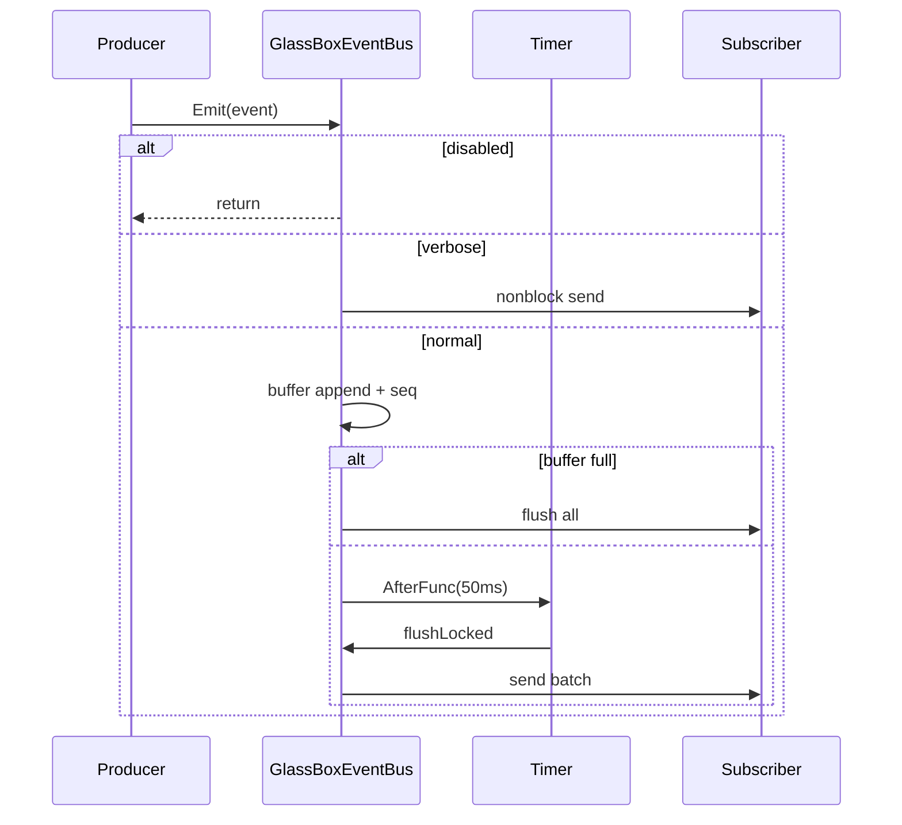

# transparency — Internal Architecture

> Last verified: 2026-07-13

## 1. Component diagram

```
                    ┌──────────────────────┐
                    │ TransparencyConfig   │
                    │ (internal/config)    │
                    └──────────┬───────────┘
                               │
                               ▼
                    ┌──────────────────────┐
                    │ TransparencyManager  │
                    │  enabled + mutex     │
                    └───┬──────────────┬───┘
                        │              │
            ┌───────────▼──┐    ┌──────▼──────────┐
            │ ShardObserver│    │ SafetyReporter  │
            │ map[id]exec  │    │ []violations    │
            │ history      │    │ classify heuristics
            │ observers[]  │    └─────────────────┘
            └──────────────┘
                    │
                    │ FormatError ──► ClassifyError

  ┌─────────────────────────────────────────────────────────┐
  │ Independent bus instances (usually one per chat session)│
  │                                                         │
  │  GlassBoxEventBus          ToolEventBus                 │
  │  - subscribers[]           - single chan                │
  │  - buffer + timer          - buffer 50                  │
  │  - categories filter       - always emit                │
  │  - verbose flag                                         │
  └─────────────────────────────────────────────────────────┘
                               ▲
                               │ Emit
          ┌────────────────────┼────────────────────┐
          │                    │                    │
   VirtualStore          ShardManager         system.Router
   (routing/tools)       (spawn/complete)     (tool routes)

  Explainer ──reads──► mangle.DerivationTrace (external)
```

## 2. Data types overview

### 2.1 GlassBoxEvent

| Field | Role |
|-------|------|
| ID | Monotonic sequence assigned by bus |
| Timestamp | Event time (default now) |
| Category | Subsystem taxonomy |
| Summary | One-line UI |
| Details | Verbose expansion |
| TurnID | Conversation turn affinity |
| Duration | Timed ops |
| Source | e.g. shard id, action type |

### 2.2 ToolEvent

Always-visible tool execution card: name, result snippet, success, duration, timestamp.

### 2.3 ShardExecution

Live structured state: type, task, phase, start/phase times, message, progress 0–1.

### 2.4 SafetyViolation

ID, time, action, type, rule, target, summary, explanation, remediation[].

### 2.5 ClassifiedError

Wraps original error with category, summary, remediation; implements `error` + `Unwrap`.

### 2.6 OperationSummary

Post-op narrative fields for `FormatOperationSummary` (not a live tracker).

## 3. State machines

### 3.1 Shard phase machine

```
        StartExecution
Idle ──────────────────► Initializing
                              │
                              │ UpdatePhase(...)
                              ▼
                    Loading / Analyzing /
                    Generating / Executing
                              │
                    EndExecution(failed?)
                              │
                    ┌─────────┴─────────┐
                    ▼                   ▼
                Complete              Failed
```

- Terminal phases excluded from `GetActiveExecutions`.  
- Unknown shard ID on Update/End → no-op.  
- Disabled observer: still mutates execution map on Start/Update/End; history/notify only if enabled (Start always creates map entry; notify gated).

### 3.2 Glass Box bus modes

```
                Enable
  disabled ─────────────► enabled
                             │
              ┌──────────────┼──────────────┐
              │ verbose      │ normal        │ filtered
              ▼              ▼               ▼
         EmitImmediate   buffer+timer    maybe drop
```

Category filter empty ⇒ allow all. Non-empty map ⇒ membership required.

### 3.3 Manager enable cascade

```
Enable:
  enabled=true
  if config.ShardPhases → observer.Enable
  safetyReporter.Enable

Disable:
  enabled=false
  observer.Disable
  safetyReporter.Disable
```

Note: `SafetyReporter.New` starts `enabled: true` internally; Manager may disable it via cascade. Fresh Manager with master off still constructs reporter with its own default until Disable is called—callers should treat **Manager gates** as the public control plane.

## 4. Control flow — Emit batching (normal)



## 5. Explainer tree walk

```
ExplainTrace(trace)
  for each root in RootNodes:
    explainNode(root, depth=0)
      if depth > maxDepth: omit marker
      if SourceEDB: "base fact"
      else: fact + rule explanation + "Because:" children
  footer: facts examined + duration if showDetails
```

`ExplainDecision` searches roots for predicate `next_action`, then `buildNarrative` limited to depth 3.

## 6. Key algorithms (brief)

### 6.1 ClassifyError

Ordered switch on lowercase error string substrings (safety → config → API → kernel → shard → filesystem → network → timeout). First match wins. Unknown fallback.

**Ordering subtlety:** filesystem pattern includes `"permission denied"`, which can also be safety-ish; safety patterns run first (permission/blocked/constitutional/…), so pure “permission denied” may still hit safety depending on phrases present—tests cover intended classifications.

### 6.2 classifyViolation

Destructive action tokens → secret path tokens → protected dirs → resource_limit rules → permitted/policy rules → unknown.

### 6.3 Unsubscribe

Uses `reflect.ValueOf(ch).Pointer()` to match receive-only channel to send-only subscriber entry, then closes and removes.

## 7. Memory & lifecycle

| Object | Lifecycle |
|--------|-----------|
| Manager | Session-long; chat Model field |
| Buses | Session-long; Close on teardown |
| Explainer | Ephemeral per explain command |
| Histories | Bounded rings |

`Close` on Glass Box closes all subscriber channels—consumers must stop listening to avoid panics on closed channel (chat init owns lifecycle).

## 8. Extension points

| Extension | How |
|-----------|-----|
| New Glass Box category | Add const + AllCategories + producers + ValidCategory |
| New error category | Extend ErrorCategory + Prefix/String + ClassifyError + guides |
| Phase observer UI | Implement `PhaseObserver`, `AddObserver` |
| Custom rule English | Extend `explainRule` map |
| New always-on channel | Prefer new bus type; do not overload Glass Box filter semantics for tools |
