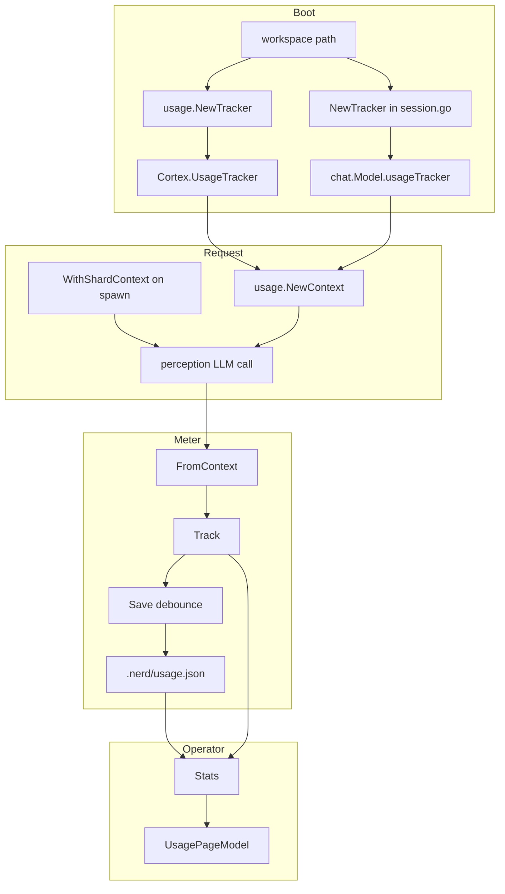

# usage — Implemented Spec

> Last verified against codebase: **2026-08-15**  
> Status: Living reference — **code-grounded full corpus**  
> Mode: 1:1 with `internal/usage/`  
> Implementation: **3** non-test Go · **6** tests · **0** `.mg`  
> Heuristic completeness: **~95%** of a production-grade multi-engine meter (core tracker solid; every HTTP LLM client meters; CLI-engine clients expose no token counts to meter)

---

## 1. Overview

`codenerd/internal/usage` implements **workspace-local LLM token accounting**.

It answers: *How many input/output tokens has this project consumed, broken down by provider, model, shard type, operation, and session?*

It does **not** answer: *Is this call permitted?* That remains the Mangle kernel’s job. Usage is a **sensor** on the creative center’s spend, attached ambiently through `context.Context`.

### Design in one paragraph

`NewTracker(workspace)` ensures `.nerd/` exists, loads `.nerd/usage.json` if present, and holds an in-memory `UsageData` under a mutex. Callers embed the tracker with `NewContext`. After successful LLM completions, producers call `FromContext` + `Track`. Track updates aggregate maps and schedules a 5-second debounced `Save`. Operators read via `Stats()` (e.g. TUI usage page).

### Fact-flow placement

```
user input → perception → user_intent → kernel → next_action
                │                              → VirtualStore → articulation
                │
                └── side channel: Track tokens (if tracker on ctx)
```

Usage never asserts facts, never queries the kernel, never routes VirtualStore actions.

---

## 2. Implementation status

| Component | Status | Notes |
|-----------|--------|-------|
| Types (`UsageData`, aggregates, `TokenCounts`) | **Implemented** | `usage_types.go` |
| `Tracker` construct/load/save | **Implemented** | Soft-fail corrupt load, logged |
| `Track` multi-dimension aggregates | **Implemented** | incl. `ByShardName` |
| Atomic save (temp file + fsync + rename) | **Implemented** | `saveLocked` |
| Debounced autosave + dirty re-arm | **Implemented** | `autoSaveTimer`, re-arms if a mutation lands mid-write |
| `Close`/`Flush` on shutdown | **Implemented** | Cortex close + chat shutdown |
| Refcounted single owner per workspace | **Implemented** | `Shared` registry; last `Close` shuts down |
| Context attach / retrieve | **Implemented** | Typed key for tracker |
| Shard attribution helpers | **Implemented** | Typed keys, legacy string keys still read |
| Stats defensive copy | **Implemented** | |
| Cortex boot wiring | **Implemented** | `system/factory.go` via `Shared` |
| CLI/chat context attach | **Implemented** | Multiple cmd + chat files |
| Track producers — HTTP LLM clients | **Implemented** | zai, anthropic, openai, gemini, xai, openrouter, ollama, dashscope, meta, moonshot |
| Track producers — streaming paths | **Implemented** | once per stream, from the final billed usage chunk |
| Track producers — CLI engines | **N/A** | `claude-cli` / `codex-cli` decoders receive no token counts |
| Canonical provider ids | **Implemented** | `perception.canonicalProviderIDs`, checked against config engine names |
| `UsageEvent` bounded ring | **Implemented** | opt-in via `WithEventLog` |
| `Cost` estimation | **Implemented** | `pricing.go` price table; `UnpricedTokens` for misses |
| By-shard-name aggregates | **Implemented** | `ByShardName` |
| `BySession` pruning | **Implemented** | folds low-spend rows into `(pruned)` |
| Negative-token rejection | **Implemented** | logged and dropped |
| Logging integration | **Implemented** | `logging.CategorySession` |
| `nerd usage` CLI | **Implemented** | `cmd/nerd/cmd_usage.go` |
| Mangle surface | **N/A** | Correct absence |
| Unit tests | **Strong** | 6 test files + producer tests in `internal/perception` |
| Architecture corpus | **This document set** | 2026-08-15 update |

**Overall:** Living, wired package — **not** pre-implementation. Treat as **production telemetry with full coverage of every LLM client that reports tokens**.

---

## 3. Source inventory

### 3.1 Layout

```
internal/usage/
  usage_types.go                 # data model + TokenCounts.Add/AddCost
  usage_tracker.go               # Tracker + persistence + context + Shared registry
  pricing.go                     # model → list price table, EstimateCost
  usage_tracker_test.go
  usage_tracker_context_test.go
  usage_types_test.go
  usage_comprehensive_test.go
  durability_test.go
  pricing_test.go
  shared_tracker_test.go
```

### 3.2 Production files

| Path | ~Lines | Role |
|------|-------:|------|
| `internal/usage/usage_tracker.go` | 211 | Core behavior |
| `internal/usage/usage_types.go` | 47 | Schemas |

### 3.3 On-disk artifact

| Path | Writer | Reader |
|------|--------|--------|
| `<workspace>/.nerd/usage.json` | `Tracker.saveLocked` | `Tracker.Load`, operators, next `NewTracker` |

---

## 4. Public surface (complete)

### Types

| Type | Location | Role |
|------|----------|------|
| `UsageData` | `usage_types.go` | JSON root |
| `UsageEvent` | `usage_types.go` | Per-call schema (unused writer) |
| `AggregatedStats` | `usage_types.go` | Project + maps |
| `TokenCounts` | `usage_types.go` | Input/Output/Total/Cost |
| `Tracker` | `usage_tracker.go` | Mutable owner |

### Functions / methods

| Symbol | Location | Role |
|--------|----------|------|
| `NewTracker` | `usage_tracker.go:26` | Construct + best-effort load |
| `(*Tracker) Load` | `:56` | Disk → memory |
| `(*Tracker) Save` | `:93` | Memory → disk |
| `(*Tracker) Track` | `:108` | Record call |
| `(*Tracker) Stats` | `:161` | Snapshot aggregates |
| `NewContext` | `:191` | Embed tracker |
| `FromContext` | `:196` | Retrieve or nil |
| `WithShardContext` | `:205` | Set name/type/session |
| `(*TokenCounts) Add` | `usage_types.go:43` | Mutating sum |

---

## 5. Deep dive — Tracker lifecycle

### 5.1 Construction

```
NewTracker(workspacePath)
  nerdDir = join(workspace, ".nerd")
  MkdirAll(nerdDir, 0755)  ──fail──► return error
  filePath = join(nerdDir, "usage.json")
  init empty AggregatedStats maps, Version "1.0"
  Load()  ──any error──► ignored; keep empty maps from init
  return tracker
```

**Implication:** Callers that treat `err == nil` as “history loaded” are wrong when the file was corrupt — they still get a valid empty tracker.

### 5.2 Track algorithm

Under `mu`:

1. `shard_type` ← ctx string or `"unknown"`  
2. `shard_name` ← ctx string or `"unknown"` (name **not** aggregated today)  
3. `session_id` ← ctx string or `"unknown"`  
4. `TotalProject.Add(input, output)`  
5. `addToMap` for provider, model, shard type, operation, session  
6. If `!dirty`: set dirty; `time.AfterFunc(5s, Save; dirty=false)`  

Then: cost estimate from the price table (unpriced tokens counted separately), optional append to the bounded `Events` ring, `BySession` pruning, and `markDirtyLocked`. Negative counts are rejected before any of this; all-zero counts return early.

### 5.3 Persistence

`saveLocked` → `json.MarshalIndent` → temp file in the same directory → `Write` → `Sync` → `Chmod 0644` → `Rename` onto `usage.json`.

Atomic: a reader sees either the old file or the new one. A failed write leaves no temp file behind and keeps the tracker dirty so the next flush retries.

### 5.4 Stats

Struct value copy + per-map `maps.Copy`. Nil map stays nil via helper.

---

## 6. Deep dive — Context contract

### Tracker embedding

Uses unexported `type contextKey struct{}` — only `NewContext`/`FromContext` can use it. Safe against accidental collisions.

### Attribution keys (typed)

`WithShardContext` writes private `shardMetaKey` values, not raw strings, so no
other package can collide with or read them. Track still falls back to the
legacy raw-string key on read for contexts built before the change; nothing in
the tree writes those any more.

| Key | Set by | Read by |
|-----|--------|---------|
| `shardMetaKey{"shard_name"}` | `WithShardContext` | Track → `ByShardName` |
| `shardMetaKey{"shard_type"}` | `WithShardContext` | Track → `ByShardType` |
| `shardMetaKey{"session_id"}` | `WithShardContext` | Track → `BySession` |

**Live setter:** `internal/core/shards/manager_spawn.go` before shard goroutine.

---

## 7. Integration map

### 7.1 Construction sites

| Site | Path | Notes |
|------|------|-------|
| Cortex boot | `internal/system/factory.go` | `initCoreComponents` → `usage.Shared`; field on Cortex |
| Chat session | `cmd/nerd/chat/session.go` | `usage.Shared` → **same** tracker as Cortex for that workspace |
| `nerd usage` CLI | `cmd/nerd/cmd_usage.go` | `NewTracker`, read-only, separate process |

`Shared` refcounts: each owner Closes its own handle and only the last Close
flushes and shuts the tracker down.

### 7.2 Context attach sites

| Site | Path |
|------|------|
| Advanced | `cmd/nerd/cmd_advanced.go` |
| Interactive refine | `cmd/nerd/cmd_interactive.go` |
| Instruction | `cmd/nerd/cmd_instruction.go` |
| Direct actions | `cmd/nerd/cmd_direct_actions.go` |
| Chat process / stream | `cmd/nerd/chat/process.go` |
| Campaign | `cmd/nerd/chat/campaign.go` |
| Assault | `cmd/nerd/chat/campaign_assault.go` |

### 7.3 Producers (Track)

All producers go through `perception.trackUsage` (`internal/perception/usage_track.go`),
which resolves the provider id through `usageProviderID` and calls
`usage.TrackFromContext`.

| Site | Path | Operation | Provider |
|------|------|-----------|----------|
| ZAI chat / structured / tools / stream | `client_zai.go`, `client_zai_streaming.go` | `chat`, `tool_gen` | `zai` |
| Anthropic chat / tools / tool-results / stream | `client_anthropic.go` | `chat`, `tool_gen` | `anthropic` |
| OpenAI chat / stream / non-streaming funnel | `client_openai.go` | `chat`, `tool_gen` | `openai` |
| Ollama (OpenAI transport, own provider id) | `client_ollama.go` | `chat`, `tool_gen` | `ollama` |
| xAI chat / tools / tool-results | `client_xai.go` | `chat`, `tool_gen` | `xai` |
| OpenRouter chat / stream / tools | `client_openrouter.go` | `chat`, `tool_gen` | `openrouter` |
| OpenAI-compatible funnel (`executeChat`) + stream | `client_openai_compat.go` | `chat`, `tool_gen` | `dashscope`, `meta`, `moonshot` |
| Meta Responses surface | `client_meta_responses.go` | `tool_gen` | `meta` |
| Meta grounded web search | `client_openai_compat_grounding.go` | `grounded_search` | `meta` |
| Gemini chat / schema / tools / tool-results / stream | `client_gemini*.go` | `chat`, `tool_gen` | `gemini` |

Notes:

- **Streaming tracks once**, after the stream ends, from the final usage-bearing
  chunk (`stream_options.include_usage`, Anthropic `message_start`/`message_delta`,
  Gemini `usageMetadata`). Never per delta.
- **xAI streaming** delegates to `CompleteWithSystem` and must not track again.
- **Gemini** bills thinking tokens as output, so `geminiOutputTokens` folds
  `thoughtsTokenCount` into the output count.
- **Retries that reached the vendor are each billed**, so the compat funnel
  tracks per successful HTTP response, including the empty-content thinking retry.
- **CLI engines** (`claude-cli`, `codex-cli`) are the remaining unmetered
  producers: their response decoders carry no token counts, so there is nothing
  to record without inventing numbers.

Enforced by `internal/perception/usage_track_test.go`.

### 7.4 Consumers (Stats)

| Site | Path |
|------|------|
| Usage TUI page | `cmd/nerd/ui/usage_page.go` |
| UI tests | `cmd/nerd/ui/pages_test.go` |

### 7.5 Mermaid — end-to-end



---

## 8. Data model reference

### TokenCounts

| Field | JSON | Populated |
|-------|------|-----------|
| Input | `input` | Yes via Add |
| Output | `output` | Yes via Add |
| Total | `total` | Yes via Add |
| Cost | `cost_est_usd` | Yes via `AddCost` (estimate from `pricing.go`) |

### AggregatedStats maps

All maps are `map[string]TokenCounts`. Keys are free-form strings from callers (provider id, model id, shard type, operation, session id). Missing metadata → `"unknown"`.

### UsageEvent (bounded ring)

Fields mirror Track arguments plus `Timestamp` and `CostUSD`. Retained only when
the tracker is built `WithEventLog`, capped at `maxEvents` (1000) with oldest-first
eviction. Aggregates remain the durable record; the ring is recent history only.

---

## 9. Concurrency and failure posture

| Concern | Posture |
|---------|---------|
| Thread safety of maps | Mutex on all entry points |
| Missing tracker | Silent no-op |
| Bad attribution types | Degrade to unknown |
| Corrupt disk | Empty start |
| Save error in AfterFunc | Logged; tracker stays dirty and the timer re-arms |
| Multi-process | **Unsupported** (last writer wins across processes) |
| Dual Tracker same file | **Resolved** in-process via `Shared` refcounting |

Full catalog: [12-FAILURE-MODES.md](12-FAILURE-MODES.md).

---

## 10. Testing summary

| Suite | Proves |
|-------|--------|
| Aggregates + dimensions | Multi Track updates correct maps |
| Persist | Save + NewTracker reload |
| Context | New/From/WithShard + non-string safety |
| Load matrix | Missing/bad/partial/success |
| Copy safety | Stats mutation isolation |
| Corrupt boot | Tracker still created |

Command: `go test ./internal/usage/...`

Details: [10-TESTING-ALIGNMENT.md](10-TESTING-ALIGNMENT.md).

---

## 11. Gaps pointer

Priority summary:

All P0–P4 backlog items are closed except metering the CLI engines, which is
blocked on those clients surfacing token counts at all. Remaining risk is
cross-process, not in-process.

Full matrix: [03-GAP-ANALYSIS.md](03-GAP-ANALYSIS.md) · backlog: [TODO.md](TODO.md).

---

## 12. North-star compliance

| North-star item | Compliance |
|-----------------|------------|
| LLM creative / logic executive | Meter only; no executive power |
| Constitutional safety | No effect surface; default-deny unaffected |
| JIT prompt atoms | N/A |
| Wiring before delete | Events/Cost/autoSaveTimer reserved — audit first |

Alignment scores: [00-ALIGNMENT-VISION-REVIEW.md](00-ALIGNMENT-VISION-REVIEW.md).

---

## 13. Non-goals of this corpus revision

- Cross-process coordination of `usage.json`  
- Mangle predicates for hard token budgets  
- Cloud billing reconciliation (costs here are list-price estimates)  
- Claiming CLI-engine metering that the CLI decoders cannot support  

---

## 14. Related documents

| Doc | Topic |
|-----|-------|
| [README.md](README.md) | Index + verify |
| [01-VISION.md](01-VISION.md) | Target architecture |
| [02-CURRENT-STATE.md](02-CURRENT-STATE.md) | Inventory hotspots |
| [05-INTERNAL-ARCHITECTURE.md](05-INTERNAL-ARCHITECTURE.md) | Components / state machine |
| [06-PUBLIC-API-AND-TYPES.md](06-PUBLIC-API-AND-TYPES.md) | API cookbook |
| [07-DEPENDENCY-MAP.md](07-DEPENDENCY-MAP.md) | Import graph |
| [08-WIRING-AND-INTEGRATION.md](08-WIRING-AND-INTEGRATION.md) | Boot/CLI/chat/shards |
| [09-SAFETY-AND-INVARIANTS.md](09-SAFETY-AND-INVARIANTS.md) | Invariants |
| [11-OBSERVABILITY.md](11-OBSERVABILITY.md) | Operator channels |
| [OPEN-QUESTIONS.md](OPEN-QUESTIONS.md) | Design forks |

---

## 15. Worked example (behavioral)

Interactive chat with ZAI, one coder shard:

1. `session.go` builds tracker at workspace root → empty or prior aggregates.  
2. Turn starts; `process.go` puts tracker on ctx.  
3. Kernel spawns coder shard; `manager_spawn.go` sets shard_name/type/session on ctx.  
4. ZAI completes; Track(…, "glm-…", "zai", 1200, 400, "chat").  
5. Aggregates: Total +1200/+400; ByProvider["zai"]; ByShardType["coder"]; BySession[id].  
6. ~5s later JSON rewritten.  
7. User opens Usage page → Stats tables show provider/model/shard type/operation.

The same turn on any other HTTP engine now records identically, under that
engine's config name. Only the CLI engines stay silent, and they stay silent
because they report no tokens — not because the wiring is missing.
