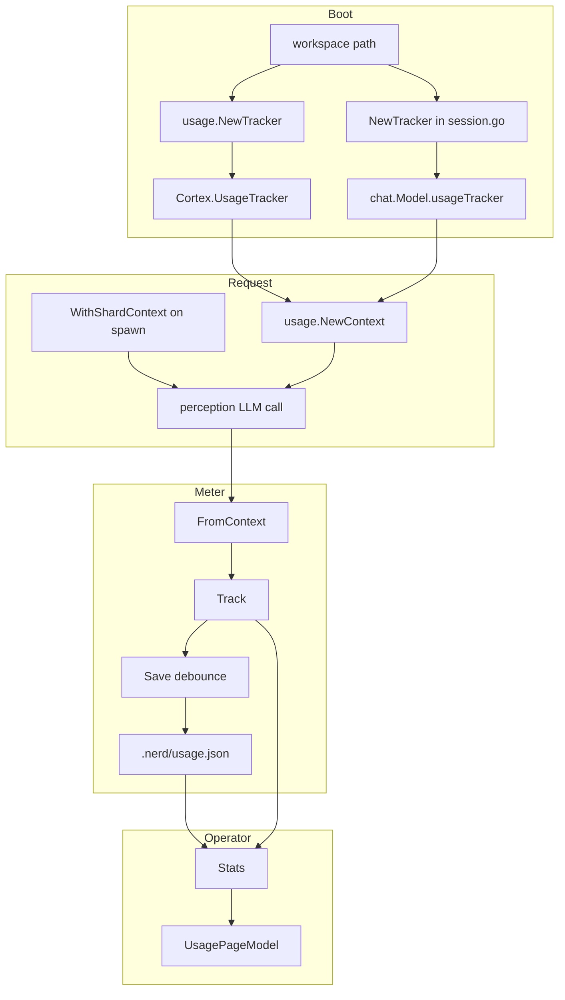

# usage — Implemented Spec

> Last verified against codebase: **2026-07-13**  
> Status: Living reference — **code-grounded full corpus**  
> Mode: 1:1 with `internal/usage/`  
> Implementation: **2** non-test Go · **4** tests · **0** `.mg`  
> Heuristic completeness: **~75%** of a production-grade multi-engine meter (core tracker solid; producer coverage partial)

---

## 1. Overview

`codenerd/internal/usage` implements **workspace-local LLM token accounting**.

It answers: *How many input/output tokens has this project consumed, broken down by provider, model, shard type, operation, and session?*

It does **not** answer: *Is this call permitted?* That remains the Mangle kernel’s job. Usage is a **sensor** on the creative center’s spend, attached ambiently through `context.Context`.

### Design in one paragraph

`NewTracker(workspace)` ensures `.nerd/` exists, loads `.nerd/usage.json` if present, and holds an in-memory `UsageData` under a mutex. Callers embed the tracker with `NewContext`. After successful LLM completions, producers call `FromContext` + `Track`. Track updates aggregate maps and schedules a 5-second debounced `Save`. Operators read via `Stats()` (e.g. TUI usage page).

### Fact-flow placement

```
user input → perception → user_intent → kernel → next_action
                │                              → VirtualStore → articulation
                │
                └── side channel: Track tokens (if tracker on ctx)
```

Usage never asserts facts, never queries the kernel, never routes VirtualStore actions.

---

## 2. Implementation status

| Component | Status | Notes |
|-----------|--------|-------|
| Types (`UsageData`, aggregates, `TokenCounts`) | **Implemented** | `usage_types.go` |
| `Tracker` construct/load/save | **Implemented** | Soft-fail corrupt load |
| `Track` multi-dimension aggregates | **Implemented** | |
| Debounced autosave | **Implemented** | Known dirty race (see gaps) |
| Context attach / retrieve | **Implemented** | Typed key for tracker |
| Shard attribution helpers | **Implemented** | String keys |
| Stats defensive copy | **Implemented** | |
| Cortex boot wiring | **Implemented** | `system/factory.go` |
| CLI/chat context attach | **Implemented** | Multiple cmd + chat files |
| ZAI Track producer | **Implemented** | Sole production Track site found |
| Other LLM engines Track | **Missing** | Silent undercount |
| `UsageEvent` append | **Not implemented** | Type only |
| `Cost` estimation | **Not implemented** | Field only |
| By-shard-name aggregates | **Not implemented** | Comment only |
| Logging integration | **Missing** | |
| Mangle surface | **N/A** | Correct absence |
| Unit tests | **Strong** | 4 test files |
| Architecture corpus | **This document set** | 2026-07-13 rebuild |

**Overall:** Living, wired package — **not** pre-implementation. Treat as **production telemetry with incomplete multi-engine coverage**.

---

## 3. Source inventory

### 3.1 Layout

```
internal/usage/
  usage_types.go                 # data model + TokenCounts.Add
  usage_tracker.go               # Tracker + persistence + context
  usage_tracker_test.go
  usage_tracker_context_test.go
  usage_types_test.go
  usage_comprehensive_test.go
```

### 3.2 Production files

| Path | ~Lines | Role |
|------|-------:|------|
| `internal/usage/usage_tracker.go` | 211 | Core behavior |
| `internal/usage/usage_types.go` | 47 | Schemas |

### 3.3 On-disk artifact

| Path | Writer | Reader |
|------|--------|--------|
| `<workspace>/.nerd/usage.json` | `Tracker.saveLocked` | `Tracker.Load`, operators, next `NewTracker` |

---

## 4. Public surface (complete)

### Types

| Type | Location | Role |
|------|----------|------|
| `UsageData` | `usage_types.go` | JSON root |
| `UsageEvent` | `usage_types.go` | Per-call schema (unused writer) |
| `AggregatedStats` | `usage_types.go` | Project + maps |
| `TokenCounts` | `usage_types.go` | Input/Output/Total/Cost |
| `Tracker` | `usage_tracker.go` | Mutable owner |

### Functions / methods

| Symbol | Location | Role |
|--------|----------|------|
| `NewTracker` | `usage_tracker.go:26` | Construct + best-effort load |
| `(*Tracker) Load` | `:56` | Disk → memory |
| `(*Tracker) Save` | `:93` | Memory → disk |
| `(*Tracker) Track` | `:108` | Record call |
| `(*Tracker) Stats` | `:161` | Snapshot aggregates |
| `NewContext` | `:191` | Embed tracker |
| `FromContext` | `:196` | Retrieve or nil |
| `WithShardContext` | `:205` | Set name/type/session |
| `(*TokenCounts) Add` | `usage_types.go:43` | Mutating sum |

---

## 5. Deep dive — Tracker lifecycle

### 5.1 Construction

```
NewTracker(workspacePath)
  nerdDir = join(workspace, ".nerd")
  MkdirAll(nerdDir, 0755)  ──fail──► return error
  filePath = join(nerdDir, "usage.json")
  init empty AggregatedStats maps, Version "1.0"
  Load()  ──any error──► ignored; keep empty maps from init
  return tracker
```

**Implication:** Callers that treat `err == nil` as “history loaded” are wrong when the file was corrupt — they still get a valid empty tracker.

### 5.2 Track algorithm

Under `mu`:

1. `shard_type` ← ctx string or `"unknown"`  
2. `shard_name` ← ctx string or `"unknown"` (name **not** aggregated today)  
3. `session_id` ← ctx string or `"unknown"`  
4. `TotalProject.Add(input, output)`  
5. `addToMap` for provider, model, shard type, operation, session  
6. If `!dirty`: set dirty; `time.AfterFunc(5s, Save; dirty=false)`  

No append to `Events`. No cost. No validation of non-negative tokens.

### 5.3 Persistence

`saveLocked` → `json.MarshalIndent` → `os.WriteFile(path, data, 0644)`.

Not atomic. No fsync. No backup file.

### 5.4 Stats

Struct value copy + per-map `maps.Copy`. Nil map stays nil via helper.

---

## 6. Deep dive — Context contract

### Tracker embedding

Uses unexported `type contextKey struct{}` — only `NewContext`/`FromContext` can use it. Safe against accidental collisions.

### Attribution keys (string)

| Key | Set by | Read by |
|-----|--------|---------|
| `"shard_name"` | `WithShardContext` | Track (not aggregated) |
| `"shard_type"` | `WithShardContext` | Track → `ByShardType` |
| `"session_id"` | `WithShardContext` | Track → `BySession` |

**Live setter:** `internal/core/shards/manager_spawn.go` before shard goroutine.

---

## 7. Integration map

### 7.1 Construction sites

| Site | Path | Notes |
|------|------|-------|
| Cortex boot | `internal/system/factory.go` | `initCoreComponents`; field on Cortex |
| Chat session | `cmd/nerd/chat/session.go` | Separate construction for TUI model |

### 7.2 Context attach sites

| Site | Path |
|------|------|
| Advanced | `cmd/nerd/cmd_advanced.go` |
| Interactive refine | `cmd/nerd/cmd_interactive.go` |
| Instruction | `cmd/nerd/cmd_instruction.go` |
| Direct actions | `cmd/nerd/cmd_direct_actions.go` |
| Chat process / stream | `cmd/nerd/chat/process.go` |
| Campaign | `cmd/nerd/chat/campaign.go` |
| Assault | `cmd/nerd/chat/campaign_assault.go` |

### 7.3 Producers (Track)

| Site | Path | Operation | Provider |
|------|------|-----------|----------|
| ZAI HTTP client | `internal/perception/client_zai.go` | `"chat"` | `"zai"` |

No other production `Track` call sites found under `internal/` or `cmd/` at verification date.

### 7.4 Consumers (Stats)

| Site | Path |
|------|------|
| Usage TUI page | `cmd/nerd/ui/usage_page.go` |
| UI tests | `cmd/nerd/ui/pages_test.go` |

### 7.5 Mermaid — end-to-end



---

## 8. Data model reference

### TokenCounts

| Field | JSON | Populated |
|-------|------|-----------|
| Input | `input` | Yes via Add |
| Output | `output` | Yes via Add |
| Total | `total` | Yes via Add |
| Cost | `cost_est_usd` | **No** |

### AggregatedStats maps

All maps are `map[string]TokenCounts`. Keys are free-form strings from callers (provider id, model id, shard type, operation, session id). Missing metadata → `"unknown"`.

### UsageEvent (schema aspirational)

Fields mirror Track arguments plus `Timestamp`. Would support forensic “what happened when” if a ring buffer is added.

---

## 9. Concurrency and failure posture

| Concern | Posture |
|---------|---------|
| Thread safety of maps | Mutex on all entry points |
| Missing tracker | Silent no-op |
| Bad attribution types | Degrade to unknown |
| Corrupt disk | Empty start |
| Save error in AfterFunc | Currently **ignored** |
| Multi-process | **Unsupported** |
| Dual Tracker same file | **Risk** in chat+Cortex |

Full catalog: [12-FAILURE-MODES.md](12-FAILURE-MODES.md).

---

## 10. Testing summary

| Suite | Proves |
|-------|--------|
| Aggregates + dimensions | Multi Track updates correct maps |
| Persist | Save + NewTracker reload |
| Context | New/From/WithShard + non-string safety |
| Load matrix | Missing/bad/partial/success |
| Copy safety | Stats mutation isolation |
| Corrupt boot | Tracker still created |

Command: `go test ./internal/usage/...`

Details: [10-TESTING-ALIGNMENT.md](10-TESTING-ALIGNMENT.md).

---

## 11. Gaps pointer

Priority summary:

1. **P0** — Track from all LLM engines and stream finals  
2. **P1** — Atomic save + dirty re-arm + shutdown flush  
3. **P2** — Events/Cost/logging/UI session table  
4. **P3** — Single tracker owner; prune sessions  

Full matrix: [03-GAP-ANALYSIS.md](03-GAP-ANALYSIS.md) · backlog: [TODO.md](TODO.md).

---

## 12. North-star compliance

| North-star item | Compliance |
|-----------------|------------|
| LLM creative / logic executive | Meter only; no executive power |
| Constitutional safety | No effect surface; default-deny unaffected |
| JIT prompt atoms | N/A |
| Wiring before delete | Events/Cost/autoSaveTimer reserved — audit first |

Alignment scores: [00-ALIGNMENT-VISION-REVIEW.md](00-ALIGNMENT-VISION-REVIEW.md).

---

## 13. Non-goals of this corpus revision

- Implementing missing Track producers or cost tables  
- Changing Go source under `internal/usage`  
- Spec-doc-sprint product templates outside this folder  
- Claiming 100% multi-engine metering when only ZAI tracks  

---

## 14. Related documents

| Doc | Topic |
|-----|-------|
| [README.md](README.md) | Index + verify |
| [01-VISION.md](01-VISION.md) | Target architecture |
| [02-CURRENT-STATE.md](02-CURRENT-STATE.md) | Inventory hotspots |
| [05-INTERNAL-ARCHITECTURE.md](05-INTERNAL-ARCHITECTURE.md) | Components / state machine |
| [06-PUBLIC-API-AND-TYPES.md](06-PUBLIC-API-AND-TYPES.md) | API cookbook |
| [07-DEPENDENCY-MAP.md](07-DEPENDENCY-MAP.md) | Import graph |
| [08-WIRING-AND-INTEGRATION.md](08-WIRING-AND-INTEGRATION.md) | Boot/CLI/chat/shards |
| [09-SAFETY-AND-INVARIANTS.md](09-SAFETY-AND-INVARIANTS.md) | Invariants |
| [11-OBSERVABILITY.md](11-OBSERVABILITY.md) | Operator channels |
| [OPEN-QUESTIONS.md](OPEN-QUESTIONS.md) | Design forks |

---

## 15. Worked example (behavioral)

Interactive chat with ZAI, one coder shard:

1. `session.go` builds tracker at workspace root → empty or prior aggregates.  
2. Turn starts; `process.go` puts tracker on ctx.  
3. Kernel spawns coder shard; `manager_spawn.go` sets shard_name/type/session on ctx.  
4. ZAI completes; Track(…, "glm-…", "zai", 1200, 400, "chat").  
5. Aggregates: Total +1200/+400; ByProvider["zai"]; ByShardType["coder"]; BySession[id].  
6. ~5s later JSON rewritten.  
7. User opens Usage page → Stats tables show provider/model/shard type/operation.

If the same turn used a non-ZAI engine with no Track site, steps 4–6 never update disk — **the primary integrity gap of the living system**.
