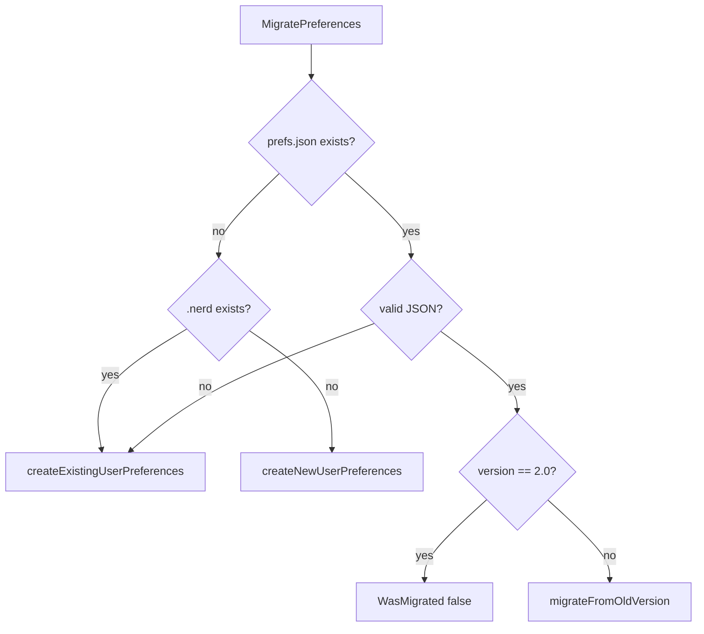

# ux — Internal Architecture

> Last verified: **2026-07-13**

## Component diagram

```
┌─────────────────────────────────────────────────────────────┐
│                     PreferencesManager                      │
│  path: {workspace}/.nerd/preferences.json                   │
│  mu: RWMutex                                                │
│  preferences: *UserPreferences                              │
│                                                             │
│  Load / Save / Get / mutators                               │
└───────────────┬─────────────────────────────┬───────────────┘
                │                             │
                ▼                             ▼
     ┌──────────────────┐          ┌────────────────────┐
     │  UserPreferences │          │ Workspace helpers  │
     │  (JSON schema)   │          │ migration.go       │
     └────────┬─────────┘          │ MigratePreferences │
              │                    │ ShouldShow…        │
              ▼                    │ RecordSessionStart │
     ┌──────────────────┐          │ CheckJourney…      │
     │ JourneyPrefs     │          └────────────────────┘
     │ GuidancePrefs    │
     │ TelemetryPrefs   │          ┌────────────────────┐
     │ UserMetrics ───────────────►│ ShouldTransition   │
     │ LearnedPatterns  │          │ (user_state.go)    │
     │ AgentSelection   │          └────────────────────┘
     └──────────────────┘
              │
              ▼
     ┌──────────────────┐
     │ GetDisclosureLevel│
     │ (pure function)  │
     └──────────────────┘
```

## Data model relationships

```
UserPreferences
├── Version: string                     // "2.0"
├── UserJourney: JourneyPrefs
│   ├── State: UserJourneyState
│   ├── TransitionTimestamp
│   ├── OnboardingCompleted / OnboardingSkippedAt
│   └── CompletedSteps[]
├── Guidance: GuidancePrefs
│   ├── Level: config.GuidanceLevel
│   └── ShowHints / ShowWhyExplanations / AutoSuggestHelp
├── Telemetry: TelemetryPrefs
├── Metrics: UserMetrics
│   └── counters + ClarificationRate (computed field, not always set)
├── LearnedPatterns
│   ├── IntentCorrections[]
│   └── CommandPreferences map
└── AgentSelection: AgentSelectionPrefs
```

## Journey state machine

```
                    CommandsExecuted>=1
     ┌──────┐  ─────────────────────►  ┌────────────┐
     │ new  │                          │ onboarding │
     └──────┘                          └─────┬──────┘
                                             │ MarkOnboardingComplete
                                             │ or SkipOnboarding
                                             ▼
                                       ┌──────────┐
                                       │ learning │
                                       └────┬─────┘
                    sessions>=15 &          │
                    successful>=20 &        │
                    clar_rate<0.15          │
                                            ▼
                                       ┌────────────┐
                                       │ productive │
                                       └─────┬──────┘
                    sessions>=50 &           │
                    commands>=200 &          │
                    help_requests<5          │
                                             ▼
                                       ┌─────────┐
                                       │  power  │
                                       └─────────┘
```

Notes:

- `ShouldTransition` does **not** auto-leave `onboarding`; completion APIs set `learning` directly.  
- There is no automatic demotion path (power → learning) in code.

## Migration decision tree



## Disclosure pure function

```
if guidanceLevel == GuidanceNone:
    return DisclosureMinimal
switch journey:
  power       → Minimal
  productive  → Standard
  learning    → Verbose
  default     → Tutorial
```

Guidance override is hard: `none` collapses all journeys to minimal.

## Concurrency & lifetime

- **No global singleton.** Each `NewPreferencesManager(workspace)` is independent.  
- Chat holds one instance on `Model.preferencesMgr` / boot `PreferencesMgr` but wizard paths often construct **new** managers for short operations.  
- Disk is the shared truth between instances; last `Save` wins.

## Error handling patterns

| Operation | Failure behavior |
|-----------|------------------|
| `Load` missing file | Defaults in memory, nil error |
| `Load` other I/O | Wrapped error |
| `Load` JSON parse | Wrapped error (no auto-repair) |
| `Save` | MkdirAll + write; wrapped errors |
| `IncrementMetric` unknown | Error `unknown metric` |
| `MigratePreferences` invalid JSON | Recreate as existing user |
| `ShouldShowOnboarding` load error | false |

## Interaction with feature flags

`ShouldShowOnboarding` short-circuits to false when `features.IsOnboardingSkipped()` resolves true from:

1. Env `NERD_SKIP_ONBOARDING`  
2. Features config `skip_onboarding`  
3. Default false  

Resolution order is owned by `internal/features` (`resolveBool`), not this package.
