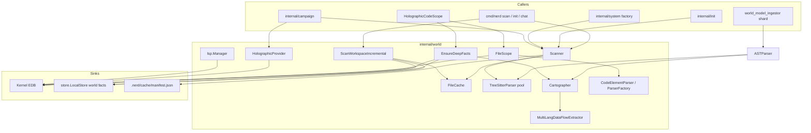

# world — Implemented Spec (Flagship)

> Last verified against codebase: **2026-07-13**  
> Status: Living reference — code-grounded full corpus  
> Source of truth: `internal/world/` (+ `internal/world/lsp/`)  
> Schema companion: `internal/core/defaults/schemas_world.mg`  
> **Implementation: ~37 non-test Go files, ~31 test files, 1 subpackage (`lsp`), 0 package-local `.mg`**

---

## 1. Purpose

`internal/world` is codeNERD’s **workspace perception layer**: it turns the filesystem and source ASTs into **Mangle EDB facts** the kernel can reason over.

It is not the executive (that is Mangle/kernel policy). It is not the LLM. It is the **transducer** from disk reality → structured atoms:

```
disk tree + source text
        │
        ▼
 Scanner / Cartographer / CodeDOM / DataFlow / LSP
        │
        ▼
 core.Fact{Predicate, Args}  ──LoadFacts / ApplyIncremental──►  Kernel EDB
        │
        ▼
 policy queries (file_exists, code_defines, spreading activation, impact, …)
```

Two critical surfaces dominate this package and must be understood together:

1. **Filesystem topology** — portable `file_topology` / `directory` identity, hashing, ignore rules, incremental deltas.
2. **AST / holographic projection** — `symbol_graph`, `code_defines` / `code_calls`, data-flow guards, CodeDOM elements, holographic context for agents.

---

## 2. Source inventory (1:1)

### 2.1 Package tree

| Path | Role |
|------|------|
| `internal/world/` | Primary package (`package world`) |
| `internal/world/lsp/` | Mangle LSP → world-fact projection |
| `internal/world/testdata/` | Large-file fixtures |
| `internal/world/debug_program_ERROR.mg` | Crash dump artifact (not product source) |
| `Docs/architecture/world/` | This corpus |

### 2.2 Role map (non-test Go)

| Cluster | Files | Responsibility |
|---------|-------|----------------|
| **FS topology** | `fs.go`, `scanner_config.go`, `cache.go`, `incremental_scan.go`, `apply_incremental.go`, `persist.go`, `deep_scan.go`, `git_scanner.go` | Walk, hash, ignore, cache, delta apply, DB snapshot, git churn |
| **Fast AST (scan-path)** | `ast.go`, `ast_treesitter.go`, `mangle_fastparse.go` | Tree-sitter / cartographer symbols during scan → `symbol_graph` |
| **Deep holographic map** | `cartographer.go`, `dataflow*.go`, `dataflow_cache.go` | Go `go/ast` deep facts + multi-lang data flow |
| **CodeDOM** | `parser_interface.go`, `parser_factory.go`, `go_parser.go`, `python_parser.go`, `typescript_parser.go`, `rust_parser.go`, `mangle_parser.go`, `code_elements.go`, `code_elements_mangle.go` | Polyglot `CodeElement` + language Stratum-0 facts |
| **Scope (1-hop)** | `scope.go` | Open active file + package/import neighborhood → scope EDB |
| **Holographic agent context** | `holographic.go`, `holographic_formatting.go`, `holographic_impact.go` | Package X-ray + impact-prioritized callers for LLM injection |
| **Predicates / types** | `world_predicates.go`, `types.go`, `graph_interface.go` | Replaceable predicate set; cycle-break aliases |
| **Test selection** | `test_dependency.go` | Test→source graph for codedom |
| **LSP** | `lsp/manager.go` | Index Mangle workspace; project defs/refs/diags |

### 2.3 Largest files (approximate line counts from prior inventory)

| Path | ~Lines | Hotspot |
|------|-------:|---------|
| `scope.go` | 1023 | 1-hop scope, encoding diagnostics, fact emission |
| `rust_parser.go` | 784 | Tree-sitter CodeDOM for Rust |
| `holographic_impact.go` | 750 | Impact priority + caller body extraction |
| `ast_treesitter.go` | 736 | Fast multi-lang symbol_graph |
| `dataflow.go` | 706 | Go scope-range data-flow facts |
| `typescript_parser.go` | 643 | TS/JS CodeDOM |
| `holographic.go` | 614 | Package-level holographic context |
| `fs.go` | 571 | Concurrent workspace walk + topology |
| `incremental_scan.go` | 545 | Delta scan + entry-point heuristics |
| `code_elements.go` | 464 | CodeElement model + pattern detect |

### 2.4 Implementation status (living code — not pre-impl)

| Component | Status | Notes |
|-----------|--------|-------|
| FS full scan | **Implemented** | Concurrent, cached hashes, ignore lists |
| FS incremental scan | **Implemented** | FileCache + LocalStore per-file facts |
| Fast AST (scan) | **Implemented** | Go/Py/RS/JS/TS/Mangle; size-gated |
| Deep Cartographer | **Partial** | `MapFile` deep path is **Go-only**; multi-lang data flow exists but Cartographer entry only deep-maps `.go` |
| CodeDOM polyglot | **Implemented** | Factory registers go/py/ts/rs/mangle |
| FileScope 1-hop | **Implemented** | Go import graph strongest; other langs get sibling 0-hop |
| Holographic provider | **Implemented** | Rich for Go; basic for other langs |
| Impact priorities | **Implemented** | Depends on kernel `context_priority_file` / fallbacks |
| Git history facts | **Implemented** | Soft-fail if not a git repo |
| LSP world projection | **Implemented (Mangle-only)** | gopls etc. not wired |
| Predicate replace set | **Implemented** | `WorldPredicates` / `ApplyIncrementalResult` |
| Overall package | **~85–90%** | Production-used; multi-lang depth uneven |

---

## 3. Architecture overview



### 3.1 Fact-flow placement

```
user_intent → perception → kernel derives next_action
                              ↑
                    world facts already in EDB
                              ↑
         Scanner / FileScope / EnsureDeepFacts / LSP
```

World does **not** decide `permitted(...)`. It **supplies EDB** so policy can derive:

- `file_exists(Path) :- file_topology(...)`
- impact / spreading activation from `code_defines` / `code_calls`
- test selection edges
- holographic retrieval for reviewers

---

## 4. Deep dive: filesystem topology

### 4.1 Core type: `Scanner`

**File:** `internal/world/fs.go`

```go
type Scanner struct {
    parserPool sync.Pool   // *TreeSitterParser
    config     ScannerConfig
}
```

Constructors:

| Func | Behavior |
|------|----------|
| `NewScanner()` | `DefaultScannerConfig()` from features + CPU bounds |
| `NewScannerWithConfig(cfg)` | Custom concurrency / ignore / AST size cap |

Config (`scanner_config.go`):

| Field | Default / source |
|-------|------------------|
| `MaxConcurrency` | `max(min(NumCPU,20),4)` or `features.FastScanWorkers()` |
| `IgnorePatterns` | `.git`, `.nerd`, `node_modules`, `vendor`, `dist`, `build`, `.next`, `target`, `bin`, `obj`, `.terraform`, `.venv`, `.cache` |
| `MaxASTFileBytes` | 2MB or `features.FastASTMaxBytes()` |

Env/config keys (via features): `NERD_FAST_SCAN_WORKERS`, `NERD_FAST_AST_MAX_BYTES`.

### 4.2 Canonical path identity (portability)

**Critical invariant:** topology facts use **workspace-relative, forward-slash** paths when possible.

```go
// fs.go — canonicalScanPath
// Store workspace-relative path so knowledge store is not machine-dependent
```

| Input | Stored identity |
|-------|-----------------|
| Path under root | `filepath.ToSlash(rel)` |
| Path outside root / Rel fail | `filepath.ToSlash(path)` (normalized absolute fallback) |

This exists so session restore and multi-machine caches do not embed `C:\...` as predicate identity.

**Known partial:** `ScanWorkspaceIncremental` directory facts and some delta `file_topology` args still use walk `path` (often absolute). Full scan path is more carefully relativized. Treat absolute-vs-relative identity as a **live hazard** for delta vs full consistency.

### 4.3 Emitted topology facts

#### `file_topology/5`

| Arg | Type | Meaning |
|-----|------|---------|
| 0 Path | string | Canonical (prefer relative) path |
| 1 Hash | string | SHA-256 hex of content |
| 2 Language | `MangleAtom` | e.g. `/go`, `/python` |
| 3 LastModified | int64 | **UnixNano** mtime |
| 4 IsTestFile | `MangleAtom` | `/true` or `/false` |

Schema: `internal/core/defaults/schemas_world.mg` — `Decl file_topology(...) bound [/string, /string, /name, /number, /name].`

Derived: `file_exists(Path) :- file_topology(Path, _, _, _, _).`

#### `directory/2`

| Arg | Meaning |
|-----|---------|
| Path | Canonical dir path |
| Name | Base name |

### 4.4 Walk algorithm (`ScanDirectory`)

1. Load `FileCache` at `.nerd/cache/manifest.json`; `Save()` on exit.
2. `filepath.Walk` with context cancel.
3. **Hard skip dirs:** `node_modules`, `vendor`, `dist`, `build`, `.git`, `.nerd`.
4. **Hidden dirs:** skip unless allowlist (`.github`, `.vscode`, `.circleci`, `.config`).
5. **Config ignore:** `isIgnoredRel` name / prefix / glob.
6. Directories → channel `dirResults` → `directory` facts (no mutex convoy).
7. Files → acquire semaphore **before** spawn (bounded workers) → hash (cache hit by size+UnixNano mtime) → `file_topology` → optional fast AST.
8. Aggregator goroutine merges file/dir channels into `ScanResult`.

`ScanResult`:

```go
type ScanResult struct {
    FileCount, DirectoryCount, TestFileCount int
    Facts []core.Fact
    Languages map[string]int
}
```

### 4.5 Language detection

`detectLanguage(ext, path)` maps extensions (go, mg/mangle/dl, py, js/ts/tsx/jsx, rs, java, c/cpp, shell, yaml, md, …) plus special basenames (`Dockerfile`, `go.mod`, `package.json`, `Cargo.toml`, …). Unknown → `"unknown"`.

Test detection (`isTestFile`): `_test.go`, `test_*.py` / `*_test.py`, `*.test.ts`, `tests/` dirs, `*Test.java`, etc.

### 4.6 FileCache (hash thrashing fix)

**File:** `cache.go`  
**Path:** `<workspace>/.nerd/cache/manifest.json`

```go
type CacheEntry struct {
    Hash    string
    ModTime int64  // UnixNano
    Size    int64
}
```

`Get` returns cached hash only if mtime **nanoseconds** and size match. Second-resolution mtime previously allowed same-second rewrites to keep stale hashes; nano comparison is intentional.

### 4.7 Incremental scan

**File:** `incremental_scan.go`  
**API:** `(*Scanner).ScanWorkspaceIncremental(ctx, root, db, opts)`

| Case | Behavior |
|------|----------|
| Empty prior FileCache | Full `ScanWorkspaceCtx`; optionally persist to `LocalStore`; set `Full=true` |
| No deltas + `SkipWhenUnchanged` | `Unchanged=true`, no facts |
| Deltas | Retract old fast facts from DB for changed/deleted; re-hash/re-parse only those; update cache/DB |

`IncrementalResult` fields: `Full`, `Unchanged`, `NewFacts`, `RetractFacts`, `ChangedFiles`, `NewFiles`, `DeletedFiles`, counts, `Duration`, `ProjectLanguage`.

**Full-scan extras** (not always on delta):

- `project_language(/lang)` majority vote over `file_topology`
- `entry_point(path)` heuristics: `main.go`, `__main__.py`, `index.js/ts`, or `symbol_graph` package/func main

Fingerprint for DB: `fmt.Sprintf("%d:%d", size, mtime.UnixNano())`.

### 4.8 Apply to kernel

**File:** `apply_incremental.go`

```go
func ApplyIncrementalResult(kernel types.Kernel, res *IncrementalResult) error
```

| `res.Full` | Action |
|------------|--------|
| true | `RemoveFactsByPredicateSet(WorldPredicateSet())` then `LoadFacts` |
| false | `RetractExactFactsBatch(RetractFacts)`; always `Retract("directory")`; `LoadFacts(NewFacts)` |

`WorldPredicates` (`world_predicates.go`):  
`file_topology`, `directory`, `symbol_graph`, `dependency_link`, holographic data-flow preds, LSP preds (`symbol_defined`, `symbol_referenced`, `code_diagnostic`, `symbol_completion`).

**Note:** `project_language`, `entry_point`, CodeDOM preds (`code_element`, …), git preds are **not** all in `WorldPredicates` — replace-set is incomplete vs all emitters (gap).

### 4.9 Persist to LocalStore

**File:** `persist.go` — `PersistFastSnapshotToDB(db, facts)` groups by path via `groupFactsByPath`, upserts `WorldFileMeta`, `ReplaceWorldFactsForFile(..., "deep"|"fast", fp, inputs)`.

Global non-file facts key: `"__world_global__"`.

### 4.10 Deep scan (Cartographer layer)

**File:** `deep_scan.go` — `EnsureDeepFacts(ctx, paths, db, workers)`

- Filters to **`.go` only**
- Reuses `LocalStore` depth=`"deep"` when fingerprint matches
- Else `Cartographer.MapFile` → cache + return
- Returns `DeepResult{NewFacts, RetractFacts, FilesParsed, Duration}`

Wired by `internal/system/holographic_code_scope.go` so VirtualStore-facing scope keeps `code_defines`/`code_calls` fresh without import cycles (`core` cannot import `world`).

### 4.11 Git history

**File:** `git_scanner.go` — `ScanGitHistory(ctx, root, depth)`

- Soft skip if not a git repo
- Emits `git_history` and churn-related facts from `git log --numstat`
- Not in `WorldPredicates` list

---

## 5. Deep dive: AST and holographic projection

### 5.1 Two AST pipelines (do not conflate)

| Pipeline | Entry | Engine | Primary predicates | Used by |
|----------|-------|--------|--------------------|---------|
| **Fast scan AST** | `Scanner` → `TreeSitterParser` | tree-sitter pool | `symbol_graph` (+ mangle fast symbols) | Full/incremental workspace scan |
| **Deep map** | `Cartographer.MapFile` | `go/parser` + dataflow | `code_defines`, `code_calls`, data-flow | Deep scan, ASTParser.Go, campaigns |
| **CodeDOM** | `ParserFactory` / `CodeElementParser` | go/ast or tree-sitter | `code_element`, signatures, lang-specific | FileScope, interactive edit model |
| **Agent holographic** | `HolographicProvider` | go/ast package parse + kernel queries | *structs for prompts*, not always EDB | Campaign / review context |

`ASTParser` (`ast.go`) is a facade: Go → Cartographer; other langs → TreeSitterParser.

### 5.2 Fast path: TreeSitterParser

**File:** `ast_treesitter.go`

Holds separate `*sitter.Parser` for go, python, rust, js, ts.  
`ParseGo/Python/Rust/JavaScript/TypeScript(path, content) ([]Fact, error)` walks nodes and emits:

```
symbol_graph(SymbolID, Type, Visibility, Path, Signature)
```

Example IDs: `package:main`, `func:Foo`, `method:(*T).Bar`. Visibility `public`/`private` by capitalization heuristics.

**Scanner gate:** skip AST if test file or size > `MaxASTFileBytes` (topology still emitted).

Mangle fast path: `extractMangleSymbolFacts` (not full LSP).

### 5.3 Deep path: Cartographer

**File:** `cartographer.go`

```go
type Cartographer struct {
    dataFlowExtractor *MultiLangDataFlowExtractor
}
```

`MapFile`:

- `.go` → `mapGoFile` with `go/parser.ParseFile` + `ast.Inspect`
- else → `(nil, nil)` (unsupported for deep symbol map)

Emits:

| Predicate | Args (conceptual) |
|-----------|-------------------|
| `code_defines` | File, Symbol atom (`pkg.Type.Method`), Type (`/function`/`/struct`/`/interface`/`/type`), StartLine, EndLine |
| `code_calls` | Caller atom, Callee atom |
| + data-flow | via extractor (best-effort; errors do not fail symbol extraction) |

Supported languages for **data flow** (extractor): go, python, typescript, javascript, rust — even though `MapFile` only invokes deep Go AST for symbols. Multi-lang data flow is reachable via `ExtractDataFlow` / tests / future wiring.

### 5.4 Data-flow facts (Go-native)

**File:** `dataflow.go` — scope-range heuristics, **not** full CFG.

Emits (among others):

| Predicate | Intent |
|-----------|--------|
| `assigns` | Var + type class + file + line |
| `guards_return` / `guards_block` | nil/error checks |
| `guard_dominates` | early-return domination range |
| `uses` | reads/derefs in function |
| `call_arg` | call argument flows |
| `safe_access` | language-specific safe patterns |
| `function_scope` | function line bounds |
| `error_checked_return` / `error_checked_block` | err handling patterns |

Limits: skip non-`.go`; skip files > 5MB; single-read TOCTOU mitigation.

`DataFlowCache` (`dataflow_cache.go`): disk cache of serialized facts with version + invalidate APIs + hit-rate stats.

Multi-lang extractors: `dataflow_python.go`, `dataflow_javascript.go`, `dataflow_rust.go`, orchestrated by `dataflow_multilang.go`.

### 5.5 CodeDOM: CodeElement + ParserFactory

**Interface** (`parser_interface.go`):

```go
type CodeParser interface {
    Parse(path string, content []byte) ([]CodeElement, error)
    SupportedExtensions() []string
    EmitLanguageFacts(elements []CodeElement) []core.Fact  // Stratum 0
    Language() string
}
```

**Stratified bridge pattern** (documented in source): language facts (e.g. `go_struct`, `py_decorator`) bridge in Mangle to semantic archetypes (`is_data_contract`, …).

`CodeElement` fields: `Ref`, `Type`, `File`, `StartLine`/`EndLine`, `Signature`, `Body`, `Parent`, `Visibility`, `Actions`, `Package`, `Name`.

`ToFacts()` → `code_element`, `element_signature`, `element_visibility`, optional `element_parent`, `code_interactable`.

`DefaultParserFactory` registers: Go, Mangle, Python, TypeScript, Rust.

Pattern detection (`DetectCodePatterns`): generated code, CGo, build tags, API patterns → pattern facts.

### 5.6 FileScope (1-hop CodeDOM session)

**File:** `scope.go`

When `Open(path)`:

**Go:**

1. Detect `module` from `go.mod`
2. Include all non-test package siblings (0-hop)
3. Resolve outbound imports (module-local packages)
4. Find inbound importers (walk project)
5. Parse all in-scope files via factory → `Elements`
6. `emitScopeFacts` if callback set: `active_file`, `file_in_scope`, element facts
7. Encoding diagnostics (BOM, mixed endings, invalid UTF-8) recorded as diagnostic facts

**Non-Go:** active file + same-extension siblings; load via factory; no full import graph.

Thread safety: `mu`, `diagMu`, `cbMu` for concurrent read vs diagnostic/callback updates.

Also exposes `GetCoreElement` / `toCoreElement` for `core.CodeElement` VirtualStore surface.

### 5.7 HolographicProvider (agent X-ray)

**File:** `holographic.go`

`HolographicContext` aggregates:

- package siblings, signatures, types, constants, imports
- architectural layer/module/role heuristics from path
- dependency importers / external deps
- call graph + related entities from kernel
- test presence, TODO count, complexity hints
- `PrioritizedCallers` + `ImpactPriority` (impact path)

`GetContext` / `GetContextWithContext`: Go builds full package parse (cap **100** package files); non-Go basic architecture only.

**Impact path** (`holographic_formatting.go` helpers + `holographic_impact.go`):

1. Base context
2. Query `context_priority_file` or `relevant_context_file`
3. Resolve top **10** callers, body capped **50** lines each
4. Format for prompt injection

Used heavily by campaign / assault / edge-case detectors.

### 5.8 Test dependency graph

**File:** `test_dependency.go`  
Implements `codedom.TestDependencyAnalyzer`.

Phases: identify test files → test funcs → dependency edges (kernel queries + path heuristics). Enables smart test selection when wired through codedom tools.

### 5.9 LSP subpackage

**File:** `internal/world/lsp/manager.go`  
**CLI:** `nerd mangle-lsp` (`cmd/nerd/cmd_mangle_lsp.go`)

- Owns `mangle.LSPServer` + engine
- `Initialize` indexes workspace
- `ProjectToFacts` → `symbol_defined`, `symbol_referenced`, `code_diagnostic`
- Batch APIs for shards; `ServeStdio` for editors
- Extensibility documented for gopls — **not implemented**

---

## 6. Public surface (selected)

### 6.1 Constructors / entrypoints

| Symbol | File |
|--------|------|
| `NewScanner` / `NewScannerWithConfig` | `fs.go` |
| `DefaultScannerConfig` | `scanner_config.go` |
| `ScanWorkspace` / `ScanWorkspaceCtx` / `ScanDirectory` | `fs.go` |
| `ScanWorkspaceIncremental` | `incremental_scan.go` |
| `ApplyIncrementalResult` | `apply_incremental.go` |
| `PersistFastSnapshotToDB` | `persist.go` |
| `EnsureDeepFacts` | `deep_scan.go` |
| `ScanGitHistory` | `git_scanner.go` |
| `NewCartographer` / `MapFile` | `cartographer.go` |
| `NewASTParser` / `Parse` | `ast.go` |
| `NewTreeSitterParser` | `ast_treesitter.go` |
| `NewDataFlowExtractor` / `ExtractDataFlow` | `dataflow.go` |
| `NewMultiLangDataFlowExtractor` | `dataflow_multilang.go` |
| `NewFileCache` | `cache.go` |
| `NewFileScope` / `Open` / `Refresh` | `scope.go` |
| `DefaultParserFactory` / `Register` / `Parse` | `parser_factory.go` |
| `NewCodeElementParserWithRoot` | `code_elements.go` |
| `NewHolographicProvider` / `GetContext` / `BuildWithImpactPriorities` | `holographic*.go` |
| `NewTestDependencyBuilder` | `test_dependency.go` |
| `WorldPredicates` / `WorldPredicateSet` | `world_predicates.go` |
| `lsp.NewManager` / `Initialize` / `ProjectToFacts` | `lsp/manager.go` |

### 6.2 Type aliases (cycle break)

```go
// types.go
type Fact = types.Fact
type MangleAtom = types.MangleAtom
// graph_interface.go
type GraphQuery = types.GraphQuery
```

Canonical definitions live in `internal/types` so `world` and `core` do not import each other circularly. Some APIs still take `[]core.Fact` where historical.

---

## 7. Integration map (callers)

| Caller | How world is used |
|--------|-------------------|
| `cmd/nerd/cmd_init_scan.go` | `NewScanner` full topology |
| `cmd/nerd/cmd_instruction.go` | `ApplyIncrementalResult` |
| `cmd/nerd/chat/helpers_scan.go` | Incremental apply + `EnsureDeepFacts` |
| `cmd/nerd/chat/session_boot.go` | Scanner construction |
| `cmd/nerd/chat/process_sync.go` / `process_dream_delegation.go` | Apply incremental after edits |
| `cmd/nerd/cmd_campaign.go` + chat campaign | Scanner + HolographicProvider |
| `internal/init` | Scanner during init |
| `internal/system/factory.go` | Scanner with config in boot context |
| `internal/system/holographic_code_scope.go` | FileScope + EnsureDeepFacts for VS/scope |
| `internal/campaign/*` | Scanner, holographic, edge cases |
| `internal/shards/system/world_model.go` | ASTParser continuous ingestor shard |
| `internal/shards/system/campaign_runner.go` | Scanner + holographic |
| `cmd/nerd/cmd_mangle_lsp.go` | `world/lsp` |

Fact-flow: after scan, facts enter kernel; VirtualStore/CodeScope use deep facts for holographic retrieval; policy rules in core schemas consume topology/symbols.

---

## 8. Concurrency model

| Mechanism | Where |
|-----------|-------|
| Worker pool + semaphore | `ScanDirectory`, incremental parse, deep scan |
| Channel aggregation (no result mutex) | `ScanDirectory` file/dir results |
| `sync.Pool` of TreeSitterParser | Scanner fast AST |
| RWMutex | FileCache, FileScope, LSP Manager, TestDependencyBuilder |
| Context cancellation | Scans, holographic, deep |

Invariant: acquire semaphore **before** spawning walk workers (prevents unbounded goroutines).

---

## 9. Observability

Logging category: `logging.CategoryWorld` (`"world"`).

Convenience: `logging.World`, `WorldDebug`, `WorldWarn`; timers via `logging.StartTimer(CategoryWorld, name)` on ScanWorkspace / ScanDirectory / FileScope.Open.

Metrics are log-based (file counts, cache hits/misses, fact counts, durations) — no separate Prometheus surface in-package.

---

## 10. Safety notes (world-local)

- Read-only by design for scanning (git via `git log` subprocess).
- Ignores heavy trees to avoid DoS of the agent runtime.
- Caps: AST size, dataflow file size 5MB, holographic package file count 100, prioritized callers 10.
- Encoding diagnostics rather than silent mis-parse.
- Does **not** implement constitutional `permitted` — consumers must gate side effects elsewhere.

---

## 11. Gaps pointer

See `03-GAP-ANALYSIS.md` for full matrix. Headline gaps:

1. Cartographer deep `MapFile` Go-only despite multi-lang dataflow code.
2. Incremental path identity absolute vs full-scan relative.
3. `WorldPredicates` incomplete vs all emitted predicates.
4. LSP multi-language (gopls) not built.
5. World-model ingestor shard vs chat incremental path dual systems (overlap risk).
6. `dependency_link` in predicate list but sparse production emission.

---

## 12. Non-goals of this corpus

- Reimplementing scanners
- Product vision for sibling-platform/foreign-product-surface terms
- Exhaustive line-by-line commentary of every parser switch case

---

## 13. Verify

```powershell
go test ./internal/world/...
go test ./internal/world/lsp/...
```

Optional integration touchpoints:

```powershell
go test ./internal/system/... -count=1
go test ./internal/init/... -count=1
```

---

*End of IMPLEMENTED_SPEC — living document, last verified 2026-07-13.*
